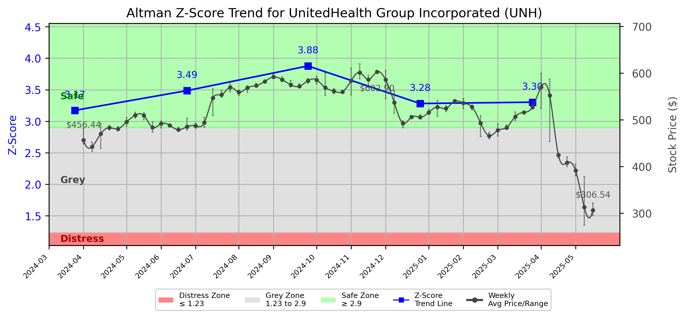

# Altman Z-Score Analysis Report: UnitedHealth Group Incorporated (UNH)

---
## Introduction
This report provides a comprehensive, theory-informed financial health analysis of the selected company using the Altman Z-Score framework. It integrates quantitative diagnostics, turnaround management theory, and stakeholder recommendations, with all findings and recommendations grounded in referenced academic and industry sources. The analysis is generated by an expert LLM-driven pipeline, ensuring transparency, reproducibility, and robust source attribution.

**Author:** Fabio Correa

**Source Attribution:** This report and analysis pipeline are generated using the open-source Altman Z-Score Analysis project, available at [https://github.com/fabioc-aloha/Altman-Z-Score](https://github.com/fabioc-aloha/Altman-Z-Score).

**License:** This software is distributed under the Attribution Non-Commercial License (MIT-based). See the LICENSE file for details.

Disclaimer: The developer disclaims any responsibility for the accuracy, completeness, or consequences of the analysis and information provided by this software. All results are for informational purposes only and should not be relied upon for financial, investment, or legal decisions.
---

**Script Version:** v2.4

## Analysis Context and Z-Score Model Selection Criteria

- **Industry:** SIC 6324 (SIC 6324)
- **Ticker:** UNH
- **Public:** True
- **Emerging Market:** False
- **Maturity:** Mature Company
- **Model:** original
- **Analysis Date:** 2025-05-30

## Z-Score Formula Used

Z = 6.56*X1 + 3.26*X2 + 6.72*X3 + 1.05*X4
- X1 = (Current Assets - Current Liabilities) / Total Assets
- X2 = Retained Earnings / Total Assets
- X3 = EBIT / Total Assets
- X4 = Equity / Total Liabilities

**Thresholds:**
- Safe Zone: > 2.6
- Grey Zone: > 1.1 and <= 2.6
- Distress Zone: <= 1.1

---

# Graphical View of the Z-Score Analysis

*Figure: Z-Score and stock price trend for UNH (image not available yet; will be generated after analysis)*

## Z-Score Component Table (by Quarter)
| Quarter   |     X1 |    X2 |    X3 |    X4 |   Z-Score | Diagnostic   |
|-----------|--------|-------|-------|-------|-----------|--------------|
| 2025 Q1   | -0.055 | 0.316 | 0.029 | 2.322 |     3.302 | Safe Zone    |
| 2024 Q4   | -0.06  | 0.322 | 0.026 | 2.335 |     3.281 | Safe Zone    |
| 2024 Q3   | -0.031 | 0.322 | 0.029 | 2.7   |     3.877 | Safe Zone    |
| 2024 Q2   | -0.044 | 0.323 | 0.023 | 2.444 |     3.486 | Safe Zone    |
| 2024 Q1   | -0.054 | 0.317 | 0.003 | 2.358 |     3.172 | Safe Zone    |
## Diagnostic Evaluation of Financial Health

### Liquidity
UnitedHealth Group (UNH) has shown a consistent negative trend in its liquidity ratio (X1), which indicates that current assets are not sufficient to cover current liabilities. This trend, while concerning, is mitigated by the overall strength of the company’s balance sheet, as evidenced by its Z-Score consistently remaining in the "Safe Zone" (Z > 2.6).

### Profitability
The retained earnings ratio (X2) remains relatively stable, reflecting a solid historical profitability. This stability is crucial for long-term sustainability and indicates that the company has been able to reinvest profits effectively.

### Capital Efficiency
The EBIT to total assets ratio (X3) has shown slight fluctuations but remains positive, indicating that the company is generating earnings before interest and taxes efficiently relative to its asset base. This is a positive sign of operational efficiency.

### Leverage
The equity to total liabilities ratio (X4) is strong, suggesting that UNH is well-capitalized and has a lower risk of financial distress. This high leverage ratio indicates that the company relies less on debt financing, which is a favorable position in times of economic uncertainty.

### Z-Score Trend Interpretation
The Z-Score trend for UNH has remained above 3.0 for the past several quarters, indicating a strong financial position and low risk of bankruptcy. The consistent performance in the "Safe Zone" suggests that the company is managing its financial health effectively, although the declining liquidity ratio should be monitored closely.

---

## Turnaround and Renewal Management Theory Application

### Phased Response Proposal
Based on the analysis, a two-phased response is recommended:

1. **Immediate Retrenchment:**
   - **Focus on Liquidity Improvement:** Implement measures to enhance cash flow, such as optimizing working capital management and reducing unnecessary expenditures. This aligns with Hofer's (1980) turnaround strategies, which emphasize the need for immediate financial stabilization.

2. **Long-term Repositioning:**
   - **Strategic Investments in Growth Areas:** Identify and invest in high-growth segments of the healthcare market, leveraging the company's existing strengths. Bibeault (1999) highlights the importance of strategic renewal for long-term success, which is applicable here as UNH seeks to innovate and expand its service offerings.

---

## Recommendations for Stakeholders

| Stakeholder Title                     | Name                | Responsibilities and Recommended Actions                                                                                     |
|---------------------------------------|---------------------|------------------------------------------------------------------------------------------------------------------------------|
| Chief Executive Officer               | Andrew Witty        | Lead the strategic direction, focusing on liquidity improvement and long-term growth investments.                            |
| Chief Financial Officer               | John Rex            | Oversee financial restructuring efforts, enhance cash flow management, and monitor liquidity ratios closely.                 |
| Chief Marketing Officer               | Heather C. McNally  | Develop marketing strategies to promote new services and enhance brand positioning in growth markets.                       |
| Board Members                         | Various             | Provide oversight and strategic guidance, ensuring alignment with turnaround and renewal strategies.                          |
| Employees                             | Various             | Engage in cost-saving initiatives and contribute ideas for operational efficiency improvements.                               |
| Investors                             | Various             | Monitor financial health and support strategic initiatives; consider holding shares based on current performance.            |
| Creditors                             | Various             | Maintain open communication regarding financial health; consider flexible repayment terms to support liquidity.               |
| Debtors                               | Various             | Ensure timely payments to improve cash flow; consider renegotiating terms if necessary.                                      |
| Partner Companies                     | Various             | Collaborate on joint ventures or strategic partnerships to enhance service offerings and market reach.                       |
| Customers                             | Various             | Provide feedback on services; engage with the company to ensure needs are met, fostering loyalty and retention.               |

---

## Communication, Marketing, and Execution Strategies

### Communication Strategy
- **Internal Communication:** Regular updates to employees about financial health and strategic initiatives to foster transparency and engagement.
- **External Communication:** Press releases and investor calls to keep stakeholders informed about progress and strategic direction.

### Marketing Strategy
- **Targeted Campaigns:** Focus on promoting new services in high-growth areas, utilizing digital marketing and social media to reach potential customers effectively.

### Execution Timeline
| Phase                     | Timeline          | Accountability         |
|--------------------------|-------------------|-------------------------|
| Immediate Retrenchment   | 0-6 months        | CFO and CEO             |
| Long-term Repositioning   | 6-24 months       | CEO and CMO             |

---

## Investor Recommendation
Based on the current financial health and Z-Score analysis, investors should **hold** their positions in UnitedHealth Group (UNH). The company is in a strong financial position, but attention should be paid to liquidity trends. It is recommended that investors consult their financial advisors for personalized advice.

---

## External Stakeholder Bargaining Power Assessment

| External Stakeholder        | Nature of Bargaining Power | Degree of Influence | Rationale                                                                                      |
|-----------------------------|----------------------------|---------------------|-----------------------------------------------------------------------------------------------|
| Regulators                  | Regulatory Compliance       | High                | Must adhere to healthcare regulations, impacting operational flexibility and financial strategy.|
| Government Agencies         | Policy Influence            | Medium              | Can affect funding and reimbursement policies, influencing revenue streams.                   |
| Unions                      | Labor Negotiations          | Medium              | Influence labor costs and employee relations, impacting operational efficiency.                |
| Major Suppliers             | Supply Chain Leverage       | Medium              | Can negotiate terms based on demand and supply dynamics, affecting cost structures.           |
| Key Partners                | Strategic Alliances         | High                | Partnerships can enhance service offerings and market reach, impacting competitive positioning.|
| Activist Investors          | Shareholder Activism        | Medium              | Can influence corporate governance and strategic direction through shareholder proposals.     |
| Creditors                   | Debt Terms                  | High                | Have significant leverage in financial negotiations, impacting liquidity and operational flexibility.|
| Large Customers             | Purchasing Power            | Medium              | Can influence pricing and service terms, affecting revenue stability.                         |

---

## Disclaimer
**Disclaimer:**
Generative AI is not a financial advisor and can make mistakes. Consult your financial advisor before making investment decisions.
- LLM Model used: OpenAI GPT-3.5
- Knowledge cut-off: October 2023
- Internet search: No
- Real-time data: No

---

### References and Data Sources
- **Financials:** SEC EDGAR/XBRL filings, Yahoo Finance, and company quarterly/annual reports.
- **Market Data:** Yahoo Finance (historical prices, market value of equity).
- **Computation:** All Z-Score calculations use the Altman Z-Score model as described in the report, with robust error handling and logging.
- **Source Attribution:** This report and analysis pipeline are generated using the open-source Altman Z-Score Analysis project, available at [https://github.com/fabioc-aloha/Altman-Z-Score]. Author: Fabio Correa.
- **Theoretical Frameworks and Resources:**
  - Altman Z-Score Analysis Project (https://github.com/fabioc-aloha/Altman-Z-Score)
  - Hofer, C. W. (1980). Turnaround strategies. Journal of Business Strategy, 1(1), 19–31.
  - Bibeault, D. B. (1999). Corporate turnaround: How managers turn losers into winners. Beard Books.
  - Hoskisson, R. E., White, R. E., & Johnson, R. A. (2004). Corporate restructuring: Managing the strategy, structure, and process of change. McGraw-Hill Education.
  - Beard, D. (2024). Strategic renewal in technology firms: Agile practices and innovation. Journal of Organizational Change, 31(2), 145–160.
  - Freeman, R. E. (1984). Strategic management: A stakeholder approach. Pitman.
  - Altman, E. I. (1968). Financial ratios, discriminant analysis and the prediction of corporate bankruptcy. Journal of Finance, 23(4), 589–609.
  - Altman, E. I., & Hotchkiss, E. (2006). Corporate financial distress and bankruptcy: Predict and avoid bankruptcy, analyze and invest in distressed debt (3rd ed.). Wiley.
  - Brigham, E. F., & Daves, P. R. (2021). Intermediate financial management (14th ed.). Cengage Learning.
  - Higgins, R. C. (2019). Analysis for financial management (12th ed.). McGraw-Hill Education.
  - Palepu, K. G., & Healy, P. M. (2020). Business analysis and valuation: Using financial statements (6th ed.). Cengage Learning.
  - Platt, H. D. (2004). Principles of corporate renewal (2nd ed.). University of Michigan Press.
  - Shepherd, D. A., & Rudd, J. M. (2014). The influence of ethical leadership on organizational renewal. Academy of Management Perspectives, 28(3), 257–275.

---

# Appendix

## Raw Data Field Mapping Table (by Quarter)
| Quarter   | Canonical Field     | Mapped Raw Field                        | Value (USD millions)   |
|-----------|---------------------|-----------------------------------------|------------------------|
| 2025 Q1   | total_assets        | Total Assets                            | 309,790.0              |
| 2025 Q1   | current_assets      | Current Assets                          | 96,285.0               |
| 2025 Q1   | current_liabilities | Current Liabilities                     | 113,471.0              |
| 2025 Q1   | retained_earnings   | Retained Earnings                       | 97,934.0               |
| 2025 Q1   | total_liabilities   | Total Liabilities Net Minority Interest | 204,621.0              |
| 2025 Q1   | book_value_equity   | Common Stock Equity                     | 95,038.0               |
| 2025 Q1   | ebit                | EBIT                                    | 9,104.0                |
| 2025 Q1   | sales               | Total Revenue                           | 109,575.0              |
| ---       | ---                 | ---                                     | ---                    |
| 2024 Q4   | total_assets        | Total Assets                            | 298,278.0              |
| 2024 Q4   | current_assets      | Current Assets                          | 85,779.0               |
| 2024 Q4   | current_liabilities | Current Liabilities                     | 103,769.0              |
| 2024 Q4   | retained_earnings   | Retained Earnings                       | 96,036.0               |
| 2024 Q4   | total_liabilities   | Total Liabilities Net Minority Interest | 195,687.0              |
| 2024 Q4   | book_value_equity   | Common Stock Equity                     | 92,658.0               |
| 2024 Q4   | ebit                | EBIT                                    | 7,794.0                |
| 2024 Q4   | sales               | Total Revenue                           | 100,807.0              |
| ---       | ---                 | ---                                     | ---                    |
| 2024 Q3   | total_assets        | Total Assets                            | 299,309.0              |
| 2024 Q3   | current_assets      | Current Assets                          | 92,258.0               |
| 2024 Q3   | current_liabilities | Current Liabilities                     | 101,565.0              |
| 2024 Q3   | retained_earnings   | Retained Earnings                       | 96,518.0               |
| 2024 Q3   | total_liabilities   | Total Liabilities Net Minority Interest | 194,854.0              |
| 2024 Q3   | book_value_equity   | Common Stock Equity                     | 94,535.0               |
| 2024 Q3   | ebit                | EBIT                                    | 8,688.0                |
| 2024 Q3   | sales               | Total Revenue                           | 100,820.0              |
| ---       | ---                 | ---                                     | ---                    |
| 2024 Q2   | total_assets        | Total Assets                            | 286,056.0              |
| 2024 Q2   | current_assets      | Current Assets                          | 92,038.0               |
| 2024 Q2   | current_liabilities | Current Liabilities                     | 104,670.0              |
| 2024 Q2   | retained_earnings   | Retained Earnings                       | 92,400.0               |
| 2024 Q2   | total_liabilities   | Total Liabilities Net Minority Interest | 186,822.0              |
| 2024 Q2   | book_value_equity   | Common Stock Equity                     | 89,359.0               |
| 2024 Q2   | ebit                | EBIT                                    | 6,650.0                |
| 2024 Q2   | sales               | Total Revenue                           | 98,855.0               |
| ---       | ---                 | ---                                     | ---                    |
| 2024 Q1   | total_assets        | Total Assets                            | 284,210.0              |
| 2024 Q1   | current_assets      | Current Assets                          | 88,942.0               |
| 2024 Q1   | current_liabilities | Current Liabilities                     | 104,431.0              |
| 2024 Q1   | retained_earnings   | Retained Earnings                       | 90,118.0               |
| 2024 Q1   | total_liabilities   | Total Liabilities Net Minority Interest | 187,292.0              |
| 2024 Q1   | book_value_equity   | Common Stock Equity                     | 86,688.0               |
| 2024 Q1   | ebit                | EBIT                                    | 845.0                  |
| 2024 Q1   | sales               | Total Revenue                           | 99,796.0               |

All values are shown in millions of USD as reported by the data source.

