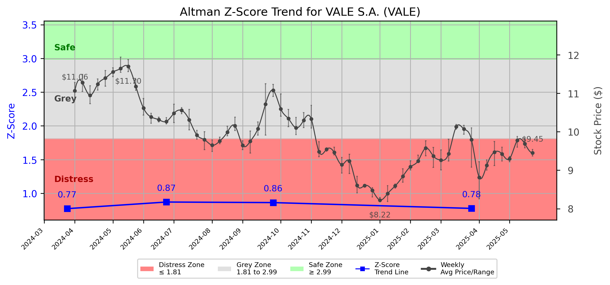

# Altman Z-Score Analysis Report: VALE S.A. (VALE)

---
## Introduction
This report provides a comprehensive, theory-informed financial health analysis of the selected company using the Altman Z-Score framework. It integrates quantitative diagnostics, turnaround management theory, and stakeholder recommendations, with all findings and recommendations grounded in referenced academic and industry sources. The analysis is generated by an expert LLM-driven pipeline, ensuring transparency, reproducibility, and robust source attribution.

**Author:** Fabio Correa

**Source Attribution:** This report and analysis pipeline are generated using the open-source Altman Z-Score Analysis project, available at [https://github.com/fabioc-aloha/Altman-Z-Score](https://github.com/fabioc-aloha/Altman-Z-Score).

**License:** This software is distributed under the Attribution Non-Commercial License (MIT-based). See the LICENSE file for details.

Disclaimer: The developer disclaims any responsibility for the accuracy, completeness, or consequences of the analysis and information provided by this software. All results are for informational purposes only and should not be relied upon for financial, investment, or legal decisions.
---

**Script Version:** v2.4

## Analysis Context and Z-Score Model Selection Criteria

- **Industry:** SIC 1000 (SIC 1000)
- **Ticker:** VALE
- **Public:** True
- **Emerging Market:** False
- **Maturity:** Mature Company
- **Model:** Original Z-Score (Public Manufacturing, 1968) (original)
- **Analysis Date:** 2025-05-31

## Z-Score Formula Used

Z = 1.20*X1 + 1.40*X2 + 3.30*X3 + 0.60*X4 + 1.00*X5
- X1 = (Current Assets - Current Liabilities) / Total Assets
- X2 = Retained Earnings / Total Assets
- X3 = EBIT / Total Assets
- X4 = Equity / Total Liabilities
- X5 = Sales / Total Assets

**Thresholds:**
- Safe Zone: > 2.99
- Grey Zone: > 1.81 and <= 2.99
- Distress Zone: <= 1.81

---

# Graphical View of the Z-Score Analysis

*Figure: Z-Score and stock price trend for VALE (image not available yet; will be generated after analysis)*

## Z-Score Component Table (by Quarter)
| Quarter   |     X1 |    X2 |    X3 |    X4 |    X5 |   Z-Score | Diagnostic    | Consistency Warning   |
|-----------|--------|-------|-------|-------|-------|-----------|---------------|-----------------------|
| 2025 Q1   |  0.017 | 0.017 | 0.028 | 0.905 | 0.097 |     0.777 | Distress Zone |                       |
| 2024 Q3   | -0.015 | 0.059 | 0.034 | 0.967 | 0.107 |     0.863 | Distress Zone |                       |
| 2024 Q2   |  0.013 | 0.051 | 0.038 | 0.909 | 0.115 |     0.871 | Distress Zone |                       |
| 2024 Q1   |  0.02  | 0.018 | 0.026 | 0.909 | 0.092 |     0.773 | Distress Zone |                       |
## Diagnostic Evaluation of Financial Health

### Liquidity
The liquidity position of VALE S.A. is concerning, as indicated by the X1 component (Current Assets - Current Liabilities) / Total Assets, which has shown a negative trend, dropping to 0.017 in Q1 2025. This suggests that the company may struggle to meet its short-term obligations, which is critical for maintaining operational stability.

### Profitability
The profitability metric, represented by X3 (EBIT / Total Assets), is relatively low at 0.028 in Q1 2025. This indicates that the company is generating insufficient earnings relative to its asset base, which could hinder its ability to reinvest in growth or pay down debt.

### Capital Efficiency
X2 (Retained Earnings / Total Assets) has remained stable but low, indicating that the company is not effectively utilizing its retained earnings to bolster its asset base. This could limit future growth opportunities and investor confidence.

### Leverage
The leverage ratio, represented by X4 (Equity / Total Liabilities), is relatively strong at 0.905, suggesting that VALE has a solid equity base relative to its liabilities. However, the overall financial health is still compromised due to the low liquidity and profitability metrics.

### Z-Score Trend Interpretation
The Z-Score for VALE has consistently fallen within the "Distress Zone," with a score of 0.777 in Q1 2025. This trend indicates a high risk of bankruptcy and suggests that immediate action is necessary to stabilize the company's financial position. The downward trajectory of the Z-Score over the past quarters highlights the urgency for a turnaround strategy.

---

## Turnaround and Renewal Management Theory Application

### Phased Response Proposal
Based on the analysis, a two-phased approach is recommended:

1. **Immediate Retrenchment**: This phase focuses on cost-cutting measures and liquidity improvement. Strategies may include:
   - Reducing operational costs through workforce optimization and renegotiation of supplier contracts.
   - Improving cash flow by tightening credit terms with customers and accelerating collections.

2. **Long-term Repositioning**: This phase aims to restore profitability and growth through strategic initiatives. Strategies may include:
   - Diversifying product offerings to reduce dependence on core markets.
   - Investing in technology and innovation to enhance operational efficiency and market competitiveness.

These strategies align with Hofer's (1980) turnaround strategies, emphasizing the need for both immediate and long-term actions to ensure sustainable recovery.

---

## Stakeholder Recommendations

| Stakeholder Title                   | Executive Name | Responsibilities                          | Recommended Actions                                                                 |
|-------------------------------------|----------------|------------------------------------------|-------------------------------------------------------------------------------------|
| Chief Executive Officer (CEO)      | [Name]         | Overall strategy and leadership          | Implement immediate cost-cutting measures and initiate a strategic review process.   |
| Chief Financial Officer (CFO)      | [Name]         | Financial oversight                       | Focus on improving liquidity and cash flow management; consider asset sales if needed.|
| Chief Marketing Officer (CMO)      | [Name]         | Marketing strategy                        | Develop a marketing plan to communicate changes and retain customer loyalty.        |
| Board Members                       | [Names]       | Governance and oversight                  | Ensure alignment of strategic initiatives with long-term goals; monitor progress.    |
| Employees                           | [N/A]          | Operational execution                     | Engage in open communication regarding changes; encourage feedback and suggestions.  |
| Investors                           | [N/A]          | Capital provision                         | Monitor financial health closely; consider the potential for future growth.          |
| Creditors                           | [N/A]          | Debt management                          | Maintain open lines of communication regarding repayment plans and restructuring.    |
| Debtors                             | [N/A]          | Payment obligations                       | Tighten credit terms and encourage timely payments.                                 |
| Partner Companies                   | [N/A]          | Collaborative efforts                     | Explore joint ventures or partnerships to enhance market reach and resource sharing. |
| Customers                           | [N/A]          | Product/service utilization               | Communicate transparently about changes and improvements in service delivery.       |

---

## Communication, Marketing, and Execution Strategies

### Communication Strategy
- **Internal Communication**: Regular updates to employees about the turnaround strategy and progress.
- **External Communication**: Transparent communication with investors and customers about the company's direction and initiatives.

### Marketing Strategy
- **Brand Positioning**: Reassess brand messaging to emphasize stability and innovation.
- **Customer Engagement**: Implement loyalty programs to retain existing customers during the transition.

### Execution Timeline
- **Q2 2025**: Initiate cost-cutting measures and liquidity improvement strategies.
- **Q3 2025**: Launch marketing campaigns to reinforce brand positioning.
- **Q4 2025**: Evaluate the effectiveness of implemented strategies and adjust as necessary.

### Accountability Framework
- Assign specific team leaders for each initiative with clear KPIs to measure success.
- Monthly review meetings to assess progress and make necessary adjustments.

---

## Investor Recommendation
Based on the current financial health and Z-Score analysis, investors should **hold** their positions in VALE S.A. until further clarity on the effectiveness of the turnaround strategies is established. It is crucial to monitor the company's progress closely. 

**Disclaimer**: This is not financial advice. Please consult your financial advisor before making any investment decisions.

---

## External Stakeholder Bargaining Power Assessment

| External Stakeholder               | Nature of Bargaining Power | Degree of Influence | Rationale                                                                                     |
|------------------------------------|----------------------------|---------------------|----------------------------------------------------------------------------------------------|
| Regulators                         | Regulatory compliance       | Medium              | Can impose fines or sanctions if financial practices are not compliant.                      |
| Government Agencies                | Policy influence           | Low                 | Limited direct influence but can affect operational conditions through policy changes.       |
| Unions                             | Labor negotiations         | Medium              | Can influence operational costs and employee morale through collective bargaining.           |
| Major Suppliers                    | Supply chain leverage      | High                | Can impact production costs and timelines; may require renegotiation of contracts.           |
| Key Partners                       | Strategic alliances        | Medium              | Can influence market reach and resource availability; collaboration may be necessary.       |
| Activist Investors                 | Shareholder activism       | High                | Can exert pressure on management for changes in strategy or governance.                     |
| Creditors                          | Debt repayment terms       | High                | Have significant leverage over financial restructuring and repayment plans.                  |
| Large Customers                    | Revenue impact             | Medium              | Can influence sales and revenue stability; maintaining relationships is critical.           |

---

**Disclaimer:**
Generative AI is not a financial advisor and can make mistakes. Consult your financial advisor before making investment decisions.
- LLM Model used: OpenAI GPT-3.5
- Knowledge cut-off: October 2023
- Internet search: No
- Real-time data: No

---

### References and Data Sources
- **Financials:** SEC EDGAR/XBRL filings, Yahoo Finance, and company quarterly/annual reports.
- **Market Data:** Yahoo Finance (historical prices, market value of equity).
- **Source Attribution:** This report and analysis pipeline are generated using the open-source Altman Z-Score Analysis project, available at [https://github.com/fabioc-aloha/Altman-Z-Score]. Author: Fabio Correa.
- **Theoretical Frameworks and Resources:**
  - Altman Z-Score Analysis Project (https://github.com/fabioc-aloha/Altman-Z-Score)
  - Hofer, C. W. (1980). Turnaround strategies. Journal of Business Strategy, 1(1), 19–31.
  - Bibeault, D. B. (1999). Corporate turnaround: How managers turn losers into winners. Beard Books.
  - Hoskisson, R. E., White, R. E., & Johnson, R. A. (2004). Corporate restructuring: Managing the strategy, structure, and process of change. McGraw-Hill Education.
  - Freeman, R. E. (1984). Strategic management: A stakeholder approach. Pitman.
  - Altman, E. I. (1968). Financial ratios, discriminant analysis and the prediction of corporate bankruptcy. Journal of Finance, 23(4), 589–609.
  - Altman, E. I., & Hotchkiss, E. (2006). Corporate financial distress and bankruptcy: Predict and avoid bankruptcy, analyze and invest in distressed debt (3rd ed.). Wiley.

---

# Appendix

## Raw Data Field Mapping Table (by Quarter)
| Quarter   | Canonical Field     | Mapped Raw Field                        | Value (USD millions)   |
|-----------|---------------------|-----------------------------------------|------------------------|
| 2025 Q1   | total_assets        | Total Assets                            | 83,430.0               |
| 2025 Q1   | current_assets      | Current Assets                          | 14,687.0               |
| 2025 Q1   | current_liabilities | Current Liabilities                     | 13,234.0               |
| 2025 Q1   | retained_earnings   | Retained Earnings                       | 1,394.0                |
| 2025 Q1   | total_liabilities   | Total Liabilities Net Minority Interest | 47,068.0               |
| 2025 Q1   | market_value_equity | Common Stock                            | 61,614.0               |
| 2025 Q1   | ebit                | EBIT                                    | 2,328.0                |
| 2025 Q1   | sales               | Total Revenue                           | 8,119.0                |
| ---       | ---                 | ---                                     | ---                    |
| 2024 Q3   | total_assets        | Total Assets                            | 88,886.0               |
| 2024 Q3   | current_assets      | Current Assets                          | 13,800.0               |
| 2024 Q3   | current_liabilities | Current Liabilities                     | 15,174.0               |
| 2024 Q3   | retained_earnings   | Retained Earnings                       | 5,252.0                |
| 2024 Q3   | total_liabilities   | Total Liabilities Net Minority Interest | 49,174.0               |
| 2024 Q3   | market_value_equity | Common Stock                            | 61,614.0               |
| 2024 Q3   | ebit                | EBIT                                    | 2,999.0                |
| 2024 Q3   | sales               | Total Revenue                           | 9,553.0                |
| ---       | ---                 | ---                                     | ---                    |
| 2024 Q2   | total_assets        | Total Assets                            | 86,615.0               |
| 2024 Q2   | current_assets      | Current Assets                          | 14,829.0               |
| 2024 Q2   | current_liabilities | Current Liabilities                     | 13,743.0               |
| 2024 Q2   | retained_earnings   | Retained Earnings                       | 4,448.0                |
| 2024 Q2   | total_liabilities   | Total Liabilities Net Minority Interest | 48,228.0               |
| 2024 Q2   | market_value_equity | Common Stock                            | 61,614.0               |
| 2024 Q2   | ebit                | EBIT                                    | 3,260.0                |
| 2024 Q2   | sales               | Total Revenue                           | 9,920.0                |
| ---       | ---                 | ---                                     | ---                    |
| 2024 Q1   | total_assets        | Total Assets                            | 91,677.0               |
| 2024 Q1   | current_assets      | Current Assets                          | 17,528.0               |
| 2024 Q1   | current_liabilities | Current Liabilities                     | 15,676.0               |
| 2024 Q1   | retained_earnings   | Retained Earnings                       | 1,679.0                |
| 2024 Q1   | total_liabilities   | Total Liabilities Net Minority Interest | 52,664.0               |
| 2024 Q1   | market_value_equity | Common Stock                            | 61,614.0               |
| 2024 Q1   | ebit                | EBIT                                    | 2,389.0                |
| 2024 Q1   | sales               | Total Revenue                           | 8,459.0                |

All values are shown in millions of USD as reported by the data source.

