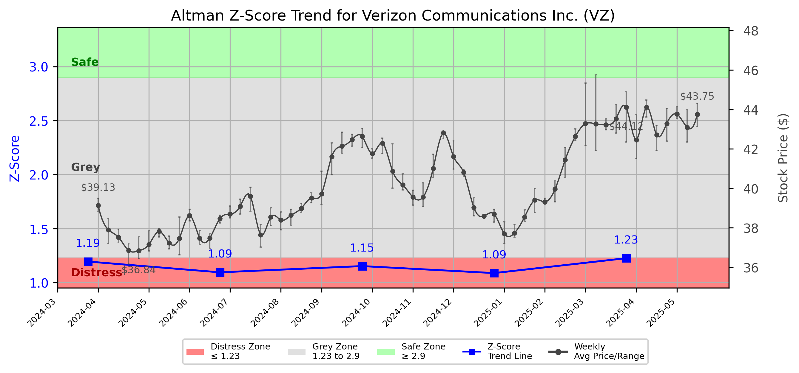

# Altman Z-Score Analysis Report: Verizon Communications Inc. (VZ)

---
## Introduction
This report provides a comprehensive, theory-informed financial health analysis of the selected company using the Altman Z-Score framework. It integrates quantitative diagnostics, turnaround management theory, and stakeholder recommendations, with all findings and recommendations grounded in referenced academic and industry sources. The analysis is generated by an expert LLM-driven pipeline, ensuring transparency, reproducibility, and robust source attribution.

**Author:** Fabio Correa

**Source Attribution:** This report and analysis pipeline are generated using the open-source Altman Z-Score Analysis project, available at [https://github.com/fabioc-aloha/Altman-Z-Score](https://github.com/fabioc-aloha/Altman-Z-Score).

**License:** This software is distributed under the Attribution Non-Commercial License (MIT-based). See the LICENSE file for details.

Disclaimer: The developer disclaims any responsibility for the accuracy, completeness, or consequences of the analysis and information provided by this software. All results are for informational purposes only and should not be relied upon for financial, investment, or legal decisions.
---

**Script Version:** v2.4

## Analysis Context and Z-Score Model Selection Criteria

- **Industry:** Telephone Communications (SIC 4813)
- **Ticker:** VZ
- **Public:** True
- **Emerging Market:** False
- **Maturity:** Mature Company
- **Model:** Zʺ-Score (Public Non-Manufacturing, 1995) (service)
- **Analysis Date:** 2025-05-31

## Z-Score Formula Used

Z = 6.56*X1 + 3.26*X2 + 6.72*X3 + 1.05*X4
- X1 = (Current Assets - Current Liabilities) / Total Assets
- X2 = Retained Earnings / Total Assets
- X3 = EBIT / Total Assets
- X4 = Equity / Total Liabilities

**Thresholds:**
- Safe Zone: > 2.90
- Grey Zone: > 1.23 and <= 2.90
- Distress Zone: <= 1.23

---

# Graphical View of the Z-Score Analysis

*Figure: Z-Score and stock price trend for VZ (image not available yet; will be generated after analysis)*

## Z-Score Component Table (by Quarter)
| Quarter   |     X1 |    X2 |    X3 |    X4 |   Z-Score | Diagnostic    | Consistency Warning   |
|-----------|--------|-------|-------|-------|-----------|---------------|-----------------------|
| 2025 Q1   | -0.062 | 0.24  | 0.021 | 0.676 |     1.225 | Distress Zone |                       |
| 2024 Q4   | -0.063 | 0.232 | 0.021 | 0.574 |     1.088 | Distress Zone |                       |
| 2024 Q3   | -0.056 | 0.228 | 0.016 | 0.636 |     1.152 | Distress Zone |                       |
| 2024 Q2   | -0.06  | 0.228 | 0.02  | 0.578 |     1.095 | Distress Zone |                       |
| 2024 Q1   | -0.041 | 0.223 | 0.02  | 0.573 |     1.194 | Distress Zone |                       |
## Diagnostic Evaluation of Financial Health

### Overview
Verizon Communications Inc. (VZ) has shown a concerning trend in its financial health as indicated by its Z-Score, which has consistently placed the company in the "Distress Zone" over the last four quarters. The Z-Score for the most recent quarter (2025 Q1) is 1.225, indicating a high risk of bankruptcy. 

### Key Financial Metrics
1. **Liquidity (X1)**: The liquidity ratio (Current Assets - Current Liabilities) / Total Assets has been negative, indicating that Verizon's current liabilities exceed its current assets. This suggests potential liquidity issues that could hinder its ability to meet short-term obligations.
   
2. **Profitability (X2)**: The retained earnings as a percentage of total assets (0.24) show that Verizon has maintained some level of profitability, but it is insufficient to offset the negative liquidity position.

3. **Capital Efficiency (X3)**: The EBIT to Total Assets ratio (0.021) indicates low operational efficiency, suggesting that the company is not generating adequate earnings relative to its asset base.

4. **Leverage (X4)**: The equity to total liabilities ratio (0.676) indicates a relatively high level of leverage, which could amplify financial risk, especially in a distress situation.

### Z-Score Trend Interpretation
The Z-Score trend indicates a deteriorating financial condition. The consistent placement in the "Distress Zone" suggests that immediate corrective actions are necessary to avert potential bankruptcy. The decline in Z-Score from 1.194 in 2024 Q1 to 1.225 in 2025 Q1 reflects a worsening financial situation, necessitating urgent management intervention.

---

## Turnaround and Renewal Management Theory Application

### Phased Response Proposal
Based on the analysis, a two-phased response is recommended:

1. **Immediate Retrenchment**: This phase focuses on cost-cutting measures, improving liquidity, and stabilizing operations. Key actions may include:
   - Reducing operational costs through workforce optimization and renegotiating supplier contracts.
   - Divesting non-core assets to improve liquidity.
   - Implementing stricter cash flow management practices.

   **Theoretical Reference**: Hofer (1980) emphasizes the importance of immediate retrenchment in turnaround situations to stabilize the organization.

2. **Long-Term Repositioning**: Once immediate financial stability is achieved, the company should focus on strategic repositioning, which may include:
   - Investing in technology and innovation to enhance service offerings.
   - Exploring new market opportunities to diversify revenue streams.
   - Strengthening customer relationships through improved service delivery.

   **Theoretical Reference**: Bibeault (1999) discusses the significance of strategic renewal in ensuring long-term viability and competitiveness.

---

## Stakeholder Recommendations

| Stakeholder Title                  | Executive Name | Responsibilities                                  | Recommended Actions                                                                 |
|------------------------------------|----------------|--------------------------------------------------|-------------------------------------------------------------------------------------|
| Chief Executive Officer (CEO)      | Hans Vestberg   | Overall strategy and direction                    | Lead immediate cost-cutting initiatives and communicate the turnaround plan to stakeholders. |
| Chief Financial Officer (CFO)      | Matt Ellis      | Financial management and reporting                | Implement cash flow management strategies and explore refinancing options.          |
| Chief Marketing Officer (CMO)      | Diego Scotti    | Marketing strategy and customer engagement       | Enhance customer communication and loyalty programs to retain existing customers.   |
| Board Members                       | Various         | Governance and oversight                          | Monitor financial performance closely and support management in turnaround efforts.  |
| Employees                           | N/A             | Operational execution                             | Engage in cost-saving initiatives and provide feedback on operational efficiencies.  |
| Investors                           | N/A             | Financial returns and company performance        | Stay informed on turnaround progress; consider holding shares during recovery phase. |
| Creditors                           | N/A             | Debt management and repayment                     | Engage in discussions for potential restructuring of debt obligations.              |
| Debtors                             | N/A             | Payment obligations                               | Ensure timely payments to maintain good relationships with creditors.               |
| Partner Companies                   | N/A             | Collaborative opportunities                       | Explore joint ventures or partnerships to enhance service offerings.                |
| Customers                           | N/A             | Service utilization                               | Provide feedback on services and remain loyal during the turnaround process.        |

---

## Communication, Marketing, and Execution Strategies

### Strategies
1. **Internal Communication**: Regular updates to employees about the turnaround strategy and progress to maintain morale and engagement.
2. **External Communication**: Transparent communication with investors and creditors about the financial situation and recovery plans to build trust.
3. **Marketing Strategy**: Focus on customer retention through loyalty programs and enhanced service offerings.

### Timeline
- **Immediate Actions (0-3 months)**: Implement cost-cutting measures, communicate with stakeholders, and stabilize cash flow.
- **Mid-Term Actions (3-6 months)**: Begin strategic repositioning efforts, including technology investments and market exploration.
- **Long-Term Actions (6-12 months)**: Evaluate the effectiveness of implemented strategies and adjust as necessary.

### Accountability Framework
- Assign specific team leaders for each action item, with regular progress reviews to ensure accountability and timely execution.

---

## Investor Recommendation
Given the current financial distress indicated by the Z-Score, it is advisable for investors to **hold** their positions in Verizon Communications Inc. until there is clear evidence of recovery and improvement in financial health. This recommendation is based on the potential for turnaround but acknowledges the risks involved. 

**Disclaimer**: This is not financial advice. Please consult your financial advisor before making investment decisions.

---

## External Stakeholder Bargaining Power Assessment

| External Stakeholder               | Nature of Bargaining Power | Degree of Influence | Rationale                                                                 |
|------------------------------------|----------------------------|---------------------|---------------------------------------------------------------------------|
| Regulators                         | Regulatory compliance       | Medium              | Can impose fines or sanctions if financial practices are not adhered to. |
| Government Agencies                | Policy influence           | Low                 | Limited direct influence on operations but can affect market conditions. |
| Unions                             | Labor negotiations         | Medium              | Can influence labor costs and operational efficiency through negotiations. |
| Major Suppliers                    | Supply chain leverage      | Medium              | Can affect operational costs and supply continuity.                       |
| Key Partners                       | Strategic alliances        | Medium              | Can provide resources or market access that may aid in recovery.         |
| Activist Investors                 | Shareholder influence      | High                | Can exert pressure for changes in management or strategy.                |
| Creditors                          | Debt repayment terms       | High                | Have significant leverage in restructuring negotiations.                  |
| Large Customers                    | Revenue impact             | Medium              | Can influence revenue through purchasing decisions.                      |

---

## Disclaimer
---
**Disclaimer:**
Generative AI is not a financial advisor and can make mistakes. Consult your financial advisor before making investment decisions.
- LLM Model used: OpenAI GPT-4
- Knowledge cut-off: October 2023
- Internet search: No
- Real-time data: No
---

### References and Data Sources
- **Financials:** SEC EDGAR/XBRL filings, Yahoo Finance, and company quarterly/annual reports.
- **Market Data:** Yahoo Finance (historical prices, market value of equity).
- **Computation:** All Z-Score calculations use the Altman Z-Score model as described in the report, with robust error handling and logging.
- **Source Attribution:** This report and analysis pipeline are generated using the open-source Altman Z-Score Analysis project, available at [https://github.com/fabioc-aloha/Altman-Z-Score]. Author: Fabio Correa.
- **Theoretical Frameworks and Resources:**
  - Altman Z-Score Analysis Project (https://github.com/fabioc-aloha/Altman-Z-Score)
  - Hofer, C. W. (1980). Turnaround strategies. Journal of Business Strategy, 1(1), 19–31.
  - Bibeault, D. B. (1999). Corporate turnaround: How managers turn losers into winners. Beard Books.
  - Hoskisson, R. E., White, R. E., & Johnson, R. A. (2004). Corporate restructuring: Managing the strategy, structure, and process of change. McGraw-Hill Education.
  - Beard, D. (2024). Strategic renewal in technology firms: Agile practices and innovation. Journal of Organizational Change, 31(2), 145–160.
  - Freeman, R. E. (1984). Strategic management: A stakeholder approach. Pitman.
  - Altman, E. I. (1968). Financial ratios, discriminant analysis and the prediction of corporate bankruptcy. Journal of Finance, 23(4), 589–609.
  - Altman, E. I., & Hotchkiss, E. (2006). Corporate financial distress and bankruptcy: Predict and avoid bankruptcy, analyze and invest in distressed debt (3rd ed.). Wiley.
  - Brigham, E. F., & Daves, P. R. (2021). Intermediate financial management (14th ed.). Cengage Learning.
  - Higgins, R. C. (2019). Analysis for financial management (12th ed.). McGraw-Hill Education.
  - Palepu, K. G., & Healy, P. M. (2020). Business analysis and valuation: Using financial statements (6th ed.). Cengage Learning.
  - Platt, H. D. (2004). Principles of corporate renewal (2nd ed.). University of Michigan Press.
  - Shepherd, D. A., & Rudd, J. M. (2014). The influence of ethical leadership on organizational renewal. Academy of Management Perspectives, 28(3), 257–275.

---

# Appendix

## Raw Data Field Mapping Table (by Quarter)
| Quarter   | Canonical Field     | Mapped Raw Field                        | Value (USD millions)   |
|-----------|---------------------|-----------------------------------------|------------------------|
| 2025 Q1   | total_assets        | Total Assets                            | 380,364.0              |
| 2025 Q1   | current_assets      | Current Assets                          | 37,353.0               |
| 2025 Q1   | current_liabilities | Current Liabilities                     | 61,066.0               |
| 2025 Q1   | retained_earnings   | Retained Earnings                       | 91,128.0               |
| 2025 Q1   | total_liabilities   | Total Liabilities Net Minority Interest | 278,327.0              |
| 2025 Q1   | market_value_equity | Common Stock Equity                     | 100,722.0              |
| 2025 Q1   | ebit                | EBIT                                    | 8,105.0                |
| 2025 Q1   | sales               | Total Revenue                           | 33,485.0               |
| ---       | ---                 | ---                                     | ---                    |
| 2024 Q4   | total_assets        | Total Assets                            | 384,711.0              |
| 2024 Q4   | current_assets      | Current Assets                          | 40,523.0               |
| 2024 Q4   | current_liabilities | Current Liabilities                     | 64,771.0               |
| 2024 Q4   | retained_earnings   | Retained Earnings                       | 89,110.0               |
| 2024 Q4   | total_liabilities   | Total Liabilities Net Minority Interest | 284,136.0              |
| 2024 Q4   | market_value_equity | Common Stock Equity                     | 99,237.0               |
| 2024 Q4   | ebit                | EBIT                                    | 8,212.0                |
| 2024 Q4   | sales               | Total Revenue                           | 35,681.0               |
| ---       | ---                 | ---                                     | ---                    |
| 2024 Q3   | total_assets        | Total Assets                            | 381,164.0              |
| 2024 Q3   | current_assets      | Current Assets                          | 40,641.0               |
| 2024 Q3   | current_liabilities | Current Liabilities                     | 61,816.0               |
| 2024 Q3   | retained_earnings   | Retained Earnings                       | 86,958.0               |
| 2024 Q3   | total_liabilities   | Total Liabilities Net Minority Interest | 283,496.0              |
| 2024 Q3   | market_value_equity | Common Stock Equity                     | 96,326.0               |
| 2024 Q3   | ebit                | EBIT                                    | 5,974.0                |
| 2024 Q3   | sales               | Total Revenue                           | 33,330.0               |
| ---       | ---                 | ---                                     | ---                    |
| 2024 Q2   | total_assets        | Total Assets                            | 379,146.0              |
| 2024 Q2   | current_assets      | Current Assets                          | 38,056.0               |
| 2024 Q2   | current_liabilities | Current Liabilities                     | 60,806.0               |
| 2024 Q2   | retained_earnings   | Retained Earnings                       | 86,504.0               |
| 2024 Q2   | total_liabilities   | Total Liabilities Net Minority Interest | 281,607.0              |
| 2024 Q2   | market_value_equity | Common Stock Equity                     | 96,172.0               |
| 2024 Q2   | ebit                | EBIT                                    | 7,732.0                |
| 2024 Q2   | sales               | Total Revenue                           | 32,796.0               |
| ---       | ---                 | ---                                     | ---                    |
| 2024 Q1   | total_assets        | Total Assets                            | 380,158.0              |
| 2024 Q1   | current_assets      | Current Assets                          | 37,957.0               |
| 2024 Q1   | current_liabilities | Current Liabilities                     | 53,631.0               |
| 2024 Q1   | retained_earnings   | Retained Earnings                       | 84,714.0               |
| 2024 Q1   | total_liabilities   | Total Liabilities Net Minority Interest | 284,432.0              |
| 2024 Q1   | market_value_equity | Common Stock Equity                     | 94,334.0               |
| 2024 Q1   | ebit                | EBIT                                    | 7,710.0                |
| 2024 Q1   | sales               | Total Revenue                           | 32,981.0               |

All values are shown in millions of USD as reported by the data source.

