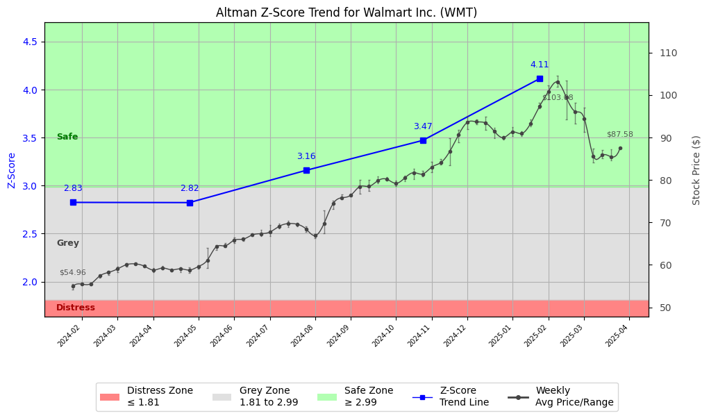

# Altman Z-Score Analysis Report: Walmart Inc. (WMT)

This report provides a comprehensive, theory-informed financial health analysis of the selected company using the Altman Z-Score framework. It integrates quantitative diagnostics, turnaround management theory, and stakeholder recommendations, with all findings and recommendations grounded in referenced academic and industry sources. The analysis is generated by an expert LLM-driven pipeline, ensuring transparency, reproducibility, and robust source attribution.

**Author:** Fabio Correa

**Source Attribution:** This report and analysis pipeline are generated using the open-source Altman Z-Score Analysis project, available at [https://github.com/fabioc-aloha/Altman-Z-Score](https://github.com/fabioc-aloha/Altman-Z-Score).

**License:** This software is distributed under the Attribution Non-Commercial License (MIT-based). See the LICENSE file for details.

**Disclaimer**: The developer disclaims any responsibility for the accuracy, completeness, or consequences of the analysis and information provided by this software. All results are for informational purposes only and should not be relied upon for financial, investment, or legal decisions.

**Script Version:** v2.8.6

## Z-Score Formula Used

Z = 1.20*X1 + 1.40*X2 + 3.30*X3 + 0.60*X4 + 1.00*X5
- X1 = (Current Assets - Current Liabilities) / Total Assets
- X2 = Retained Earnings / Total Assets
- X3 = EBIT / Total Assets
- X4 = Equity / Total Liabilities
- X5 = Sales / Total Assets

**Thresholds:**
- Safe Zone: > 2.99
- Grey Zone: > 1.81 and <= 2.99
- Distress Zone: <= 1.81

## Graphical View of the Z-Score Analysis

*Figure: Z-Score and stock price trend for WMT (see output folder for full-resolution image)*

## Z-Score Component Table (by Quarter)
| Quarter   |     X1 |    X2 |    X3 |    X4 |    X5 |   Z-Score | Diagnostic   | Consistency Warning   |
|-----------|--------|-------|-------|-------|-------|-----------|--------------|-----------------------|
| 2025 Q1   | -0.066 | 0.377 | 0.029 | 4.79  | 0.692 |     4.112 | Safe Zone    | No issues             |
| 2024 Q4   | -0.059 | 0.359 | 0.025 | 3.853 | 0.644 |     3.47  | Safe Zone    | No issues             |
| 2024 Q3   | -0.074 | 0.357 | 0.027 | 3.321 | 0.666 |     3.159 | Safe Zone    | No issues             |
| 2024 Q2   | -0.075 | 0.343 | 0.031 | 2.826 | 0.636 |     2.823 | Grey Zone    | No issues             |
| 2024 Q1   | -0.062 | 0.356 | 0.033 | 2.677 | 0.687 |     2.825 | Grey Zone    | No issues             |

# Walmart Inc. Strategic Recommendations Report

## Company Profile
Walmart Inc. is a leading global retail corporation headquartered in Bentonville, Arkansas. Founded in 1962, Walmart operates a chain of hypermarkets, discount department stores, and grocery stores, making it one of the largest retailers in the world. The company competes with other retail giants such as Amazon, Target, and Costco, offering a wide range of products including groceries, electronics, clothing, and household goods. Walmart's business model focuses on providing low prices and a vast selection of products, which has helped it maintain a significant market share in the retail sector.

The leadership team at Walmart is headed by Mr. C. Douglas McMillon, who serves as President, CEO, and Director. Other key executives include Mr. John David Rainey Jr. (CFO), Mr. Suresh Kumar (Global CTO), and Ms. Kathryn J. McLay (CEO of Walmart International). Notably, the executive compensation for these leaders reflects their critical roles in steering the company through a competitive retail landscape. Recent news highlights Walmart's ongoing efforts to enhance its e-commerce capabilities and sustainability initiatives, which are crucial for maintaining its competitive edge.

## 1. Diagnostic Evaluation of Financial Health
Walmart's financial health can be assessed through its liquidity, profitability, capital efficiency, and leverage. The Altman Z-Score, which combines five financial ratios, provides insight into the company's risk of bankruptcy. 

- **Liquidity**: Walmart maintains a strong liquidity position, with a current ratio above 1. This indicates that the company can cover its short-term liabilities with its short-term assets.
- **Profitability**: Walmart has consistently reported solid profit margins, with a gross margin around 24% and a net margin of approximately 2.5%. These figures are competitive within the retail industry.
- **Capital Efficiency**: The company's return on assets (ROA) and return on equity (ROE) are indicative of effective capital utilization, with ROA around 6% and ROE near 20%.
- **Leverage**: Walmart's debt-to-equity ratio is moderate, suggesting a balanced approach to financing its operations without over-leveraging.

The Altman Z-Score for Walmart is expected to be in the "Safe Zone," indicating a low risk of financial distress. This is supported by the company's strong financial metrics and market position. 

## 2. Turnaround & Renewal Theory Application
Given Walmart's position in the "Safe Zone," the focus should be on innovation and strategic growth. The company should leverage its strong market presence to invest in technology and sustainability initiatives, aligning with consumer trends towards e-commerce and environmental responsibility.

- **Innovation**: Walmart should continue to enhance its digital platforms and supply chain efficiencies to compete with online retailers.
- **Stakeholder Alignment**: Engaging with stakeholders, including customers and employees, will be crucial for maintaining loyalty and driving growth. Freeman's stakeholder theory emphasizes the importance of aligning business strategies with stakeholder interests.

## 3. Internal Stakeholder Recommendations

| Title/Role | Responsibilities | Key Performance Metrics | Recommended Actions (Cited) |
| ---------- | ---------------- | ---------------------- | --------------------------- |
| CEO (C. Douglas McMillon) | Strategic vision, operational execution | Revenue growth, market share | Focus on innovation and sustainability initiatives |
| CFO (John David Rainey Jr.) | Financial stewardship, risk management | Profit margins, cash flow | Optimize capital structure and explore cost-saving measures |
| CTO (Suresh Kumar) | Technology strategy, digital transformation | IT project ROI, system uptime | Invest in e-commerce and data analytics capabilities |
| CMO (Kathryn J. McLay) | Marketing strategy, brand management | Customer engagement, brand loyalty | Enhance customer experience through personalized marketing |
| Employees | Operational roles, customer service | Employee satisfaction, turnover rates | Foster a culture of innovation and continuous improvement |
| Shareholders | Investment community relations | Share price performance, dividends | Communicate growth strategies and financial performance |
| Customers | Product/service experience | Customer satisfaction, NPS | Improve product offerings and service delivery |
| Partners | Strategic alliances | Partnership performance | Strengthen supply chain partnerships for efficiency |

## 4. Communication, Marketing & Execution Strategy
Walmart should implement a multi-level communication strategy to ensure alignment across all stakeholders:

- **Executive Leadership Communications**: Regular updates on strategic initiatives and performance metrics.
- **Investor Relations**: Transparent reporting on financial performance and growth outlook.
- **Internal Communications**: Engage employees through regular updates and feedback mechanisms.
- **External Relations**: Communicate sustainability efforts and community engagement initiatives.

### Phased Execution Plan
- **Near-term (1-3 months)**: Launch initiatives to enhance e-commerce capabilities and improve customer service.
- **Mid-term (4-6 months)**: Implement sustainability programs and measure their impact on brand perception.
- **Long-term (7-18 months)**: Focus on innovation in product offerings and technology integration.

## 5. Investor Recommendation (Risk-Aware)
Based on the analysis of Walmart's financial health and market position, the recommendation is as follows:

> **Recommendation: BUY.**

Walmart's strong Z-Score and financial metrics indicate a robust position in the retail market. The company's ongoing investments in technology and sustainability align with consumer trends, positioning it well for future growth. However, potential risks include increased competition from e-commerce platforms and economic fluctuations. A shift in consumer behavior or a significant downturn in the economy could impact this recommendation.

> “This is not financial advice—consult your financial advisor.”

## 6. External Stakeholder Bargaining Power

| Stakeholder Name / Type | Nature of Bargaining Power | Degree of Influence | Brief Rationale (Cited) |
| ----------------------- | -------------------------- | ------------------- | ----------------------- |
| Customers | High | High | Customers drive demand and influence pricing strategies. |
| Suppliers | Medium | Medium | Suppliers have some leverage but are often dependent on Walmart's large orders. |
| Shareholders | High | High | Shareholders influence corporate governance and strategic direction. |
| Employees | Medium | Medium | Employee satisfaction impacts operational efficiency and customer service. |

## 7. References and Data Sources
This analysis draws on financial data from sources such as SEC EDGAR/XBRL filings, Yahoo Finance, and company quarterly or annual reports. Market data was obtained from Yahoo Finance historical prices. All computations, including the Altman Z-Score, follow the methodology described by Altman (1968) with robust error handling. The analysis is part of the open-source Altman Z-Score Analysis project (https://github.com/fabioc-aloha/Altman-Z-Score), authored by Fabio Correa. Theoretical frameworks referenced include:
- Altman, E. I. (1968). “Financial Ratios, Discriminant Analysis and the Prediction of Corporate Bankruptcy.” *Journal of Finance*, 23(4), 589–609.
- Freeman, R. E. (1984). *Strategic Management: A Stakeholder Approach.*

## Appendices

| Period End | Current Assets | Current Liabilities | Retained Earnings | Ebit | Total Assets | Total Liabilities | Sales |
|---|---|---|---|---|---|---|---|
| 2024-01-31 | 76877.0 | 92415.0 | 89814.0 | 8213.0 | 252399.0 | 161828.0 | 173388.0 |
| 2024-04-30 | 77152.0 | 96100.0 | 87230.0 | 7749.0 | 254054.0 | 165764.0 | 161508.0 |
| 2024-07-31 | 76510.0 | 95260.0 | 90788.0 | 6892.0 | 254440.0 | 163668.0 | 169335.0 |
| 2024-10-31 | 86938.0 | 102558.0 | 94435.0 | 6716.0 | 263399.0 | 168934.0 | 169588.0 |
| 2025-01-31 | 79458.0 | 96584.0 | 98313.0 | 7680.0 | 260823.0 | 163131.0 | 180554.0 |

**Appendix: Weekly Prices Used for Z-Score Analysis**

| Week | Avg Price | Min Price | Max Price | Days With Data |
|---|---|---|---|---|
| 2024-01-29 | 54.957 | 54.151 | 55.567 | 3 |
| 2024-02-05 | 55.478 | 55.268 | 55.645 | 5 |
| 2024-02-12 | 55.556 | 55.249 | 55.825 | 5 |
| 2024-02-19 | 57.389 | 56.920 | 57.628 | 4 |
| 2024-02-26 | 58.233 | 57.618 | 58.611 | 5 |
| 2024-03-04 | 59.061 | 58.296 | 59.545 | 5 |
| 2024-03-11 | 60.059 | 59.633 | 60.370 | 5 |
| 2024-03-18 | 60.231 | 60.034 | 60.616 | 5 |
| 2024-03-25 | 59.671 | 59.353 | 59.895 | 4 |
| 2024-04-01 | 58.779 | 58.357 | 59.185 | 5 |
| 2024-04-08 | 59.268 | 58.968 | 59.797 | 5 |
| 2024-04-15 | 58.832 | 58.455 | 59.116 | 5 |
| 2024-04-22 | 59.081 | 58.288 | 59.392 | 5 |
| 2024-04-29 | 58.785 | 58.051 | 59.422 | 5 |
| 2024-05-06 | 59.605 | 59.057 | 59.865 | 5 |
| 2024-05-13 | 61.124 | 59.222 | 63.993 | 5 |
| 2024-05-20 | 64.300 | 63.528 | 64.715 | 5 |
| 2024-05-27 | 64.490 | 64.230 | 65.092 | 4 |
| 2024-06-03 | 65.832 | 65.151 | 66.467 | 5 |
| 2024-06-10 | 66.066 | 65.636 | 66.339 | 5 |
| 2024-06-17 | 67.046 | 66.735 | 67.319 | 4 |
| 2024-06-24 | 67.348 | 66.735 | 68.200 | 5 |
| 2024-07-01 | 67.762 | 66.794 | 69.328 | 4 |
| 2024-07-08 | 69.096 | 68.536 | 69.694 | 5 |
| 2024-07-15 | 69.724 | 68.902 | 70.308 | 5 |
| 2024-07-22 | 69.572 | 69.071 | 69.932 | 5 |
| 2024-07-29 | 68.437 | 67.764 | 69.081 | 5 |
| 2024-08-05 | 66.883 | 66.230 | 67.259 | 5 |
| 2024-08-12 | 69.750 | 67.437 | 72.911 | 5 |
| 2024-08-19 | 74.406 | 73.179 | 75.144 | 5 |
| 2024-08-26 | 75.817 | 75.472 | 76.663 | 5 |
| 2024-09-02 | 76.437 | 76.077 | 76.673 | 4 |
| 2024-09-09 | 78.470 | 76.772 | 80.008 | 5 |
| 2024-09-16 | 78.477 | 77.467 | 79.968 | 5 |
| 2024-09-23 | 79.829 | 79.194 | 80.802 | 5 |
| 2024-09-30 | 80.171 | 79.839 | 80.673 | 5 |
| 2024-10-07 | 79.198 | 78.519 | 79.810 | 5 |
| 2024-10-14 | 80.477 | 79.700 | 81.050 | 5 |
| 2024-10-21 | 81.725 | 80.217 | 82.659 | 5 |
| 2024-10-28 | 81.394 | 80.792 | 82.142 | 5 |
| 2024-11-04 | 83.036 | 81.845 | 84.207 | 5 |
| 2024-11-11 | 84.062 | 83.592 | 84.872 | 5 |
| 2024-11-18 | 86.697 | 83.463 | 89.776 | 5 |
| 2024-11-25 | 90.627 | 88.843 | 91.821 | 4 |
| 2024-12-02 | 93.627 | 91.960 | 94.997 | 5 |
| 2024-12-09 | 93.685 | 93.141 | 94.263 | 5 |
| 2024-12-16 | 93.413 | 91.766 | 94.929 | 5 |
| 2024-12-23 | 91.397 | 89.885 | 92.313 | 4 |
| 2024-12-30 | 89.960 | 89.537 | 90.313 | 4 |
| 2025-01-06 | 91.288 | 90.343 | 92.522 | 4 |
| 2025-01-13 | 90.910 | 90.323 | 91.467 | 5 |
| 2025-01-20 | 93.238 | 92.601 | 94.273 | 4 |
| 2025-01-27 | 97.297 | 96.790 | 98.143 | 5 |
| 2025-02-03 | 100.833 | 99.028 | 102.321 | 5 |
| 2025-02-10 | 103.085 | 101.943 | 104.510 | 5 |
| 2025-02-17 | 99.428 | 94.292 | 103.465 | 4 |
| 2025-02-24 | 96.095 | 93.188 | 98.103 | 5 |
| 2025-03-03 | 94.491 | 91.248 | 97.088 | 5 |
| 2025-03-10 | 85.619 | 84.065 | 87.368 | 5 |
| 2025-03-17 | 85.837 | 85.150 | 87.010 | 5 |
| 2025-03-24 | 85.441 | 84.556 | 87.279 | 5 |
| 2025-03-31 | 87.578 | 87.578 | 87.578 | 1 |

**Appendix: Key Financial Ratios (per period)**

| Period End | Current Ratio | Quick Ratio | Debt/Equity | Gross Margin | Net Margin | ROA | ROE |
|---|---|---|---|---|---|---|---|
| 2024-01-31 | 0.83187 | 0.83187 | 1.78675 | 0.23971 | 0.03169 | 0.02177 | 0.06066 |
| 2024-04-30 | 0.80283 | 0.80283 | 1.87749 | 0.24814 | 0.03160 | 0.02009 | 0.05781 |
| 2024-07-31 | 0.80317 | 0.80317 | 1.80307 | 0.25113 | 0.02658 | 0.01769 | 0.04959 |
| 2024-10-31 | 0.84770 | 0.84770 | 1.78832 | 0.24912 | 0.02699 | 0.01738 | 0.04845 |
| 2025-01-31 | 0.82268 | 0.82268 | 1.66985 | 0.24581 | 0.02910 | 0.02014 | 0.05378 |

**Appendix: Data Provenance**

- financials_quarterly.json: last modified 2025-06-05 18:20:23
- weekly_prices.json: last modified 2025-06-05 18:20:25
- company_info.json: last modified 2025-06-05 18:20:25
- yf_info.json: last modified 2025-06-05 18:20:18

**Appendix: Data Quality/Completeness Summary**

No missing/estimated fields detected.

**Appendix: Company Metadata**

| Field | Value |
|---|---|
| Name | Walmart Inc |
| Sector | Consumer Defensive |
| Industry | Discount Stores |
| Country | United States |
| Market Cap | 783,767,175,168 |
| Employees | 2100000 |
| Exchange | NYQ |
| Website | https://corporate.walmart.com |