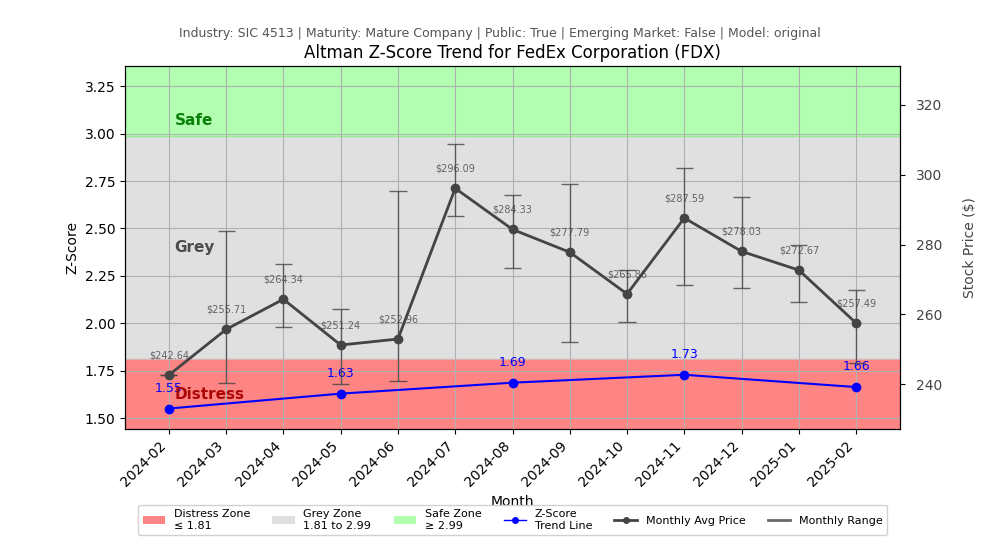
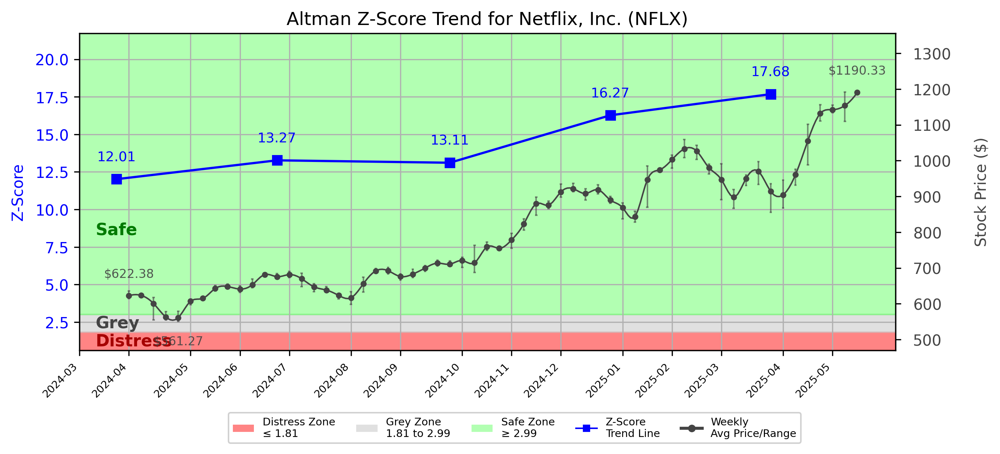
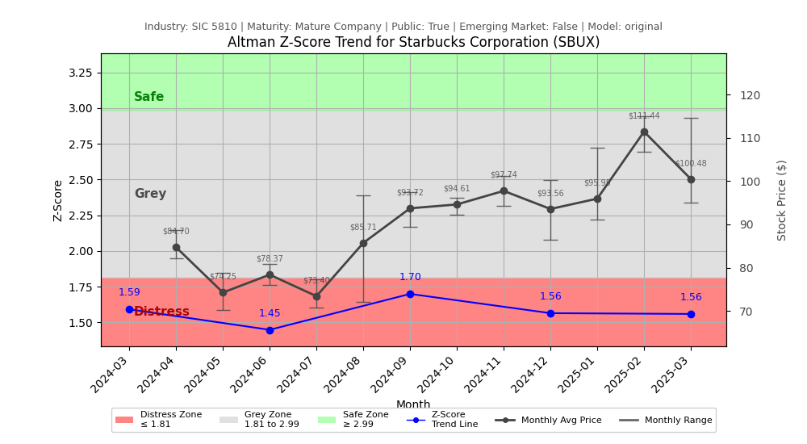

| Logo & Name | Full Report | Trend Chart | AI Generated Advice |
|-------------|-------------|:-------------:|---------------------|
| 
 American Airlines Group Inc
 | [Report](output/AAL/zscore_AAL_zscore_full_report.md) |  | 
<b>CEO:</b> 🔧 RESTRUCTURE <b>CFO:</b> 💰 OPTIMIZE CAPITAL <b>Conservative:</b> 📉 SELL <b>Dividend:</b> 📉 SELL <b>Value:</b> ⚖️ HOLD <b>Growth:</b> ⚖️ HOLD <b>Aggressive:</b> 📉 SELL <b>Short-Seller:</b> 📉 SELL
 |
| 
 Apple Inc
 | [Report](output/AAPL/zscore_AAPL_zscore_full_report.md) |  | 
<b>CEO:</b> 📢 COMMUNICATE GROWTH <b>CFO:</b> 💰 OPTIMIZE CAPITAL <b>Conservative:</b> ⚖️ HOLD <b>Dividend:</b> ⚖️ HOLD <b>Value:</b> 📈 BUY <b>Growth:</b> 📈 BUY <b>Aggressive:</b> 📈 BUY <b>Short-Seller:</b> 📉 SELL
 |
| 
 AbbVie Inc
 | [Report](output/ABBV/zscore_ABBV_zscore_full_report.md) |  | 
<b>CEO:</b> 🔧 RESTRUCTURE <b>CFO:</b> 💰 OPTIMIZE CAPITAL <b>Conservative:</b> 📉 SELL <b>Dividend:</b> 📉 SELL <b>Value:</b> ⚖️ HOLD <b>Growth:</b> ⚖️ HOLD <b>Aggressive:</b> ⚖️ HOLD <b>Short-Seller:</b> 📉 SELL
 |
| 
 Adobe Inc
 | [Report](output/ADBE/zscore_ADBE_zscore_full_report.md) |  | 
<b>CEO:</b> 📢 COMMUNICATE GROWTH <b>CFO:</b> 📊 MONITOR METRICS <b>Conservative:</b> ⚖️ HOLD <b>Dividend:</b> ⚖️ HOLD <b>Value:</b> 📈 BUY <b>Growth:</b> 📈 BUY <b>Aggressive:</b> 📈 BUY <b>Short-Seller:</b> ⚖️ HOLD
 |
| 
 Automatic Data Processing Inc
 | [Report](output/ADP/zscore_ADP_zscore_full_report.md) |  | 
<b>CEO:</b> 📊 STRATEGIC OVERSIGHT <b>CFO:</b> 📈 ENHANCE IR <b>Conservative:</b> ⚖️ HOLD <b>Dividend:</b> 📈 BUY <b>Value:</b> ⚖️ HOLD <b>Growth:</b> ⚖️ HOLD <b>Aggressive:</b> ⚖️ HOLD <b>Short-Seller:</b> ⚖️ HOLD
 |
| 
 American Electric Power Company Inc
 | [Report](output/AEP/zscore_AEP_zscore_full_report.md) |  | 
<b>CEO:</b> 🔧 RESTRUCTURE <b>CFO:</b> 📊 MONITOR CAPITAL <b>Conservative:</b> 📉 SELL <b>Dividend:</b> 📉 SELL <b>Value:</b> ⚖️ HOLD <b>Growth:</b> ⚖️ HOLD <b>Aggressive:</b> ⚖️ HOLD <b>Short-Seller:</b> 📉 SELL
 |
| 
 Applied Materials Inc
 | [Report](output/AMAT/zscore_AMAT_zscore_full_report.md) |  | 
<b>CEO:</b> 📊 MONITOR INDICATORS <b>CFO:</b> 🛠️ PREPARE ACTION <b>Conservative:</b> 📈 BUY <b>Dividend:</b> ⚖️ HOLD <b>Value:</b> 📈 BUY <b>Growth:</b> 📈 BUY <b>Aggressive:</b> 📈 BUY <b>Short-Seller:</b> ⚖️ HOLD
 |
| 
 AMC Entertainment Holdings Inc
 | [Report](output/AMC/zscore_AMC_zscore_full_report.md) |  | 
<b>CEO:</b> 🔧 RESTRUCTURE <b>CFO:</b> 💎 DIVIDEND FOCUS <b>Conservative:</b> 📉 SELL <b>Dividend:</b> 📉 SELL <b>Value:</b> ⚖️ HOLD <b>Growth:</b> ⚖️ HOLD <b>Aggressive:</b> 📉 SELL <b>Short-Seller:</b> 📈 BUY
 |
| 
 Advanced Micro Devices Inc
 | [Report](output/AMD/zscore_AMD_zscore_full_report.md) |  | 
<b>CEO:</b> 🔧 RESTRUCTURE <b>CFO:</b> 💰 OPTIMIZE CAPITAL <b>Conservative:</b> 📉 SELL <b>Dividend:</b> 📉 SELL <b>Value:</b> ⚖️ HOLD <b>Growth:</b> ⚖️ HOLD <b>Aggressive:</b> ⚖️ HOLD <b>Short-Seller:</b> ⚖️ HOLD
 |
| 
 Amgen Inc
 | [Report](output/AMGN/zscore_AMGN_zscore_full_report.md) |  | 
<b>CEO:</b> 🔧 RESTRUCTURE <b>CFO:</b> 💰 OPTIMIZE CAPITAL <b>Conservative:</b> 📉 SELL <b>Dividend:</b> ⚖️ HOLD <b>Value:</b> ⚖️ HOLD <b>Growth:</b> ⚖️ HOLD <b>Aggressive:</b> 📈 BUY <b>Short-Seller:</b> 📉 SELL
 |
| 
 Amazon.com Inc
 | [Report](output/AMZN/zscore_AMZN_zscore_full_report.md) |  | 
<b>CEO:</b> 🔧 RESTRUCTURE <b>CFO:</b> 💰 OPTIMIZE CAPITAL <b>Conservative:</b> 📉 SELL <b>Dividend:</b> ⚖️ HOLD <b>Value:</b> ⚖️ HOLD <b>Growth:</b> ⚖️ HOLD <b>Aggressive:</b> 📈 BUY <b>Short-Seller:</b> 📉 SELL
 |
| 
 Broadcom Inc
 | [Report](output/AVGO/zscore_AVGO_zscore_full_report.md) |  | 
<b>CEO:</b> 📊 MONITOR INDICATORS <b>CFO:</b> 💰 OPTIMIZE CAPITAL <b>Conservative:</b> ⚖️ HOLD <b>Dividend:</b> ⚖️ HOLD <b>Value:</b> 📈 BUY <b>Growth:</b> 📈 BUY <b>Aggressive:</b> 📈 BUY <b>Short-Seller:</b> 📉 SELL
 |
| 
 American Water Works Co Inc
 | [Report](output/AWK/zscore_AWK_zscore_full_report.md) |  | 
<b>CEO:</b> 🔧 RESTRUCTURE <b>CFO:</b> 💰 OPTIMIZE CAPITAL <b>Conservative:</b> 📉 SELL <b>Dividend:</b> ⚖️ HOLD <b>Value:</b> ⚖️ HOLD <b>Growth:</b> ⚖️ HOLD <b>Aggressive:</b> 📉 SELL <b>Short-Seller:</b> 📈 BUY
 |
| 
 Boeing Co
 | [Report](output/BA/zscore_BA_zscore_full_report.md) |  | 
<b>CEO:</b> 📢 COMMUNICATE GROWTH <b>CFO:</b> 💰 OPTIMIZE CAPITAL <b>Conservative:</b> 📉 SELL <b>Dividend:</b> 📉 SELL <b>Value:</b> ⚖️ HOLD <b>Growth:</b> ⚖️ HOLD <b>Aggressive:</b> 📈 BUY <b>Short-Seller:</b> 📉 SELL
 |
| 
 Best Buy Co Inc
 | [Report](output/BBY/zscore_BBY_zscore_full_report.md) |  | 
<b>CEO:</b> 🔧 RESTRUCTURE <b>CFO:</b> 💰 OPTIMIZE CAPITAL <b>Conservative:</b> 📉 SELL <b>Dividend:</b> 📉 SELL <b>Value:</b> ⚖️ HOLD <b>Growth:</b> ⚖️ HOLD <b>Aggressive:</b> ⚖️ HOLD <b>Short-Seller:</b> 📈 BUY
 |
| 
 Cardinal Health Inc
 | [Report](output/CAH/zscore_CAH_zscore_full_report.md) |  | 
<b>CEO:</b> 🔧 RESTRUCTURE <b>CFO:</b> 💰 OPTIMIZE CAPITAL <b>Conservative:</b> 📉 SELL <b>Dividend:</b> ⚖️ HOLD <b>Value:</b> ⚖️ HOLD <b>Growth:</b> ⚖️ HOLD <b>Aggressive:</b> ⚖️ HOLD <b>Short-Seller:</b> 📉 SELL
 |
| 
 Caterpillar Inc
 | [Report](output/CAT/zscore_CAT_zscore_full_report.md) |  | 
<b>CEO:</b> 📢 COMMUNICATE GROWTH <b>CFO:</b> 💰 OPTIMIZE CAPITAL <b>Conservative:</b> ⚖️ HOLD <b>Dividend:</b> 📈 BUY <b>Value:</b> 📈 BUY <b>Growth:</b> 📈 BUY <b>Aggressive:</b> 📈 BUY <b>Short-Seller:</b> ⚖️ HOLD
 |
| 
 Carnival Corp
 | [Report](output/CCL/zscore_CCL_zscore_full_report.md) |  | 
<b>CEO:</b> 📢 COMMUNICATE GROWTH <b>CFO:</b> 💰 OPTIMIZE CAPITAL <b>Conservative:</b> 📉 SELL <b>Dividend:</b> 📉 SELL <b>Value:</b> ⚖️ HOLD <b>Growth:</b> ⚖️ HOLD <b>Aggressive:</b> 📈 BUY <b>Short-Seller:</b> ⚖️ HOLD
 |
| 
 Colgate-Palmolive Co
 | [Report](output/CL/zscore_CL_zscore_full_report.md) |  | 
<b>CEO:</b> 📢 COMMUNICATE GROWTH <b>CFO:</b> 💰 OPTIMIZE & INVEST <b>Conservative:</b> 📈 BUY <b>Dividend:</b> 📈 BUY <b>Value:</b> ⚖️ HOLD <b>Growth:</b> 📈 BUY <b>Aggressive:</b> 📈 BUY <b>Short-Seller:</b> 📉 SELL
 |
| 
 ConocoPhillips
 | [Report](output/COP/zscore_COP_zscore_full_report.md) |  | 
<b>CEO:</b> 📢 COMMUNICATE GROWTH <b>CFO:</b> 💰 OPTIMIZE CAPITAL <b>Conservative:</b> ⚖️ HOLD <b>Dividend:</b> ⚖️ HOLD <b>Value:</b> 📈 BUY <b>Growth:</b> 📈 BUY <b>Aggressive:</b> 📈 BUY <b>Short-Seller:</b> ⚖️ HOLD
 |
| 
 Costco Wholesale Corp
 | [Report](output/COST/zscore_COST_zscore_full_report.md) |  | 
<b>CEO:</b> 📊 MONITOR INDICATORS <b>CFO:</b> 📊 MONITOR CAPITAL <b>Conservative:</b> ⚖️ HOLD <b>Dividend:</b> 📈 BUY <b>Value:</b> 📈 BUY <b>Growth:</b> 📈 BUY <b>Aggressive:</b> 📈 BUY <b>Short-Seller:</b> 📉 SELL
 |
| 
 Salesforce Inc
 | [Report](output/CRM/zscore_CRM_zscore_full_report.md) |  | 
<b>CEO:</b> 📢 COMMUNICATE GROWTH <b>CFO:</b> 💰 OPTIMIZE CAPITAL <b>Conservative:</b> 📈 BUY <b>Dividend:</b> 📈 BUY <b>Value:</b> ⚖️ HOLD <b>Growth:</b> 📈 BUY <b>Aggressive:</b> 📈 BUY <b>Short-Seller:</b> ⚖️ HOLD
 |
| 
 CrowdStrike Holdings Inc
 | [Report](output/CRWD/zscore_CRWD_zscore_full_report.md) |  | 
<b>CEO:</b> 📊 MONITOR INDICATORS <b>CFO:</b> 💰 OPTIMIZE & INVEST <b>Conservative:</b> ⚖️ HOLD <b>Dividend:</b> ⚖️ HOLD <b>Value:</b> 📈 BUY <b>Growth:</b> 📈 BUY <b>Aggressive:</b> 📈 BUY <b>Short-Seller:</b> 📉 SELL
 |
| 
 CSX Corp
 | [Report](output/CSX/zscore_CSX_zscore_full_report.md) |  | 
<b>CEO:</b> 📢 COMMUNICATE GROWTH <b>CFO:</b> 💰 OPTIMIZE CAPITAL <b>Conservative:</b> ⚖️ HOLD <b>Dividend:</b> ⚖️ HOLD <b>Value:</b> 📈 BUY <b>Growth:</b> 📈 BUY <b>Aggressive:</b> ⚖️ HOLD <b>Short-Seller:</b> ⚖️ HOLD
 |
| 
 CVS Health Corp
 | [Report](output/CVS/zscore_CVS_zscore_full_report.md) |  | 
<b>CEO:</b> 🔧 RESTRUCTURE <b>CFO:</b> 💰 OPTIMIZE CAPITAL <b>Conservative:</b> 📉 SELL <b>Dividend:</b> ⚖️ HOLD <b>Value:</b> ⚖️ HOLD <b>Growth:</b> ⚖️ HOLD <b>Aggressive:</b> 📈 BUY <b>Short-Seller:</b> 📉 SELL
 |
| 
 Chevron Corp
 | [Report](output/CVX/zscore_CVX_zscore_full_report.md) |  | 
<b>CEO:</b> 📢 COMMUNICATE GROWTH <b>CFO:</b> 💰 OPTIMIZE CAPITAL <b>Conservative:</b> ⚖️ HOLD <b>Dividend:</b> 📈 BUY <b>Value:</b> ⚖️ HOLD <b>Growth:</b> ⚖️ HOLD <b>Aggressive:</b> ⚖️ HOLD <b>Short-Seller:</b> ⚖️ HOLD
 |
| 
 Dominion Energy Inc
 | [Report](output/D/zscore_D_zscore_full_report.md) |  | 
<b>CEO:</b> 🔧 RESTRUCTURE <b>CFO:</b> 💰 OPTIMIZE CAPITAL <b>Conservative:</b> 📉 SELL <b>Dividend:</b> 📉 SELL <b>Value:</b> ⚖️ HOLD <b>Growth:</b> ⚖️ HOLD <b>Aggressive:</b> ⚖️ HOLD <b>Short-Seller:</b> ⚖️ HOLD
 |
| 
 DoorDash Inc
 | [Report](output/DASH/zscore_DASH_zscore_full_report.md) |  | 
<b>CEO:</b> 📊 MONITOR INDICATORS <b>CFO:</b> 💰 OPTIMIZE & INVEST <b>Conservative:</b> ⚖️ HOLD <b>Dividend:</b> ⚖️ HOLD <b>Value:</b> 📈 BUY <b>Growth:</b> 📈 BUY <b>Aggressive:</b> 📈 BUY <b>Short-Seller:</b> 📉 SELL
 |
| 
 Datadog Inc
 | [Report](output/DDOG/zscore_DDOG_zscore_full_report.md) |  | 
<b>CEO:</b> 📢 COMMUNICATE GROWTH <b>CFO:</b> 💰 OPTIMIZE CAPITAL <b>Conservative:</b> ⚖️ HOLD <b>Dividend:</b> ⚖️ HOLD <b>Value:</b> 📈 BUY <b>Growth:</b> 📈 BUY <b>Aggressive:</b> 📈 BUY <b>Short-Seller:</b> 📉 SELL
 |
| 
 Deere & Co
 | [Report](output/DE/zscore_DE_zscore_full_report.md) |  | 
<b>CEO:</b> 🔧 RESTRUCTURE <b>CFO:</b> 💰 OPTIMIZE CAPITAL <b>Conservative:</b> 📉 SELL <b>Dividend:</b> ⚖️ HOLD <b>Value:</b> ⚖️ HOLD <b>Growth:</b> ⚖️ HOLD <b>Aggressive:</b> 📈 BUY <b>Short-Seller:</b> ⚖️ HOLD
 |
| 
 Danaher Corp
 | [Report](output/DHR/zscore_DHR_zscore_full_report.md) |  | 
<b>CEO:</b> 🔧 RESTRUCTURE <b>CFO:</b> 💵 MANAGE CASH <b>Conservative:</b> 📉 SELL <b>Dividend:</b> 📉 SELL <b>Value:</b> ⚖️ HOLD <b>Growth:</b> ⚖️ HOLD <b>Aggressive:</b> 📈 BUY <b>Short-Seller:</b> ⚖️ HOLD
 |
| 
 Walt Disney Co
 | [Report](output/DIS/zscore_DIS_zscore_full_report.md) |  | 
<b>CEO:</b> 📢 COMMUNICATE GROWTH <b>CFO:</b> 💰 OPTIMIZE CAPITAL <b>Conservative:</b> 📉 SELL <b>Dividend:</b> ⚖️ HOLD <b>Value:</b> ⚖️ HOLD <b>Growth:</b> ⚖️ HOLD <b>Aggressive:</b> ⚖️ HOLD <b>Short-Seller:</b> 📉 SELL
 |
| 
 DocuSign Inc
 | [Report](output/DOCU/zscore_DOCU_zscore_full_report.md) |  | 
<b>CEO:</b> 📢 COMMUNICATE GROWTH <b>CFO:</b> 💰 OPTIMIZE CAPITAL <b>Conservative:</b> 📈 BUY <b>Dividend:</b> ⚖️ HOLD <b>Value:</b> 📈 BUY <b>Growth:</b> 📈 BUY <b>Aggressive:</b> 📈 BUY <b>Short-Seller:</b> ⚖️ HOLD
 |
| 
 Duke Energy Corp
 | [Report](output/DUK/zscore_DUK_zscore_full_report.md) |  | 
<b>CEO:</b> 📢 COMMUNICATE GROWTH <b>CFO:</b> 💰 OPTIMIZE CAPITAL <b>Conservative:</b> 📉 SELL <b>Dividend:</b> 📉 SELL <b>Value:</b> ⚖️ HOLD <b>Growth:</b> ⚖️ HOLD <b>Aggressive:</b> ⚖️ HOLD <b>Short-Seller:</b> 📉 SELL
 |
| 
 Consolidated Edison Inc
 | [Report](output/ED/zscore_ED_zscore_full_report.md) |  | 
<b>CEO:</b> 🔧 RESTRUCTURE <b>CFO:</b> 💰 OPTIMIZE CAPITAL <b>Conservative:</b> 📉 SELL <b>Dividend:</b> 📉 SELL <b>Value:</b> ⚖️ HOLD <b>Growth:</b> ⚖️ HOLD <b>Aggressive:</b> 📉 SELL <b>Short-Seller:</b> 📉 SELL
 |
| 
 Emerson Electric Co
 | [Report](output/EMR/zscore_EMR_zscore_full_report.md) |  | 
<b>CEO:</b> 🔧 RESTRUCTURE <b>CFO:</b> 💰 OPTIMIZE CAPITAL <b>Conservative:</b> 📉 SELL <b>Dividend:</b> ⚖️ HOLD <b>Value:</b> ⚖️ HOLD <b>Growth:</b> ⚖️ HOLD <b>Aggressive:</b> 📈 BUY <b>Short-Seller:</b> ⚖️ HOLD
 |
| 
 EOG Resources Inc
 | [Report](output/EOG/zscore_EOG_zscore_full_report.md) |  | 
<b>CEO:</b> 📢 COMMUNICATE GROWTH <b>CFO:</b> 📊 MONITOR CAPITAL <b>Conservative:</b> 📉 SELL <b>Dividend:</b> ⚖️ HOLD <b>Value:</b> ⚖️ HOLD <b>Growth:</b> ⚖️ HOLD <b>Aggressive:</b> ⚖️ HOLD <b>Short-Seller:</b> 📉 SELL
 |
| 
 Eaton Corporation PLC
 | [Report](output/ETN/zscore_ETN_zscore_full_report.md) |  | 
<b>CEO:</b> 📊 MONITOR INDICATORS <b>CFO:</b> 📊 MONITOR CAPITAL <b>Conservative:</b> ⚖️ HOLD <b>Dividend:</b> ⚖️ HOLD <b>Value:</b> 📈 BUY <b>Growth:</b> 📈 BUY <b>Aggressive:</b> 📈 BUY <b>Short-Seller:</b> 📉 SELL
 |
| 
 Exelon Corp
 | [Report](output/EXC/zscore_EXC_zscore_full_report.md) |  | 
<b>CEO:</b> 🔧 RESTRUCTURE <b>CFO:</b> 💰 OPTIMIZE CAPITAL <b>Conservative:</b> 📉 SELL <b>Dividend:</b> ⚖️ HOLD <b>Value:</b> ⚖️ HOLD <b>Growth:</b> ⚖️ HOLD <b>Aggressive:</b> 📈 BUY <b>Short-Seller:</b> 📈 BUY
 |
| 
 Ford Motor Co
 | [Report](output/F/zscore_F_zscore_full_report.md) |  | 
<b>CEO:</b> 🔧 RESTRUCTURE <b>CFO:</b> 💰 OPTIMIZE CAPITAL <b>Conservative:</b> 📉 SELL <b>Dividend:</b> 📉 SELL <b>Value:</b> ⚖️ HOLD <b>Growth:</b> ⚖️ HOLD <b>Aggressive:</b> ⚖️ HOLD <b>Short-Seller:</b> 📈 BUY
 |
| 
 Freeport-McMoRan Inc
 | [Report](output/FCX/zscore_FCX_zscore_full_report.md) |  | 
<b>CEO:</b> 🔧 RESTRUCTURE <b>CFO:</b> 📊 MONITOR CAPITAL <b>Conservative:</b> ⚖️ HOLD <b>Dividend:</b> ⚖️ HOLD <b>Value:</b> 📈 BUY <b>Growth:</b> 📈 BUY <b>Aggressive:</b> 📈 BUY <b>Short-Seller:</b> ⚖️ HOLD
 |
| 
 FedEx Corp
 | [Report](output/FDX/zscore_FDX_zscore_full_report.md) |  | 
<b>CEO:</b> 🎯 STRATEGIC FOCUS <b>CFO:</b> 💰 OPTIMIZE CAPITAL <b>Conservative:</b> 📉 SELL <b>Dividend:</b> ⚖️ HOLD <b>Value:</b> ⚖️ HOLD <b>Growth:</b> ⚖️ HOLD <b>Aggressive:</b> ⚖️ HOLD <b>Short-Seller:</b> 📈 BUY
 |
| 
 General Dynamics Corp
 | [Report](output/GD/zscore_GD_zscore_full_report.md) |  | 
<b>CEO:</b> 📊 MONITOR INDICATORS <b>CFO:</b> 💰 OPTIMIZE CAPITAL <b>Conservative:</b> 📈 BUY <b>Dividend:</b> ⚖️ HOLD <b>Value:</b> 📈 BUY <b>Growth:</b> 📈 BUY <b>Aggressive:</b> 📈 BUY <b>Short-Seller:</b> ⚖️ HOLD
 |
| 
 GE Aerospace
 | [Report](output/GE/zscore_GE_zscore_full_report.md) |  | 
<b>CEO:</b> 📢 COMMUNICATE GROWTH <b>CFO:</b> 💰 OPTIMIZE CAPITAL <b>Conservative:</b> ⚖️ HOLD <b>Dividend:</b> ⚖️ HOLD <b>Value:</b> ⚖️ HOLD <b>Growth:</b> 📈 BUY <b>Aggressive:</b> 📈 BUY <b>Short-Seller:</b> 📉 SELL
 |
| 
 Gilead Sciences Inc
 | [Report](output/GILD/zscore_GILD_zscore_full_report.md) |  | 
<b>CEO:</b> 📢 COMMUNICATE GROWTH <b>CFO:</b> 💰 OPTIMIZE CAPITAL <b>Conservative:</b> 📉 SELL <b>Dividend:</b> ⚖️ HOLD <b>Value:</b> ⚖️ HOLD <b>Growth:</b> 📈 BUY <b>Aggressive:</b> 📈 BUY <b>Short-Seller:</b> ⚖️ HOLD
 |
| 
 General Mills Inc
 | [Report](output/GIS/zscore_GIS_zscore_full_report.md) |  | 
<b>CEO:</b> 📊 STRATEGIC OVERSIGHT <b>CFO:</b> 📊 MONITOR CAPITAL <b>Conservative:</b> ⚖️ HOLD <b>Dividend:</b> 📈 BUY <b>Value:</b> ⚖️ HOLD <b>Growth:</b> ⚖️ HOLD <b>Aggressive:</b> ⚖️ HOLD <b>Short-Seller:</b> ⚖️ HOLD
 |
| 
 General Motors Co
 | [Report](output/GM/zscore_GM_zscore_full_report.md) |  | 
<b>CEO:</b> 📢 COMMUNICATE GROWTH <b>CFO:</b> 💰 OPTIMIZE CAPITAL <b>Conservative:</b> 📉 SELL <b>Dividend:</b> 📉 SELL <b>Value:</b> ⚖️ HOLD <b>Growth:</b> ⚖️ HOLD <b>Aggressive:</b> ⚖️ HOLD <b>Short-Seller:</b> 📉 SELL
 |
| 
 GameStop Corp
 | [Report](output/GME/zscore_GME_zscore_full_report.md) |  | 
<b>CEO:</b> 🔧 RESTRUCTURE <b>CFO:</b> 💰 OPTIMIZE CAPITAL <b>Conservative:</b> ⚖️ HOLD <b>Dividend:</b> ⚖️ HOLD <b>Value:</b> ⚖️ HOLD <b>Growth:</b> 📈 BUY <b>Aggressive:</b> 📈 BUY <b>Short-Seller:</b> ⚖️ HOLD
 |
| 
 Alphabet Inc
 | [Report](output/GOOG/zscore_GOOG_zscore_full_report.md) |  | 
<b>CEO:</b> 📢 COMMUNICATE GROWTH <b>CFO:</b> 💰 OPTIMIZE CAPITAL <b>Conservative:</b> ⚖️ HOLD <b>Dividend:</b> ⚖️ HOLD <b>Value:</b> 📈 BUY <b>Growth:</b> 📈 BUY <b>Aggressive:</b> 📈 BUY <b>Short-Seller:</b> 📉 SELL
 |
| 
 Alphabet Inc
 | [Report](output/GOOGL/zscore_GOOGL_zscore_full_report.md) |  | 
<b>CEO:</b> 📢 COMMUNICATE GROWTH <b>CFO:</b> 💰 OPTIMIZE & INVEST <b>Conservative:</b> ⚖️ HOLD <b>Dividend:</b> 📈 BUY <b>Value:</b> 📈 BUY <b>Growth:</b> 📈 BUY <b>Aggressive:</b> 📈 BUY <b>Short-Seller:</b> 📉 SELL
 |
| 
 Halliburton Co
 | [Report](output/HAL/zscore_HAL_zscore_full_report.md) |  | 
<b>CEO:</b> 📢 COMMUNICATE GROWTH <b>CFO:</b> 💰 OPTIMIZE CAPITAL <b>Conservative:</b> ⚖️ HOLD <b>Dividend:</b> 📈 BUY <b>Value:</b> 📈 BUY <b>Growth:</b> ⚖️ HOLD <b>Aggressive:</b> 📈 BUY <b>Short-Seller:</b> ⚖️ HOLD
 |
| 
 Home Depot Inc
 | [Report](output/HD/zscore_HD_zscore_full_report.md) |  | 
<b>CEO:</b> 📢 COMMUNICATE GROWTH <b>CFO:</b> 💰 OPTIMIZE & INVEST <b>Conservative:</b> 📈 BUY <b>Dividend:</b> 📈 BUY <b>Value:</b> ⚖️ HOLD <b>Growth:</b> 📈 BUY <b>Aggressive:</b> 📈 BUY <b>Short-Seller:</b> ⚖️ HOLD
 |
| 
 Honeywell International Inc
 | [Report](output/HON/zscore_HON_zscore_full_report.md) |  | 
<b>CEO:</b> 🔧 RESTRUCTURE <b>CFO:</b> 💰 OPTIMIZE CAPITAL <b>Conservative:</b> 📉 SELL <b>Dividend:</b> ⚖️ HOLD <b>Value:</b> ⚖️ HOLD <b>Growth:</b> ⚖️ HOLD <b>Aggressive:</b> 📈 BUY <b>Short-Seller:</b> ⚖️ HOLD
 |
| 
 Hershey Co
 | [Report](output/HSY/zscore_HSY_zscore_full_report.md) |  | 
<b>CEO:</b> 📢 COMMUNICATE GROWTH <b>CFO:</b> 📋 PLAN STRATEGY <b>Conservative:</b> ⚖️ HOLD <b>Dividend:</b> 📈 BUY <b>Value:</b> 📈 BUY <b>Growth:</b> ⚖️ HOLD <b>Aggressive:</b> ⚖️ HOLD <b>Short-Seller:</b> ⚖️ HOLD
 |
| 
 International Business Machines Corp
 | [Report](output/IBM/zscore_IBM_zscore_full_report.md) |  | 
<b>CEO:</b> 🚀 FOCUS INNOVATION <b>CFO:</b> 💰 OPTIMIZE CAPITAL <b>Conservative:</b> ⚖️ HOLD <b>Dividend:</b> 📈 BUY <b>Value:</b> 📈 BUY <b>Growth:</b> 📈 BUY <b>Aggressive:</b> 📈 BUY <b>Short-Seller:</b> ⚖️ HOLD
 |
| 
 Intel Corp
 | [Report](output/INTC/zscore_INTC_zscore_full_report.md) |  | 
<b>CEO:</b> 📢 COMMUNICATE GROWTH <b>CFO:</b> 💰 OPTIMIZE CAPITAL <b>Conservative:</b> 📉 SELL <b>Dividend:</b> ⚖️ HOLD <b>Value:</b> ⚖️ HOLD <b>Growth:</b> ⚖️ HOLD <b>Aggressive:</b> 📈 BUY <b>Short-Seller:</b> 📉 SELL
 |
| 
 Intuit Inc
 | [Report](output/INTU/zscore_INTU_zscore_full_report.md) |  | 
<b>CEO:</b> 📊 MONITOR INDICATORS <b>CFO:</b> 📊 STRATEGIC INVEST <b>Conservative:</b> ⚖️ HOLD <b>Dividend:</b> ⚖️ HOLD <b>Value:</b> 📈 BUY <b>Growth:</b> 📈 BUY <b>Aggressive:</b> 📈 BUY <b>Short-Seller:</b> 📉 SELL
 |
| 
 Illinois Tool Works Inc
 | [Report](output/ITW/zscore_ITW_zscore_full_report.md) |  | 
<b>CEO:</b> 📢 COMMUNICATE GROWTH <b>CFO:</b> 📊 STRATEGIC INVEST <b>Conservative:</b> ⚖️ HOLD <b>Dividend:</b> ⚖️ HOLD <b>Value:</b> 📈 BUY <b>Growth:</b> 📈 BUY <b>Aggressive:</b> 📈 BUY <b>Short-Seller:</b> 📉 SELL
 |
| 
 Johnson & Johnson
 | [Report](output/JNJ/zscore_JNJ_zscore_full_report.md) |  | 
<b>CEO:</b> 📢 COMMUNICATE GROWTH <b>CFO:</b> 💰 OPTIMIZE CAPITAL <b>Conservative:</b> 📈 BUY <b>Dividend:</b> 📈 BUY <b>Value:</b> ⚖️ HOLD <b>Growth:</b> 📈 BUY <b>Aggressive:</b> ⚖️ HOLD <b>Short-Seller:</b> ⚖️ HOLD
 |
| 
 Kellanova
 | [Report](output/K/zscore_K_zscore_full_report.md) |  | 
<b>CEO:</b> 🔧 RESTRUCTURE <b>CFO:</b> 💰 OPTIMIZE CAPITAL <b>Conservative:</b> 📉 SELL <b>Dividend:</b> ⚖️ HOLD <b>Value:</b> ⚖️ HOLD <b>Growth:</b> ⚖️ HOLD <b>Aggressive:</b> ⚖️ HOLD <b>Short-Seller:</b> ⚖️ HOLD
 |
| 
 Kimberly-Clark Corp
 | [Report](output/KMB/zscore_KMB_zscore_full_report.md) |  | 
<b>CEO:</b> 📢 COMMUNICATE GROWTH <b>CFO:</b> 💰 OPTIMIZE CAPITAL <b>Conservative:</b> 📉 SELL <b>Dividend:</b> ⚖️ HOLD <b>Value:</b> ⚖️ HOLD <b>Growth:</b> ⚖️ HOLD <b>Aggressive:</b> 📉 SELL <b>Short-Seller:</b> ⚖️ HOLD
 |
| 
 Kinder Morgan Inc
 | [Report](output/KMI/zscore_KMI_zscore_full_report.md) |  | 
<b>CEO:</b> 📢 COMMUNICATE GROWTH <b>CFO:</b> 💵 MANAGE CASH <b>Conservative:</b> 📉 SELL <b>Dividend:</b> ⚖️ HOLD <b>Value:</b> ⚖️ HOLD <b>Growth:</b> ⚖️ HOLD <b>Aggressive:</b> 📈 BUY <b>Short-Seller:</b> 📉 SELL
 |
| 
 Coca-Cola Co
 | [Report](output/KO/zscore_KO_zscore_full_report.md) |  | 
<b>CEO:</b> 📢 COMMUNICATE GROWTH <b>CFO:</b> 💰 OPTIMIZE CAPITAL <b>Conservative:</b> 📉 SELL <b>Dividend:</b> 📈 BUY <b>Value:</b> ⚖️ HOLD <b>Growth:</b> ⚖️ HOLD <b>Aggressive:</b> 📈 BUY <b>Short-Seller:</b> ⚖️ HOLD
 |
| 
 Lockheed Martin Corp
 | [Report](output/LMT/zscore_LMT_zscore_full_report.md) |  | 
<b>CEO:</b> 📢 COMMUNICATE GROWTH <b>CFO:</b> 💰 OPTIMIZE CAPITAL <b>Conservative:</b> ⚖️ HOLD <b>Dividend:</b> ⚖️ HOLD <b>Value:</b> ⚖️ HOLD <b>Growth:</b> 📈 BUY <b>Aggressive:</b> 📈 BUY <b>Short-Seller:</b> 📉 SELL
 |
| 
 Lowe's Companies Inc
 | [Report](output/LOW/zscore_LOW_zscore_full_report.md) |  | 
<b>CEO:</b> 🔧 RESTRUCTURE <b>CFO:</b> 💰 OPTIMIZE CAPITAL <b>Conservative:</b> 📉 SELL <b>Dividend:</b> ⚖️ HOLD <b>Value:</b> ⚖️ HOLD <b>Growth:</b> ⚖️ HOLD <b>Aggressive:</b> 📈 BUY <b>Short-Seller:</b> 📉 SELL
 |
| 
 Lululemon Athletica Inc
 | [Report](output/LULU/zscore_LULU_zscore_full_report.md) |  | 
<b>CEO:</b> 📢 COMMUNICATE GROWTH <b>CFO:</b> 📈 ENHANCE IR <b>Conservative:</b> ⚖️ HOLD <b>Dividend:</b> ⚖️ HOLD <b>Value:</b> 📈 BUY <b>Growth:</b> 📈 BUY <b>Aggressive:</b> 📈 BUY <b>Short-Seller:</b> ⚖️ HOLD
 |
| 
 Lyft Inc
 | [Report](output/LYFT/zscore_LYFT_zscore_full_report.md) |  | 
<b>CEO:</b> 🔧 RESTRUCTURE <b>CFO:</b> 📊 MONITOR CAPITAL <b>Conservative:</b> 📉 SELL <b>Dividend:</b> 📉 SELL <b>Value:</b> ⚖️ HOLD <b>Growth:</b> ⚖️ HOLD <b>Aggressive:</b> ⚖️ HOLD <b>Short-Seller:</b> 📈 BUY
 |
| 
 Macy's Inc
 | [Report](output/M/zscore_M_zscore_full_report.md) |  | 
<b>CEO:</b> 🔧 RESTRUCTURE <b>CFO:</b> 💰 OPTIMIZE CAPITAL <b>Conservative:</b> 📉 SELL <b>Dividend:</b> 📉 SELL <b>Value:</b> ⚖️ HOLD <b>Growth:</b> ⚖️ HOLD <b>Aggressive:</b> 📈 BUY <b>Short-Seller:</b> 📈 BUY
 |
| 
 Mckesson Corp
 | [Report](output/MCK/zscore_MCK_zscore_full_report.md) |  | 
<b>CEO:</b> 🔧 RESTRUCTURE <b>CFO:</b> 💰 OPTIMIZE CAPITAL <b>Conservative:</b> 📉 SELL <b>Dividend:</b> ⚖️ HOLD <b>Value:</b> ⚖️ HOLD <b>Growth:</b> ⚖️ HOLD <b>Aggressive:</b> 📈 BUY <b>Short-Seller:</b> 📉 SELL
 |
| 
 MongoDB Inc
 | [Report](output/MDB/zscore_MDB_zscore_full_report.md) |  | 
<b>CEO:</b> 🚀 INNOVATE & MONITOR <b>CFO:</b> 📈 ENHANCE IR <b>Conservative:</b> ⚖️ HOLD <b>Dividend:</b> ⚖️ HOLD <b>Value:</b> 📈 BUY <b>Growth:</b> 📈 BUY <b>Aggressive:</b> 📈 BUY <b>Short-Seller:</b> 📉 SELL
 |
| 
 3M Co
 | [Report](output/MMM/zscore_MMM_zscore_full_report.md) |  | 
<b>CEO:</b> 📊 STRATEGIC OVERSIGHT <b>CFO:</b> 💰 OPTIMIZE CAPITAL <b>Conservative:</b> ⚖️ HOLD <b>Dividend:</b> 📈 BUY <b>Value:</b> 📈 BUY <b>Growth:</b> 📈 BUY <b>Aggressive:</b> ⚖️ HOLD <b>Short-Seller:</b> ⚖️ HOLD
 |
| 
 Altria Group Inc
 | [Report](output/MO/zscore_MO_zscore_full_report.md) |  | 
<b>CEO:</b> 📢 COMMUNICATE GROWTH <b>CFO:</b> 💰 OPTIMIZE CAPITAL <b>Conservative:</b> 📈 BUY <b>Dividend:</b> 📈 BUY <b>Value:</b> ⚖️ HOLD <b>Growth:</b> ⚖️ HOLD <b>Aggressive:</b> ⚖️ HOLD <b>Short-Seller:</b> ⚖️ HOLD
 |
| 
 Moderna Inc
 | [Report](output/MRNA/zscore_MRNA_zscore_full_report.md) |  | 
<b>CEO:</b> 📊 STRATEGIC OVERSIGHT <b>CFO:</b> 🛠️ PREPARE ACTION <b>Conservative:</b> ⚖️ HOLD <b>Dividend:</b> ⚖️ HOLD <b>Value:</b> ⚖️ HOLD <b>Growth:</b> ⚖️ HOLD <b>Aggressive:</b> 📈 BUY <b>Short-Seller:</b> ⚖️ HOLD
 |
| 
 Microsoft Corp
 | [Report](output/MSFT/zscore_MSFT_zscore_full_report.md) |  | 
<b>CEO:</b> 🚀 INNOVATE & MONITOR <b>CFO:</b> 📊 STRATEGIC INVEST <b>Conservative:</b> ⚖️ HOLD <b>Dividend:</b> ⚖️ HOLD <b>Value:</b> 📈 BUY <b>Growth:</b> 📈 BUY <b>Aggressive:</b> 📈 BUY <b>Short-Seller:</b> 📉 SELL
 |
| 
 Norwegian Cruise Line Holdings Ltd
 | [Report](output/NCLH/zscore_NCLH_zscore_full_report.md) |  | 
<b>CEO:</b> 🔧 RESTRUCTURE <b>CFO:</b> 🛠️ PREPARE ACTION <b>Conservative:</b> 📉 SELL <b>Dividend:</b> 📉 SELL <b>Value:</b> ⚖️ HOLD <b>Growth:</b> ⚖️ HOLD <b>Aggressive:</b> ⚖️ HOLD <b>Short-Seller:</b> 📈 BUY
 |
| 
 Nextera Energy Inc
 | [Report](output/NEE/zscore_NEE_zscore_full_report.md) |  | 
<b>CEO:</b> 🔧 RESTRUCTURE <b>CFO:</b> 💰 OPTIMIZE CAPITAL <b>Conservative:</b> 📉 SELL <b>Dividend:</b> 📉 SELL <b>Value:</b> ⚖️ HOLD <b>Growth:</b> ⚖️ HOLD <b>Aggressive:</b> ⚖️ HOLD <b>Short-Seller:</b> 📉 SELL
 |
| 
 Cloudflare Inc
 | [Report](output/NET/zscore_NET_zscore_full_report.md) |  | 
<b>CEO:</b> 📢 COMMUNICATE GROWTH <b>CFO:</b> 💰 OPTIMIZE CAPITAL <b>Conservative:</b> ⚖️ HOLD <b>Dividend:</b> ⚖️ HOLD <b>Value:</b> 📈 BUY <b>Growth:</b> 📈 BUY <b>Aggressive:</b> 📈 BUY <b>Short-Seller:</b> 📉 SELL
 |
| 
 Netflix Inc
 | [Report](output/NFLX/zscore_NFLX_zscore_full_report.md) |  | 
<b>CEO:</b> 📊 MONITOR INDICATORS <b>CFO:</b> 💰 OPTIMIZE CAPITAL <b>Conservative:</b> ⚖️ HOLD <b>Dividend:</b> ⚖️ HOLD <b>Value:</b> 📈 BUY <b>Growth:</b> 📈 BUY <b>Aggressive:</b> 📈 BUY <b>Short-Seller:</b> 📉 SELL
 |
| 
 Nike Inc
 | [Report](output/NKE/zscore_NKE_zscore_full_report.md) |  | 
<b>CEO:</b> 🔧 RESTRUCTURE <b>CFO:</b> 💰 OPTIMIZE CAPITAL <b>Conservative:</b> 📉 SELL <b>Dividend:</b> 📉 SELL <b>Value:</b> ⚖️ HOLD <b>Growth:</b> ⚖️ HOLD <b>Aggressive:</b> 📈 BUY <b>Short-Seller:</b> ⚖️ HOLD
 |
| 
 ServiceNow Inc
 | [Report](output/NOW/zscore_NOW_zscore_full_report.md) |  | 
<b>CEO:</b> 📢 COMMUNICATE GROWTH <b>CFO:</b> 💰 OPTIMIZE & INVEST <b>Conservative:</b> ⚖️ HOLD <b>Dividend:</b> ⚖️ HOLD <b>Value:</b> 📈 BUY <b>Growth:</b> 📈 BUY <b>Aggressive:</b> 📈 BUY <b>Short-Seller:</b> 📉 SELL
 |
| 
 NVIDIA Corp
 | [Report](output/NVDA/zscore_NVDA_zscore_full_report.md) |  | 
<b>CEO:</b> 🚀 INNOVATE & MONITOR <b>CFO:</b> 💰 OPTIMIZE & INVEST <b>Conservative:</b> ⚖️ HOLD <b>Dividend:</b> ⚖️ HOLD <b>Value:</b> 📈 BUY <b>Growth:</b> 📈 BUY <b>Aggressive:</b> 📈 BUY <b>Short-Seller:</b> 📉 SELL
 |
| 
 Okta Inc
 | [Report](output/OKTA/zscore_OKTA_zscore_full_report.md) |  | 
<b>CEO:</b> 📢 COMMUNICATE GROWTH <b>CFO:</b> 🛠️ PREPARE ACTION <b>Conservative:</b> ⚖️ HOLD <b>Dividend:</b> 📉 SELL <b>Value:</b> ⚖️ HOLD <b>Growth:</b> 📈 BUY <b>Aggressive:</b> 📈 BUY <b>Short-Seller:</b> ⚖️ HOLD
 |
| 
 Oracle Corp
 | [Report](output/ORCL/zscore_ORCL_zscore_full_report.md) |  | 
<b>CEO:</b> 📢 COMMUNICATE GROWTH <b>CFO:</b> 💰 OPTIMIZE CAPITAL <b>Conservative:</b> ⚖️ HOLD <b>Dividend:</b> ⚖️ HOLD <b>Value:</b> 📈 BUY <b>Growth:</b> 📈 BUY <b>Aggressive:</b> 📈 BUY <b>Short-Seller:</b> ⚖️ HOLD
 |
| 
 Palo Alto Networks Inc
 | [Report](output/PANW/zscore_PANW_zscore_full_report.md) |  | 
<b>CEO:</b> 📢 COMMUNICATE GROWTH <b>CFO:</b> 💰 OPTIMIZE & INVEST <b>Conservative:</b> ⚖️ HOLD <b>Dividend:</b> ⚖️ HOLD <b>Value:</b> 📈 BUY <b>Growth:</b> 📈 BUY <b>Aggressive:</b> 📈 BUY <b>Short-Seller:</b> 📉 SELL
 |
| 
 PG&E Corp
 | [Report](output/PCG/zscore_PCG_zscore_full_report.md) |  | 
<b>CEO:</b> 🔧 RESTRUCTURE <b>CFO:</b> 💰 OPTIMIZE CAPITAL <b>Conservative:</b> 📉 SELL <b>Dividend:</b> 📉 SELL <b>Value:</b> ⚖️ HOLD <b>Growth:</b> ⚖️ HOLD <b>Aggressive:</b> ⚖️ HOLD <b>Short-Seller:</b> 📉 SELL
 |
| 
 PepsiCo Inc
 | [Report](output/PEP/zscore_PEP_zscore_full_report.md) |  | 
<b>CEO:</b> 📊 MONITOR INDICATORS <b>CFO:</b> 💎 DIVIDEND FOCUS <b>Conservative:</b> ⚖️ HOLD <b>Dividend:</b> 📈 BUY <b>Value:</b> 📈 BUY <b>Growth:</b> 📈 BUY <b>Aggressive:</b> 📈 BUY <b>Short-Seller:</b> ⚖️ HOLD
 |
| 
 Pfizer Inc
 | [Report](output/PFE/zscore_PFE_zscore_full_report.md) |  | 
<b>CEO:</b> 🔧 RESTRUCTURE <b>CFO:</b> 💰 OPTIMIZE CAPITAL <b>Conservative:</b> ⚖️ HOLD <b>Dividend:</b> ⚖️ HOLD <b>Value:</b> ⚖️ HOLD <b>Growth:</b> ⚖️ HOLD <b>Aggressive:</b> 📉 SELL <b>Short-Seller:</b> 📈 BUY
 |
| 
 Procter & Gamble Co
 | [Report](output/PG/zscore_PG_zscore_full_report.md) |  | 
<b>CEO:</b> 📢 COMMUNICATE GROWTH <b>CFO:</b> 💰 OPTIMIZE CAPITAL <b>Conservative:</b> ⚖️ HOLD <b>Dividend:</b> 📈 BUY <b>Value:</b> 📈 BUY <b>Growth:</b> 📈 BUY <b>Aggressive:</b> 📈 BUY <b>Short-Seller:</b> 📉 SELL
 |
| 
 Parker-Hannifin Corp
 | [Report](output/PH/zscore_PH_zscore_full_report.md) |  | 
<b>CEO:</b> 📢 COMMUNICATE GROWTH <b>CFO:</b> 💰 OPTIMIZE CAPITAL <b>Conservative:</b> ⚖️ HOLD <b>Dividend:</b> ⚖️ HOLD <b>Value:</b> 📈 BUY <b>Growth:</b> 📈 BUY <b>Aggressive:</b> 📈 BUY <b>Short-Seller:</b> 📉 SELL
 |
| 
 Palantir Technologies Inc
 | [Report](output/PLTR/zscore_PLTR_zscore_full_report.md) |  | 
<b>CEO:</b> 📊 MONITOR INDICATORS <b>CFO:</b> 💰 OPTIMIZE & INVEST <b>Conservative:</b> ⚖️ HOLD <b>Dividend:</b> ⚖️ HOLD <b>Value:</b> 📈 BUY <b>Growth:</b> 📈 BUY <b>Aggressive:</b> 📈 BUY <b>Short-Seller:</b> 📉 SELL
 |
| 
 Philip Morris International Inc
 | [Report](output/PM/zscore_PM_zscore_full_report.md) |  | 
<b>CEO:</b> 📢 COMMUNICATE GROWTH <b>CFO:</b> 📈 ENHANCE IR <b>Conservative:</b> ⚖️ HOLD <b>Dividend:</b> ⚖️ HOLD <b>Value:</b> ⚖️ HOLD <b>Growth:</b> 📈 BUY <b>Aggressive:</b> 📈 BUY <b>Short-Seller:</b> ⚖️ HOLD
 |
| 
 PayPal Holdings Inc
 | [Report](output/PYPL/zscore_PYPL_zscore_full_report.md) |  | 
<b>CEO:</b> 🔧 RESTRUCTURE <b>CFO:</b> 💰 OPTIMIZE CAPITAL <b>Conservative:</b> ⚖️ HOLD <b>Dividend:</b> ⚖️ HOLD <b>Value:</b> 📈 BUY <b>Growth:</b> 📈 BUY <b>Aggressive:</b> ⚖️ HOLD <b>Short-Seller:</b> ⚖️ HOLD
 |
| 
 Qualcomm Inc
 | [Report](output/QCOM/zscore_QCOM_zscore_full_report.md) |  | 
<b>CEO:</b> 📢 COMMUNICATE GROWTH <b>CFO:</b> 💰 OPTIMIZE & INVEST <b>Conservative:</b> ⚖️ HOLD <b>Dividend:</b> ⚖️ HOLD <b>Value:</b> 📈 BUY <b>Growth:</b> 📈 BUY <b>Aggressive:</b> 📈 BUY <b>Short-Seller:</b> 📉 SELL
 |
| 
 Roblox Corp
 | [Report](output/RBLX/zscore_RBLX_zscore_full_report.md) |  | 
<b>CEO:</b> 🔧 RESTRUCTURE <b>CFO:</b> 💰 OPTIMIZE CAPITAL <b>Conservative:</b> ⚖️ HOLD <b>Dividend:</b> ⚖️ HOLD <b>Value:</b> ⚖️ HOLD <b>Growth:</b> 📈 BUY <b>Aggressive:</b> 📈 BUY <b>Short-Seller:</b> ⚖️ HOLD
 |
| 
 Rockwell Automation Inc
 | [Report](output/ROK/zscore_ROK_zscore_full_report.md) |  | 
<b>CEO:</b> 🔧 RESTRUCTURE <b>CFO:</b> 💰 OPTIMIZE CAPITAL <b>Conservative:</b> 📉 SELL <b>Dividend:</b> 📉 SELL <b>Value:</b> ⚖️ HOLD <b>Growth:</b> ⚖️ HOLD <b>Aggressive:</b> ⚖️ HOLD <b>Short-Seller:</b> 📈 BUY
 |
| 
 Roku Inc
 | [Report](output/ROKU/zscore_ROKU_zscore_full_report.md) |  | 
<b>CEO:</b> 📊 STRATEGIC OVERSIGHT <b>CFO:</b> 💰 OPTIMIZE CAPITAL <b>Conservative:</b> ⚖️ HOLD <b>Dividend:</b> ⚖️ HOLD <b>Value:</b> 📈 BUY <b>Growth:</b> 📈 BUY <b>Aggressive:</b> 📈 BUY <b>Short-Seller:</b> ⚖️ HOLD
 |
| 
 Republic Services Inc
 | [Report](output/RSG/zscore_RSG_zscore_full_report.md) |  | 
<b>CEO:</b> 📢 COMMUNICATE GROWTH <b>CFO:</b> 💰 OPTIMIZE CAPITAL <b>Conservative:</b> 📉 SELL <b>Dividend:</b> ⚖️ HOLD <b>Value:</b> ⚖️ HOLD <b>Growth:</b> ⚖️ HOLD <b>Aggressive:</b> 📈 BUY <b>Short-Seller:</b> 📉 SELL
 |
| 
 RTX Corp
 | [Report](output/RTX/zscore_RTX_zscore_full_report.md) |  | 
<b>CEO:</b> 🔧 RESTRUCTURE <b>CFO:</b> 💰 OPTIMIZE CAPITAL <b>Conservative:</b> 📉 SELL <b>Dividend:</b> 📉 SELL <b>Value:</b> ⚖️ HOLD <b>Growth:</b> ⚖️ HOLD <b>Aggressive:</b> 📈 BUY <b>Short-Seller:</b> ⚖️ HOLD
 |
| 
 Starbucks Corp
 | [Report](output/SBUX/zscore_SBUX_zscore_full_report.md) |  | 
<b>CEO:</b> 🔧 RESTRUCTURE <b>CFO:</b> 💰 OPTIMIZE CAPITAL <b>Conservative:</b> 📉 SELL <b>Dividend:</b> ⚖️ HOLD <b>Value:</b> ⚖️ HOLD <b>Growth:</b> ⚖️ HOLD <b>Aggressive:</b> ⚖️ HOLD <b>Short-Seller:</b> ⚖️ HOLD
 |
| 
 Shopify Inc
 | [Report](output/SHOP/zscore_SHOP_zscore_full_report.md) |  | 
<b>CEO:</b> 📊 MONITOR INDICATORS <b>CFO:</b> 💰 OPTIMIZE & INVEST <b>Conservative:</b> 📈 BUY <b>Dividend:</b> ⚖️ HOLD <b>Value:</b> 📈 BUY <b>Growth:</b> 📈 BUY <b>Aggressive:</b> 📈 BUY <b>Short-Seller:</b> ⚖️ HOLD
 |
| 
 Schlumberger NV
 | [Report](output/SLB/zscore_SLB_zscore_full_report.md) |  | 
<b>CEO:</b> 📊 STRATEGIC OVERSIGHT <b>CFO:</b> 💰 OPTIMIZE CAPITAL <b>Conservative:</b> ⚖️ HOLD <b>Dividend:</b> 📈 BUY <b>Value:</b> 📈 BUY <b>Growth:</b> ⚖️ HOLD <b>Aggressive:</b> 📈 BUY <b>Short-Seller:</b> ⚖️ HOLD
 |
| 
 Snowflake Inc
 | [Report](output/SNOW/zscore_SNOW_zscore_full_report.md) |  | 
<b>CEO:</b> 📢 COMMUNICATE GROWTH <b>CFO:</b> 📊 MONITOR METRICS <b>Conservative:</b> ⚖️ HOLD <b>Dividend:</b> ⚖️ HOLD <b>Value:</b> 📈 BUY <b>Growth:</b> 📈 BUY <b>Aggressive:</b> 📈 BUY <b>Short-Seller:</b> ⚖️ HOLD
 |
| 
 Southern Co
 | [Report](output/SO/zscore_SO_zscore_full_report.md) |  | 
<b>CEO:</b> 📢 COMMUNICATE GROWTH <b>CFO:</b> 💰 OPTIMIZE CAPITAL <b>Conservative:</b> 📉 SELL <b>Dividend:</b> ⚖️ HOLD <b>Value:</b> ⚖️ HOLD <b>Growth:</b> ⚖️ HOLD <b>Aggressive:</b> ⚖️ HOLD <b>Short-Seller:</b> 📉 SELL
 |
| 
 Sonos Inc
 | [Report](output/SONO/zscore_SONO_zscore_full_report.md) |  | 
<b>CEO:</b> 🔧 RESTRUCTURE <b>CFO:</b> 📈 ENHANCE IR <b>Conservative:</b> ⚖️ HOLD <b>Dividend:</b> ⚖️ HOLD <b>Value:</b> ⚖️ HOLD <b>Growth:</b> ⚖️ HOLD <b>Aggressive:</b> 📈 BUY <b>Short-Seller:</b> ⚖️ HOLD
 |
| 
 AT&T Inc
 | [Report](output/T/zscore_T_zscore_full_report.md) |  | 
<b>CEO:</b> 📢 COMMUNICATE GROWTH <b>CFO:</b> 📊 MONITOR CAPITAL <b>Conservative:</b> 📉 SELL <b>Dividend:</b> ⚖️ HOLD <b>Value:</b> ⚖️ HOLD <b>Growth:</b> ⚖️ HOLD <b>Aggressive:</b> ⚖️ HOLD <b>Short-Seller:</b> 📉 SELL
 |
| 
 Target Corp
 | [Report](output/TGT/zscore_TGT_zscore_full_report.md) |  | 
<b>CEO:</b> 📢 COMMUNICATE GROWTH <b>CFO:</b> 💰 OPTIMIZE CAPITAL <b>Conservative:</b> ⚖️ HOLD <b>Dividend:</b> 📈 BUY <b>Value:</b> 📈 BUY <b>Growth:</b> ⚖️ HOLD <b>Aggressive:</b> ⚖️ HOLD <b>Short-Seller:</b> ⚖️ HOLD
 |
| 
 Thermo Fisher Scientific Inc
 | [Report](output/TMO/zscore_TMO_zscore_full_report.md) |  | 
<b>CEO:</b> 🔧 RESTRUCTURE <b>CFO:</b> 💰 OPTIMIZE CAPITAL <b>Conservative:</b> 📉 SELL <b>Dividend:</b> 📉 SELL <b>Value:</b> ⚖️ HOLD <b>Growth:</b> ⚖️ HOLD <b>Aggressive:</b> 📈 BUY <b>Short-Seller:</b> ⚖️ HOLD
 |
| 
 T-Mobile US Inc
 | [Report](output/TMUS/zscore_TMUS_zscore_full_report.md) |  | 
<b>CEO:</b> 🔧 RESTRUCTURE <b>CFO:</b> 💰 OPTIMIZE CAPITAL <b>Conservative:</b> 📉 SELL <b>Dividend:</b> 📉 SELL <b>Value:</b> ⚖️ HOLD <b>Growth:</b> ⚖️ HOLD <b>Aggressive:</b> 📈 BUY <b>Short-Seller:</b> ⚖️ HOLD
 |
| 
 Tesla Inc
 | [Report](output/TSLA/zscore_TSLA_zscore_full_report.md) |  | 
<b>CEO:</b> 📢 COMMUNICATE GROWTH <b>CFO:</b> 💰 OPTIMIZE CAPITAL <b>Conservative:</b> ⚖️ HOLD <b>Dividend:</b> ⚖️ HOLD <b>Value:</b> 📈 BUY <b>Growth:</b> 📈 BUY <b>Aggressive:</b> 📈 BUY <b>Short-Seller:</b> 📉 SELL
 |
| 
 Twilio Inc
 | [Report](output/TWLO/zscore_TWLO_zscore_full_report.md) |  | 
<b>CEO:</b> 📢 COMMUNICATE GROWTH <b>CFO:</b> 💰 OPTIMIZE CAPITAL <b>Conservative:</b> ⚖️ HOLD <b>Dividend:</b> ⚖️ HOLD <b>Value:</b> 📈 BUY <b>Growth:</b> 📈 BUY <b>Aggressive:</b> 📈 BUY <b>Short-Seller:</b> ⚖️ HOLD
 |
| 
 Texas Instruments Inc
 | [Report](output/TXN/zscore_TXN_zscore_full_report.md) |  | 
<b>CEO:</b> 📢 COMMUNICATE GROWTH <b>CFO:</b> 📊 MONITOR CAPITAL <b>Conservative:</b> 📈 BUY <b>Dividend:</b> 📈 BUY <b>Value:</b> ⚖️ HOLD <b>Growth:</b> 📈 BUY <b>Aggressive:</b> ⚖️ HOLD <b>Short-Seller:</b> 📉 SELL
 |
| 
 Unity Software Inc
 | [Report](output/U/zscore_U_zscore_full_report.md) |  | 
<b>CEO:</b> 📢 COMMUNICATE GROWTH <b>CFO:</b> 💰 OPTIMIZE CAPITAL <b>Conservative:</b> 📉 SELL <b>Dividend:</b> 📉 SELL <b>Value:</b> ⚖️ HOLD <b>Growth:</b> ⚖️ HOLD <b>Aggressive:</b> 📈 BUY <b>Short-Seller:</b> 📈 BUY
 |
| 
 United Airlines Holdings Inc
 | [Report](output/UAL/zscore_UAL_zscore_full_report.md) |  | 
<b>CEO:</b> 📢 COMMUNICATE GROWTH <b>CFO:</b> 💰 OPTIMIZE CAPITAL <b>Conservative:</b> 📉 SELL <b>Dividend:</b> 📉 SELL <b>Value:</b> ⚖️ HOLD <b>Growth:</b> ⚖️ HOLD <b>Aggressive:</b> 📈 BUY <b>Short-Seller:</b> 📈 BUY
 |
| 
 Uber Technologies Inc
 | [Report](output/UBER/zscore_UBER_zscore_full_report.md) |  | 
<b>CEO:</b> 📢 COMMUNICATE GROWTH <b>CFO:</b> 💰 OPTIMIZE CAPITAL <b>Conservative:</b> ⚖️ HOLD <b>Dividend:</b> ⚖️ HOLD <b>Value:</b> 📈 BUY <b>Growth:</b> 📈 BUY <b>Aggressive:</b> 📈 BUY <b>Short-Seller:</b> ⚖️ HOLD
 |
| 
 Union Pacific Corp
 | [Report](output/UNP/zscore_UNP_zscore_full_report.md) |  | 
<b>CEO:</b> 📢 COMMUNICATE GROWTH <b>CFO:</b> 💰 OPTIMIZE & INVEST <b>Conservative:</b> ⚖️ HOLD <b>Dividend:</b> 📈 BUY <b>Value:</b> ⚖️ HOLD <b>Growth:</b> 📈 BUY <b>Aggressive:</b> 📈 BUY <b>Short-Seller:</b> ⚖️ HOLD
 |
| 
 United Parcel Service Inc
 | [Report](output/UPS/zscore_UPS_zscore_full_report.md) |  | 
<b>CEO:</b> 📢 COMMUNICATE GROWTH <b>CFO:</b> 💰 OPTIMIZE CAPITAL <b>Conservative:</b> 📉 SELL <b>Dividend:</b> 📉 SELL <b>Value:</b> ⚖️ HOLD <b>Growth:</b> ⚖️ HOLD <b>Aggressive:</b> ⚖️ HOLD <b>Short-Seller:</b> 📈 BUY
 |
| 
 Verizon Communications Inc
 | [Report](output/VZ/zscore_VZ_zscore_full_report.md) |  | 
<b>CEO:</b> 🔧 RESTRUCTURE <b>CFO:</b> 💰 OPTIMIZE CAPITAL <b>Conservative:</b> 📉 SELL <b>Dividend:</b> ⚖️ HOLD <b>Value:</b> ⚖️ HOLD <b>Growth:</b> ⚖️ HOLD <b>Aggressive:</b> 📉 SELL <b>Short-Seller:</b> 📉 SELL
 |
| 
 Walgreens Boots Alliance Inc
 | [Report](output/WBA/zscore_WBA_zscore_full_report.md) |  | 
<b>CEO:</b> 🔧 RESTRUCTURE <b>CFO:</b> 📊 MONITOR CAPITAL <b>Conservative:</b> 📉 SELL <b>Dividend:</b> 📉 SELL <b>Value:</b> ⚖️ HOLD <b>Growth:</b> 📉 SELL <b>Aggressive:</b> 📉 SELL <b>Short-Seller:</b> 📈 BUY
 |
| 
 Waste Management Inc
 | [Report](output/WM/zscore_WM_zscore_full_report.md) |  | 
<b>CEO:</b> 📢 COMMUNICATE GROWTH <b>CFO:</b> 📊 MONITOR CAPITAL <b>Conservative:</b> ⚖️ HOLD <b>Dividend:</b> 📈 BUY <b>Value:</b> ⚖️ HOLD <b>Growth:</b> 📈 BUY <b>Aggressive:</b> 📈 BUY <b>Short-Seller:</b> ⚖️ HOLD
 |
| 
 Williams Companies Inc
 | [Report](output/WMB/zscore_WMB_zscore_full_report.md) |  | 
<b>CEO:</b> 📢 COMMUNICATE GROWTH <b>CFO:</b> 📊 MONITOR CAPITAL <b>Conservative:</b> 📉 SELL <b>Dividend:</b> 📉 SELL <b>Value:</b> ⚖️ HOLD <b>Growth:</b> ⚖️ HOLD <b>Aggressive:</b> ⚖️ HOLD <b>Short-Seller:</b> 📉 SELL
 |
| 
 Walmart Inc
 | [Report](output/WMT/zscore_WMT_zscore_full_report.md) |  | 
<b>CEO:</b> 🔧 RESTRUCTURE <b>CFO:</b> 💰 OPTIMIZE CAPITAL <b>Conservative:</b> 📉 SELL <b>Dividend:</b> ⚖️ HOLD <b>Value:</b> ⚖️ HOLD <b>Growth:</b> ⚖️ HOLD <b>Aggressive:</b> 📈 BUY <b>Short-Seller:</b> 📉 SELL
 |
| 
 United States Steel Corp
 | [Report](output/X/zscore_X_zscore_full_report.md) |  | 
<b>CEO:</b> 🔧 RESTRUCTURE <b>CFO:</b> 💰 OPTIMIZE CAPITAL <b>Conservative:</b> 📉 SELL <b>Dividend:</b> 📉 SELL <b>Value:</b> ⚖️ HOLD <b>Growth:</b> ⚖️ HOLD <b>Aggressive:</b> ⚖️ HOLD <b>Short-Seller:</b> 📈 BUY
 |
| 
 Exxon Mobil Corp
 | [Report](output/XOM/zscore_XOM_zscore_full_report.md) |  | 
<b>CEO:</b> 📊 MONITOR INDICATORS <b>CFO:</b> 💰 OPTIMIZE & INVEST <b>Conservative:</b> ⚖️ HOLD <b>Dividend:</b> 📈 BUY <b>Value:</b> 📈 BUY <b>Growth:</b> 📈 BUY <b>Aggressive:</b> 📈 BUY <b>Short-Seller:</b> ⚖️ HOLD
 |
| 
 Zoom Communications Inc
 | [Report](output/ZM/zscore_ZM_zscore_full_report.md) |  | 
<b>CEO:</b> 📊 STRATEGIC OVERSIGHT <b>CFO:</b> 📊 MONITOR METRICS <b>Conservative:</b> ⚖️ HOLD <b>Dividend:</b> ⚖️ HOLD <b>Value:</b> 📈 BUY <b>Growth:</b> 📈 BUY <b>Aggressive:</b> 📈 BUY <b>Short-Seller:</b> ⚖️ HOLD
 |
