| Company | Report | Investment Recommendation |
|---------|--------|----------------------------|
| 

005930.KS
 Samsung Electronics Co., Ltd.
 | [Full Report](output/005930.KS/005930.KS_comprehensive_report.html) | 

📈 STRONG BUY Z-Score: 3.65 (Safe)

🎯 AI Investment Profiles

🔍 Analysis Pending

 |
| 
 Apple Inc.
 | [Full Report](output/AAPL/AAPL_comprehensive_report.html) | 

📈 STRONG BUY Z-Score: 7.27 (Safe)

🎯 AI Investment Profiles

🔍 Analysis Pending

 |
| 
 AbbVie Inc.
 | [Full Report](output/ABBV/ABBV_comprehensive_report.html) | 

📉 SELL Z-Score: 1.48 (Distress)

🎯 AI Investment Profiles

🔍 Analysis Pending

 |
| 
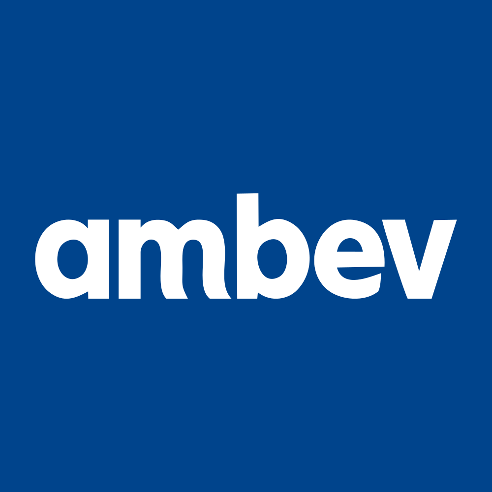 Ambev S.A.
 | [Full Report](output/ABEV/ABEV_comprehensive_report.html) | 

📉 SELL Z-Score: 0.77 (Distress)

🎯 AI Investment Profiles

🔍 Analysis Pending

 |
| 
 Adobe Inc.
 | [Full Report](output/ADBE/ADBE_comprehensive_report.html) | 

📈 STRONG BUY Z-Score: 8.43 (Safe)

🎯 AI Investment Profiles

🔍 Analysis Pending

 |
| 
 adidas AG
 | [Full Report](output/ADDYY/ADDYY_comprehensive_report.html) | 

⚖️ HOLD Z-Score: 2.67 (Gray Zone)

🎯 AI Investment Profiles

🔍 Analysis Pending

 |
| 
 Analog Devices, Inc.
 | [Full Report](output/ADI/ADI_comprehensive_report.html) | 

📈 STRONG BUY Z-Score: 6.21 (Safe)

🎯 AI Investment Profiles

🔍 Analysis Pending

 |
| 
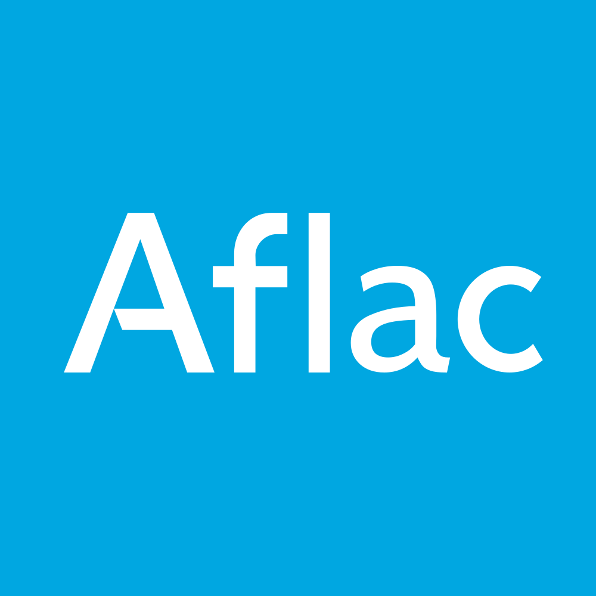 Aflac Incorporated
 | [Full Report](output/AFL/AFL_comprehensive_report.html) | 

📉 SELL Z-Score: 1.73 (Distress)

🎯 AI Investment Profiles

🔍 Analysis Pending

 |
| 
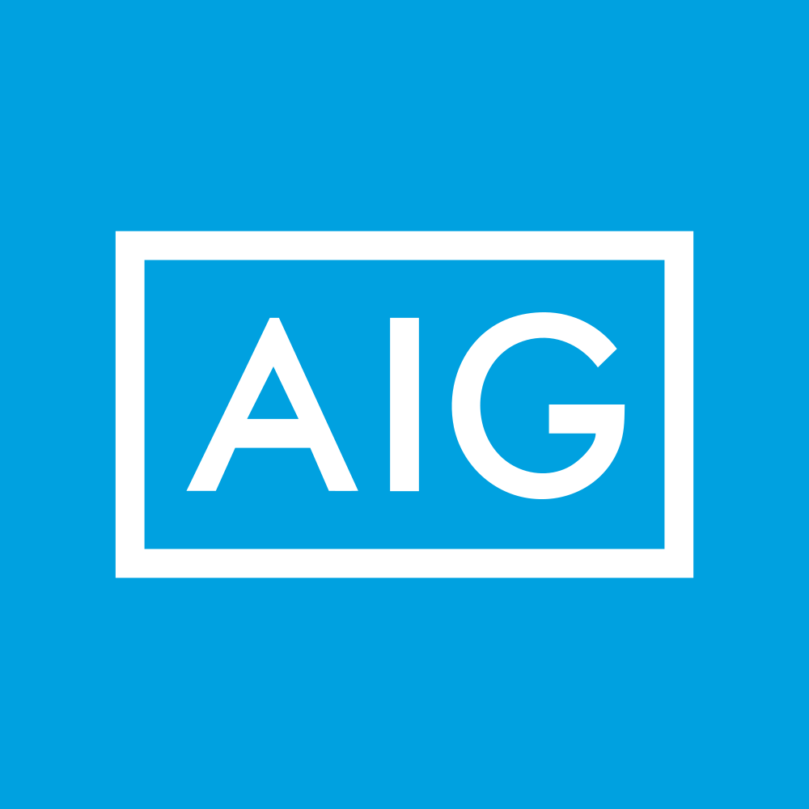 American International Group, Inc.
 | [Full Report](output/AIG/AIG_comprehensive_report.html) | 

📉 SELL Z-Score: 0.73 (Distress)

🎯 AI Investment Profiles

🔍 Analysis Pending

 |
| 
 Arthur J. Gallagher & Co.
 | [Full Report](output/AJG/AJG_comprehensive_report.html) | 

📉 SELL Z-Score: 1.43 (Distress)

🎯 AI Investment Profiles

🔍 Analysis Pending

 |
| 
 The Allstate Corporation
 | [Full Report](output/ALL/ALL_comprehensive_report.html) | 

📉 SELL Z-Score: 1.45 (Distress)

🎯 AI Investment Profiles

🔍 Analysis Pending

 |
| 
 Advanced Micro Devices, Inc.
 | [Full Report](output/AMD/AMD_comprehensive_report.html) | 

📈 STRONG BUY Z-Score: 10.66 (Safe)

🎯 AI Investment Profiles

🔍 Analysis Pending

 |
| 
 Ameriprise Financial, Inc.
 | [Full Report](output/AMP/AMP_comprehensive_report.html) | 

📉 SELL Z-Score: 0.46 (Distress)

🎯 AI Investment Profiles

🔍 Analysis Pending

 |
| 
 América Móvil, S.A.B. de C.V.
 | [Full Report](output/AMX/AMX_comprehensive_report.html) | 

📉 SELL Z-Score: 0.13 (Distress)

🎯 AI Investment Profiles

🔍 Analysis Pending

 |
| 
 Amazon.com, Inc.
 | [Full Report](output/AMZN/AMZN_comprehensive_report.html) | 

📈 STRONG BUY Z-Score: 4.86 (Safe)

🎯 AI Investment Profiles

🔍 Analysis Pending

 |
| 
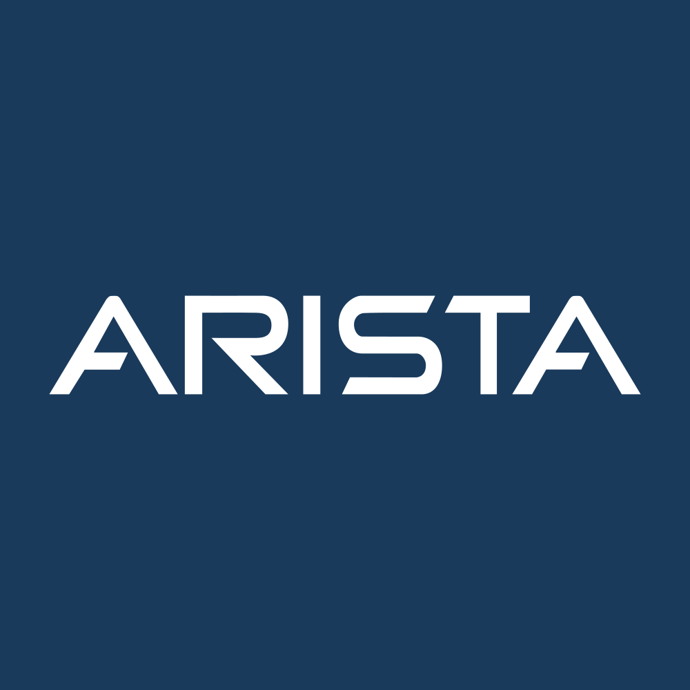 Arista Networks, Inc.
 | [Full Report](output/ANET/ANET_comprehensive_report.html) | 

📈 STRONG BUY Z-Score: 19.24 (Safe)

🎯 AI Investment Profiles

🔍 Analysis Pending

 |
| 
 ANSYS, Inc.
 | [Full Report](output/ANSS/ANSS_comprehensive_report.html) | 

📈 STRONG BUY Z-Score: 11.49 (Safe)

🎯 AI Investment Profiles

🔍 Analysis Pending

 |
| 
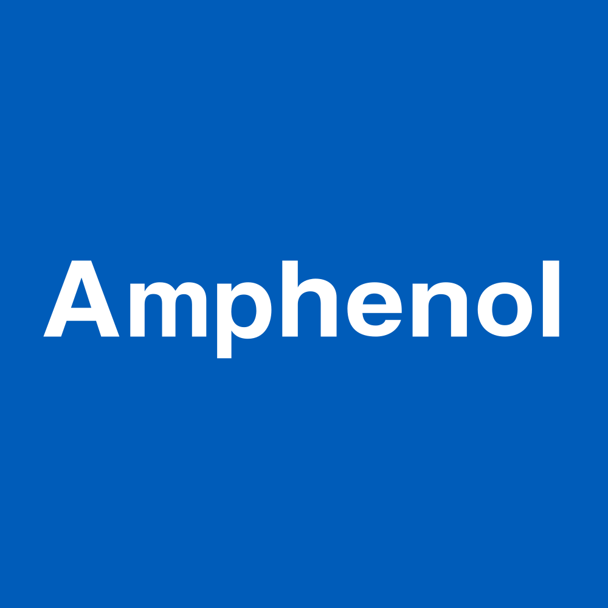 Amphenol Corporation
 | [Full Report](output/APH/APH_comprehensive_report.html) | 

📈 STRONG BUY Z-Score: 6.67 (Safe)

🎯 AI Investment Profiles

🔍 Analysis Pending

 |
| 
 Apollo Global Management, Inc.
 | [Full Report](output/APO/APO_comprehensive_report.html) | 

📉 SELL Z-Score: 0.01 (Distress)

🎯 AI Investment Profiles

🔍 Analysis Pending

 |
| 
 ASML Holding N.V.
 | [Full Report](output/ASML/ASML_comprehensive_report.html) | 

📈 STRONG BUY Z-Score: 7.46 (Safe)

🎯 AI Investment Profiles

🔍 Analysis Pending

 |
| 
 Broadcom Inc.
 | [Full Report](output/AVGO/AVGO_comprehensive_report.html) | 

📈 STRONG BUY Z-Score: 8.26 (Safe)

🎯 AI Investment Profiles

🔍 Analysis Pending

 |
| 
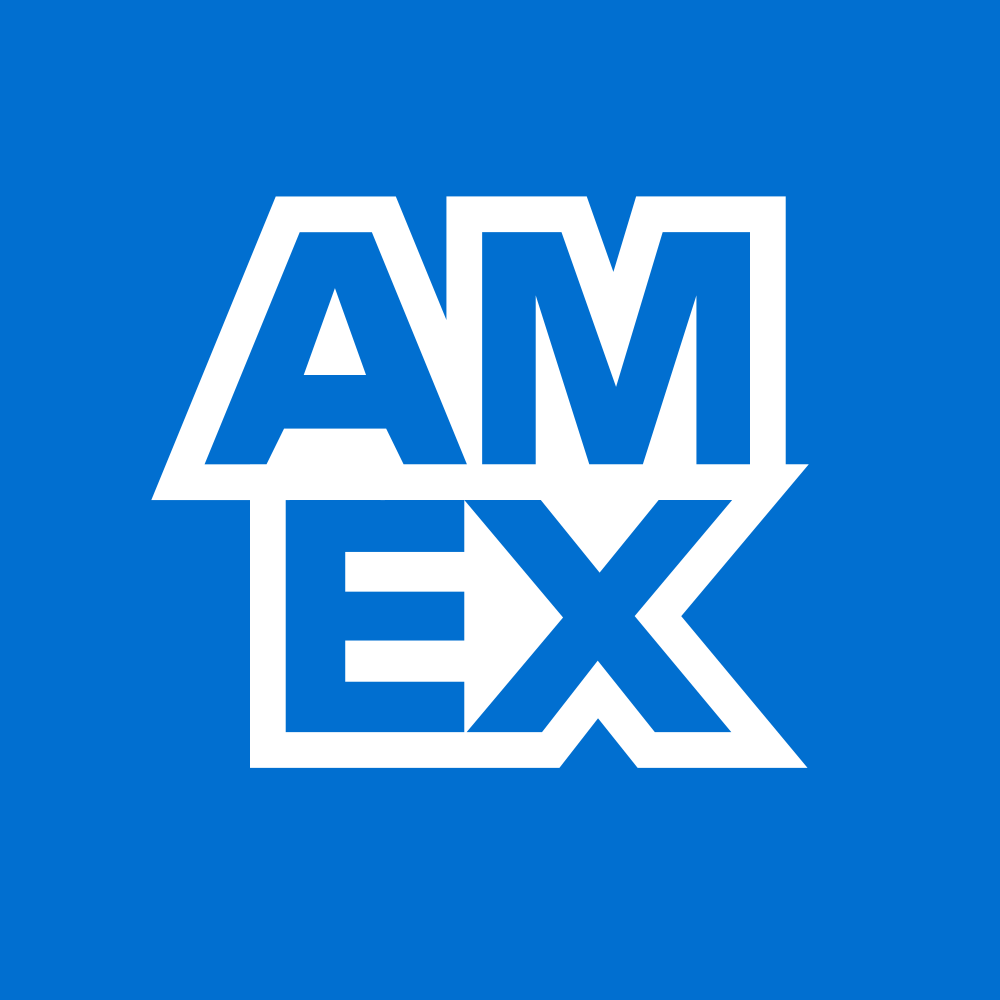 American Express Company
 | [Full Report](output/AXP/AXP_comprehensive_report.html) | 

📉 SELL Z-Score: 0.28 (Distress)

🎯 AI Investment Profiles

🔍 Analysis Pending

 |
| 
 AstraZeneca PLC
 | [Full Report](output/AZN/AZN_comprehensive_report.html) | 

⚖️ HOLD Z-Score: 2.25 (Gray Zone)

🎯 AI Investment Profiles

🔍 Analysis Pending

 |
| 
 AutoZone, Inc.
 | [Full Report](output/AZO/AZO_comprehensive_report.html) | 

⚖️ HOLD Z-Score: 1.87 (Gray Zone)

🎯 AI Investment Profiles

🔍 Analysis Pending

 |
| 
 The Boeing Company
 | [Full Report](output/BA/BA_comprehensive_report.html) | 

📉 SELL Z-Score: 1.04 (Distress)

🎯 AI Investment Profiles

🔍 Analysis Pending

 |
| 
 Alibaba Group Holding Limited
 | [Full Report](output/BABA/BABA_comprehensive_report.html) | 

📉 SELL Z-Score: 1.09 (Distress)

🎯 AI Investment Profiles

🔍 Analysis Pending

 |
| 
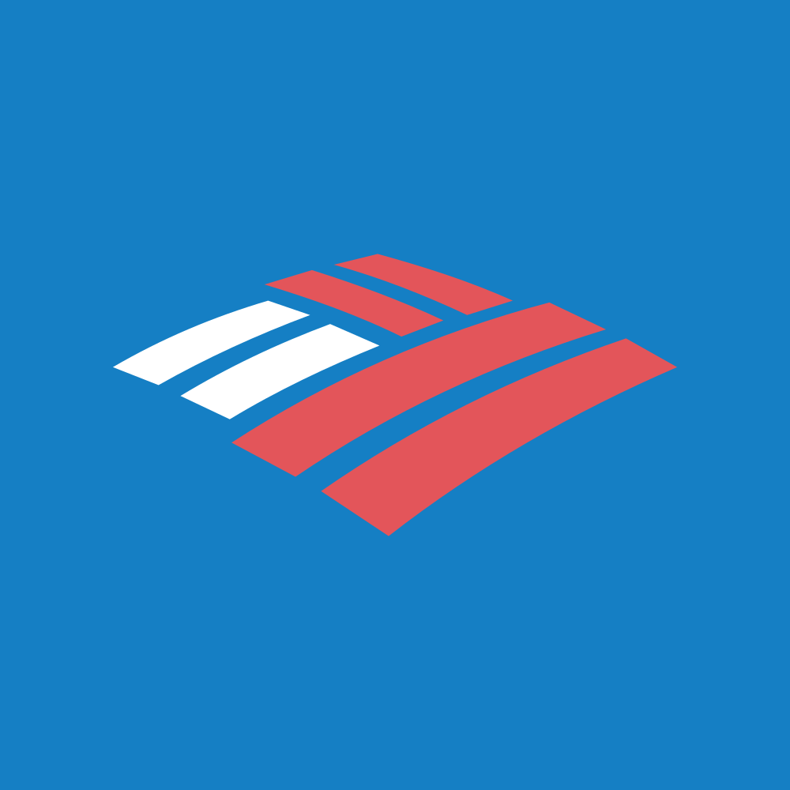 Bank of America Corporation
 | [Full Report](output/BAC/BAC_comprehensive_report.html) | 

📉 SELL Z-Score: -0.44 (Distress)

🎯 AI Investment Profiles

🔍 Analysis Pending

 |
| 
 Banco Bradesco S.A.
 | [Full Report](output/BBD/BBD_comprehensive_report.html) | 

📉 SELL Z-Score: -0.20 (Distress)

🎯 AI Investment Profiles

🔍 Analysis Pending

 |
| 
 Barclays PLC
 | [Full Report](output/BCS/BCS_comprehensive_report.html) | 

📉 SELL Z-Score: -0.06 (Distress)

🎯 AI Investment Profiles

🔍 Analysis Pending

 |
| 
 Baidu, Inc.
 | [Full Report](output/BIDU/BIDU_comprehensive_report.html) | 

📉 SELL Z-Score: 0.47 (Distress)

🎯 AI Investment Profiles

🔍 Analysis Pending

 |
| 
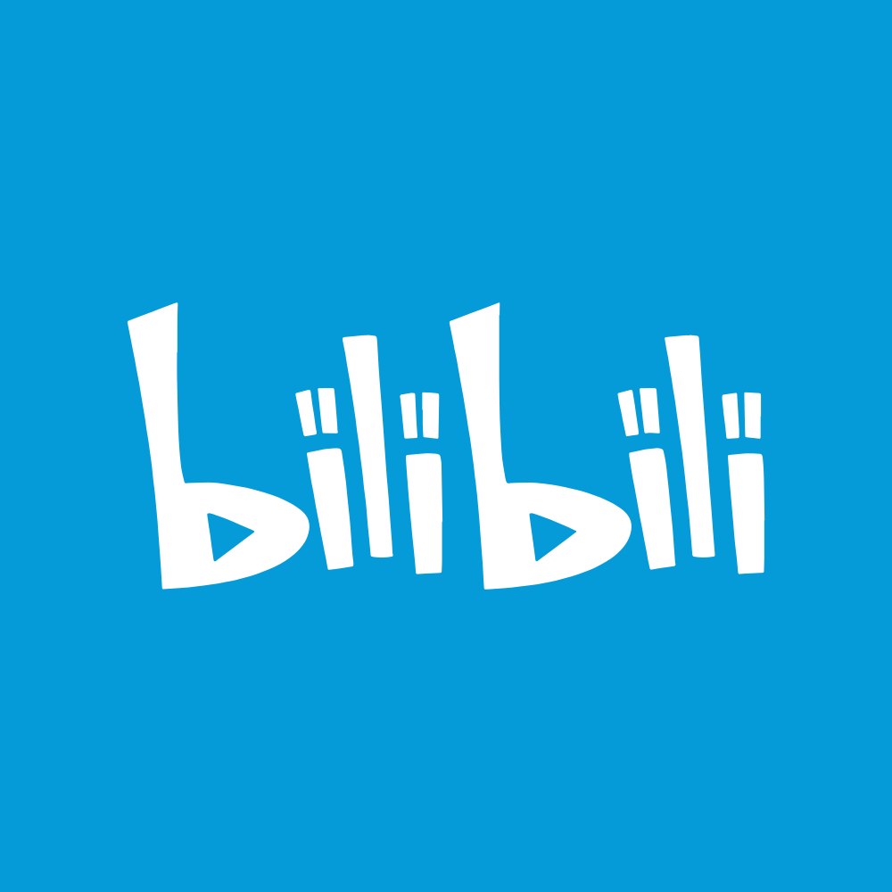 Bilibili Inc.
 | [Full Report](output/BILI/BILI_comprehensive_report.html) | 

📉 SELL Z-Score: 0.69 (Distress)

🎯 AI Investment Profiles

🔍 Analysis Pending

 |
| 
 The Bank of New York Mellon Corporation
 | [Full Report](output/BK/BK_comprehensive_report.html) | 

📉 SELL Z-Score: 0.26 (Distress)

🎯 AI Investment Profiles

🔍 Analysis Pending

 |
| 
 Booking Holdings Inc.
 | [Full Report](output/BKNG/BKNG_comprehensive_report.html) | 

📈 STRONG BUY Z-Score: 5.63 (Safe)

🎯 AI Investment Profiles

🔍 Analysis Pending

 |
| 
 BP p.l.c.
 | [Full Report](output/BP/BP_comprehensive_report.html) | 

📉 SELL Z-Score: 0.52 (Distress)

🎯 AI Investment Profiles

🔍 Analysis Pending

 |
| 
 Boston Scientific Corporation
 | [Full Report](output/BSX/BSX_comprehensive_report.html) | 

📈 STRONG BUY Z-Score: 5.62 (Safe)

🎯 AI Investment Profiles

🔍 Analysis Pending

 |
| 
 Blackstone Inc.
 | [Full Report](output/BX/BX_comprehensive_report.html) | 

📈 STRONG BUY Z-Score: 4.65 (Safe)

🎯 AI Investment Profiles

🔍 Analysis Pending

 |
| 
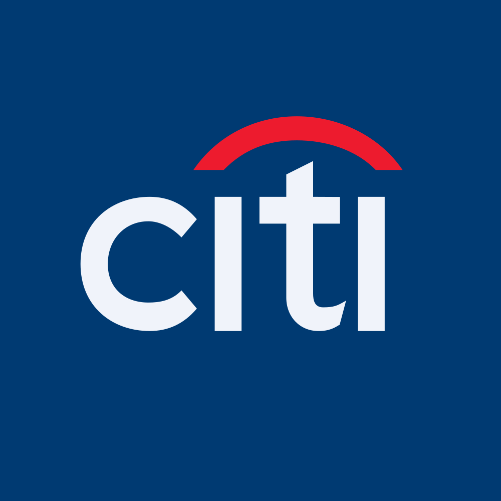 Citigroup Inc.
 | [Full Report](output/C/C_comprehensive_report.html) | 

📉 SELL Z-Score: -0.48 (Distress)

🎯 AI Investment Profiles

🔍 Analysis Pending

 |
| 
 Caterpillar Inc.
 | [Full Report](output/CAT/CAT_comprehensive_report.html) | 

📈 STRONG BUY Z-Score: 3.04 (Safe)

🎯 AI Investment Profiles

🔍 Analysis Pending

 |
| 
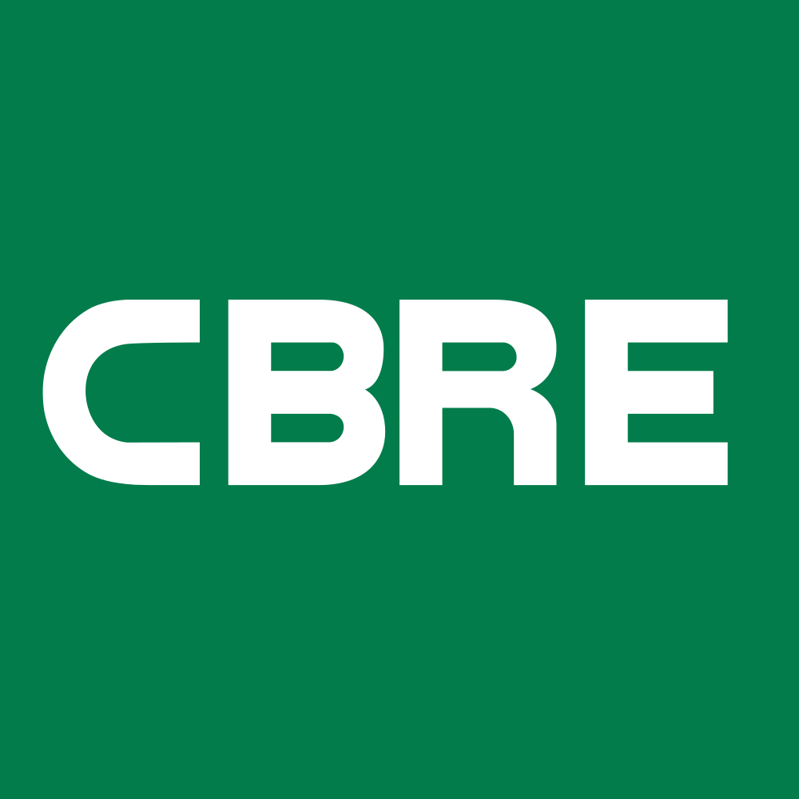 CBRE Group, Inc.
 | [Full Report](output/CBRE/CBRE_comprehensive_report.html) | 

📉 SELL Z-Score: 1.77 (Distress)

🎯 AI Investment Profiles

🔍 Analysis Pending

 |
| 
 Constellation Energy Corporation
 | [Full Report](output/CEG/CEG_comprehensive_report.html) | 

⚖️ HOLD Z-Score: 1.90 (Gray Zone)

🎯 AI Investment Profiles

🔍 Analysis Pending

 |
| 
 Check Point Software Technologies Ltd.
 | [Full Report](output/CHKP/CHKP_comprehensive_report.html) | 

📈 STRONG BUY Z-Score: 8.87 (Safe)

🎯 AI Investment Profiles

🔍 Analysis Pending

 |
| 
 Cummins Inc.
 | [Full Report](output/CMI/CMI_comprehensive_report.html) | 

⚖️ HOLD Z-Score: 2.74 (Gray Zone)

🎯 AI Investment Profiles

🔍 Analysis Pending

 |
| 
 Capital One Financial Corporation
 | [Full Report](output/COF/COF_comprehensive_report.html) | 

📉 SELL Z-Score: -0.35 (Distress)

🎯 AI Investment Profiles

🔍 Analysis Pending

 |
| 
 Coinbase Global, Inc.
 | [Full Report](output/COIN/COIN_comprehensive_report.html) | 

📈 STRONG BUY Z-Score: 6.10 (Safe)

🎯 AI Investment Profiles

🔍 Analysis Pending

 |
| 
 Cencora, Inc.
 | [Full Report](output/COR/COR_comprehensive_report.html) | 

📉 SELL Z-Score: 1.61 (Distress)

🎯 AI Investment Profiles

🔍 Analysis Pending

 |
| 
 Costco Wholesale Corporation
 | [Full Report](output/COST/COST_comprehensive_report.html) | 

📈 STRONG BUY Z-Score: 6.75 (Safe)

🎯 AI Investment Profiles

🔍 Analysis Pending

 |
| 
 Corpay, Inc.
 | [Full Report](output/CPAY/CPAY_comprehensive_report.html) | 

⚖️ HOLD Z-Score: 1.81 (Gray Zone)

🎯 AI Investment Profiles

🔍 Analysis Pending

 |
| 
 Copart, Inc.
 | [Full Report](output/CPRT/CPRT_comprehensive_report.html) | 

📈 STRONG BUY Z-Score: 34.16 (Safe)

🎯 AI Investment Profiles

🔍 Analysis Pending

 |
| 
 Salesforce, Inc.
 | [Full Report](output/CRM/CRM_comprehensive_report.html) | 

📈 STRONG BUY Z-Score: 4.53 (Safe)

🎯 AI Investment Profiles

🔍 Analysis Pending

 |
| 
 CrowdStrike Holdings, Inc.
 | [Full Report](output/CRWD/CRWD_comprehensive_report.html) | 

📈 STRONG BUY Z-Score: 14.72 (Safe)

🎯 AI Investment Profiles

🔍 Analysis Pending

 |
| 
 DoorDash, Inc.
 | [Full Report](output/DASH/DASH_comprehensive_report.html) | 

📈 STRONG BUY Z-Score: 11.80 (Safe)

🎯 AI Investment Profiles

🔍 Analysis Pending

 |
| 
 Deutsche Bank AG
 | [Full Report](output/DB/DB_comprehensive_report.html) | 

📉 SELL Z-Score: -0.30 (Distress)

🎯 AI Investment Profiles

🔍 Analysis Pending

 |
| 
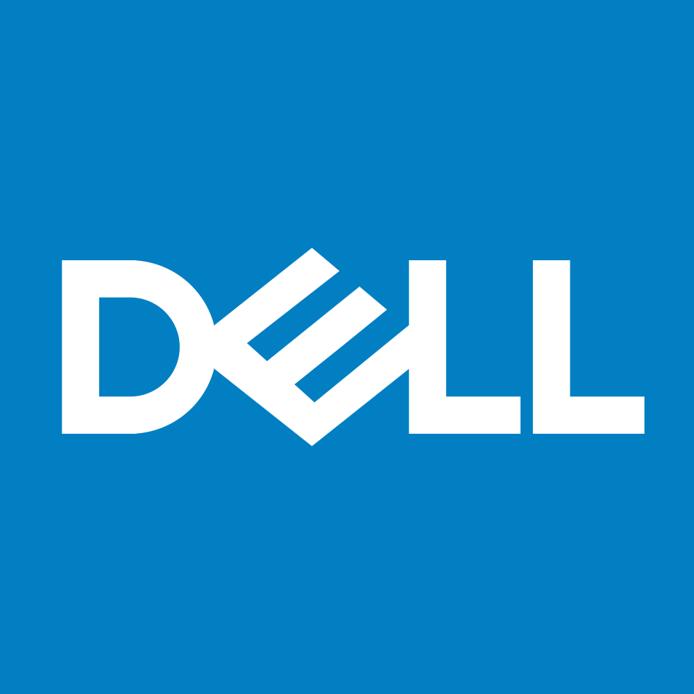 Dell Technologies Inc.
 | [Full Report](output/DELL/DELL_comprehensive_report.html) | 

📉 SELL Z-Score: 0.77 (Distress)

🎯 AI Investment Profiles

🔍 Analysis Pending

 |
| 
 The Walt Disney Company
 | [Full Report](output/DIS/DIS_comprehensive_report.html) | 

⚖️ HOLD Z-Score: 2.00 (Gray Zone)

🎯 AI Investment Profiles

🔍 Analysis Pending

 |
| 
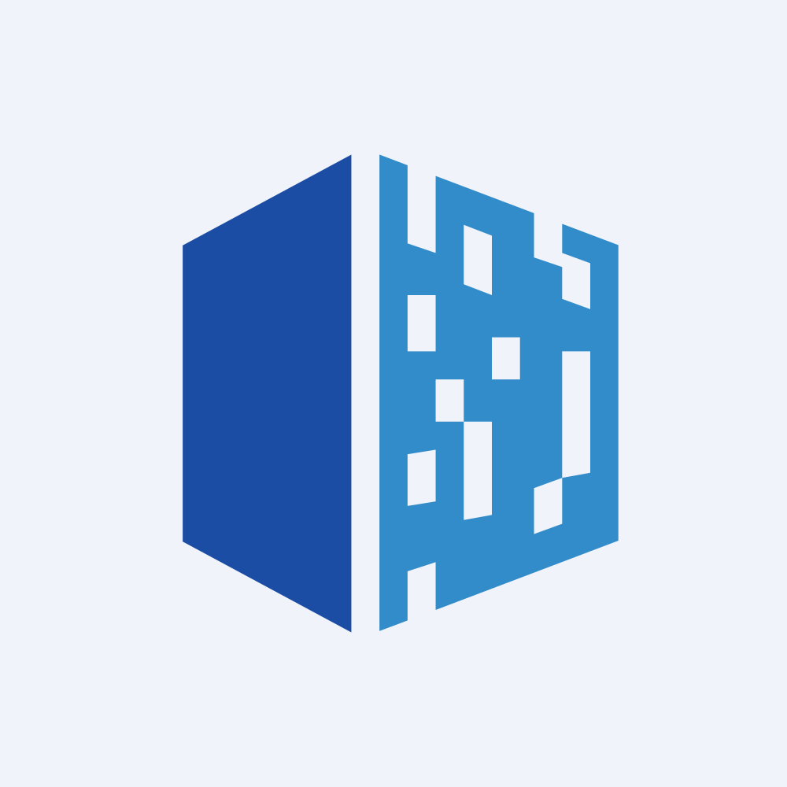 Digital Realty Trust, Inc.
 | [Full Report](output/DLR/DLR_comprehensive_report.html) | 

📉 SELL Z-Score: 1.68 (Distress)

🎯 AI Investment Profiles

🔍 Analysis Pending

 |
| 
 Eni S.p.A.
 | [Full Report](output/E/E_comprehensive_report.html) | 

📉 SELL Z-Score: 0.98 (Distress)

🎯 AI Investment Profiles

🔍 Analysis Pending

 |
| 
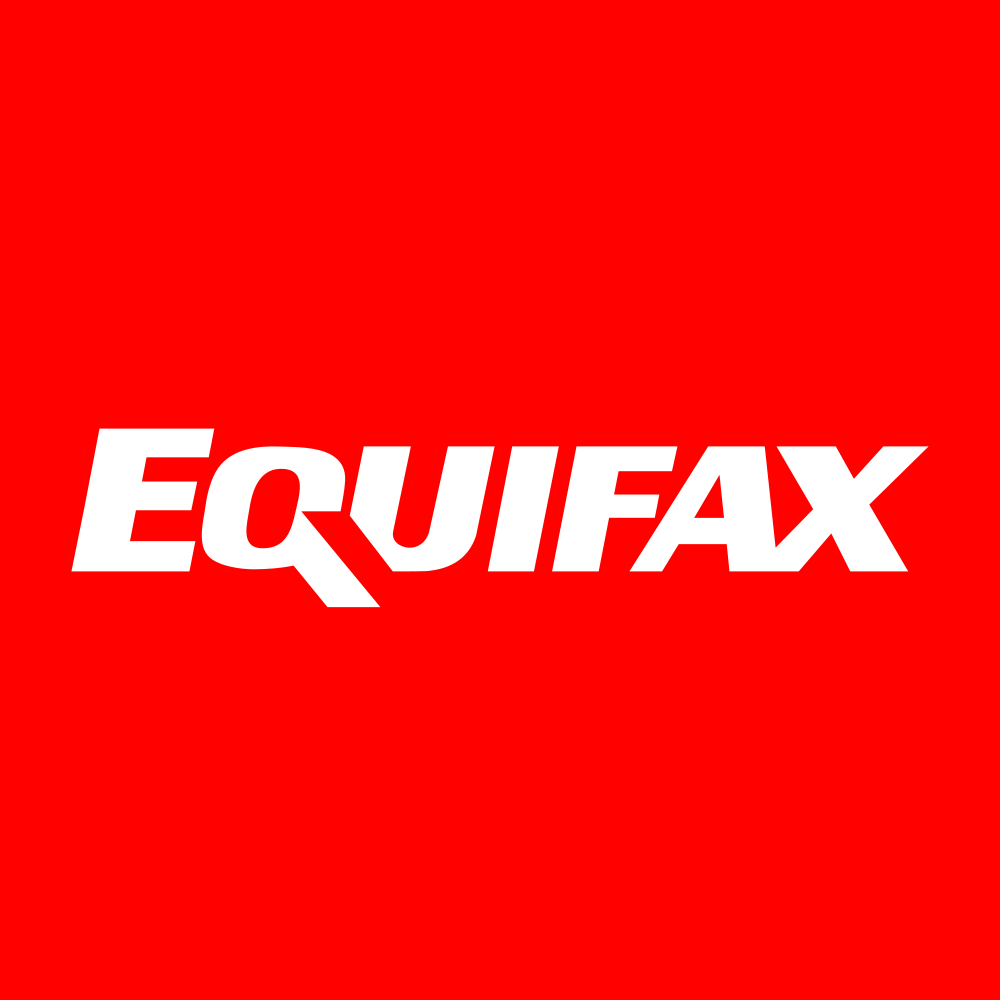 Equifax Inc.
 | [Full Report](output/EFX/EFX_comprehensive_report.html) | 

📈 STRONG BUY Z-Score: 3.72 (Safe)

🎯 AI Investment Profiles

🔍 Analysis Pending

 |
| 
 Eaton Corporation plc
 | [Full Report](output/ETN/ETN_comprehensive_report.html) | 

📈 STRONG BUY Z-Score: 4.73 (Safe)

🎯 AI Investment Profiles

🔍 Analysis Pending

 |
| 
 Entergy Corporation
 | [Full Report](output/ETR/ETR_comprehensive_report.html) | 

📉 SELL Z-Score: 0.74 (Distress)

🎯 AI Investment Profiles

🔍 Analysis Pending

 |
| 
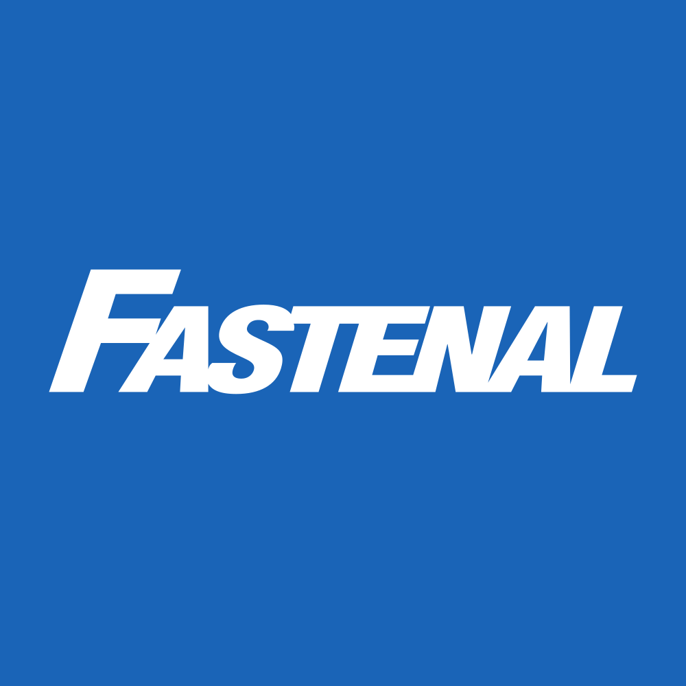 Fastenal Company
 | [Full Report](output/FAST/FAST_comprehensive_report.html) | 

📈 STRONG BUY Z-Score: 26.44 (Safe)

🎯 AI Investment Profiles

🔍 Analysis Pending

 |
| 
 General Electric Company
 | [Full Report](output/GE/GE_comprehensive_report.html) | 

⚖️ HOLD Z-Score: 2.62 (Gray Zone)

🎯 AI Investment Profiles

🔍 Analysis Pending

 |
| 
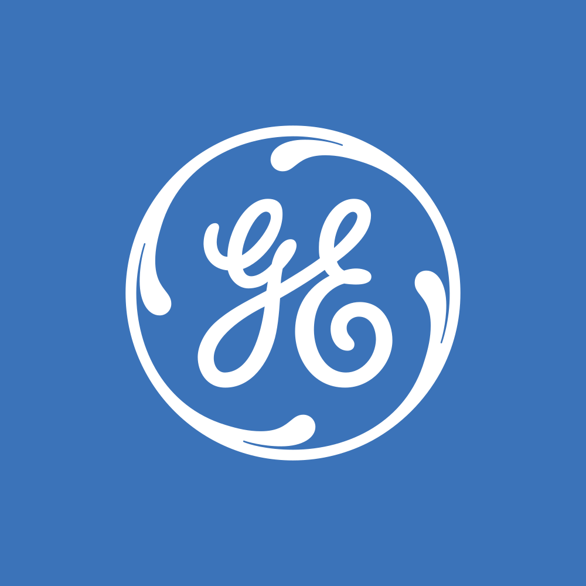 GE Vernova Inc.
 | [Full Report](output/GEV/GEV_comprehensive_report.html) | 

⚖️ HOLD Z-Score: 2.22 (Gray Zone)

🎯 AI Investment Profiles

🔍 Analysis Pending

 |
| 
 Grupo Financiero Galicia S.A.
 | [Full Report](output/GGAL/GGAL_comprehensive_report.html) | 

📉 SELL Z-Score: -0.42 (Distress)

🎯 AI Investment Profiles

🔍 Analysis Pending

 |
| 
 Gilead Sciences, Inc.
 | [Full Report](output/GILD/GILD_comprehensive_report.html) | 

⚖️ HOLD Z-Score: 2.77 (Gray Zone)

🎯 AI Investment Profiles

🔍 Analysis Pending

 |
| 
 General Motors Company
 | [Full Report](output/GM/GM_comprehensive_report.html) | 

📉 SELL Z-Score: 0.68 (Distress)

🎯 AI Investment Profiles

🔍 Analysis Pending

 |
| 
 Alphabet Inc.
 | [Full Report](output/GOOG/GOOG_comprehensive_report.html) | 

📈 STRONG BUY Z-Score: 11.09 (Safe)

🎯 AI Investment Profiles

🔍 Analysis Pending

 |
| 
 Alphabet Inc.
 | [Full Report](output/GOOGL/GOOGL_comprehensive_report.html) | 

📈 STRONG BUY Z-Score: 11.09 (Safe)

🎯 AI Investment Profiles

🔍 Analysis Pending

 |
| 
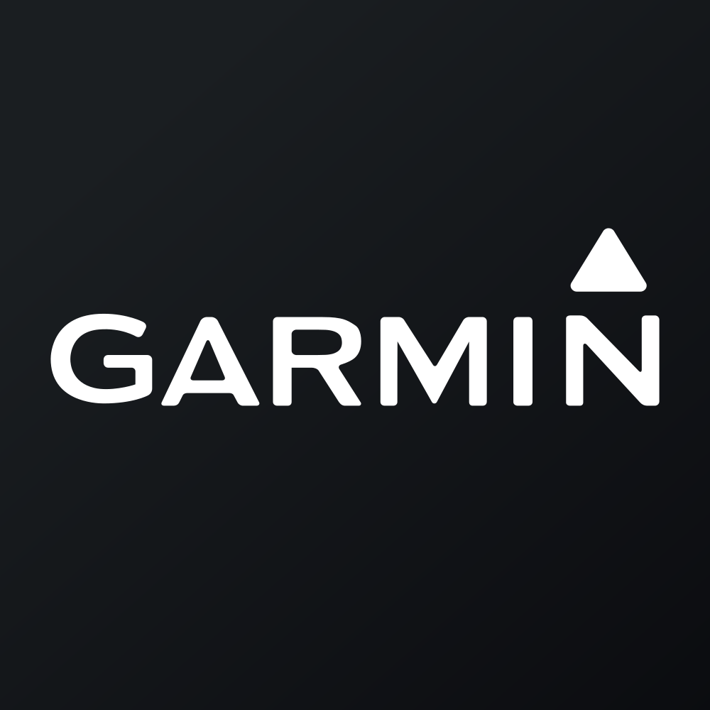 Garmin Ltd.
 | [Full Report](output/GRMN/GRMN_comprehensive_report.html) | 

📈 STRONG BUY Z-Score: 16.42 (Safe)

🎯 AI Investment Profiles

🔍 Analysis Pending

 |
| 
 The Goldman Sachs Group, Inc.
 | [Full Report](output/GS/GS_comprehensive_report.html) | 

📉 SELL Z-Score: 0.15 (Distress)

🎯 AI Investment Profiles

🔍 Analysis Pending

 |
| 
 GSK plc
 | [Full Report](output/GSK/GSK_comprehensive_report.html) | 

📉 SELL Z-Score: 1.38 (Distress)

🎯 AI Investment Profiles

🔍 Analysis Pending

 |
| 
 W.W. Grainger, Inc.
 | [Full Report](output/GWW/GWW_comprehensive_report.html) | 

📈 STRONG BUY Z-Score: 7.32 (Safe)

🎯 AI Investment Profiles

🔍 Analysis Pending

 |
| 
 The Home Depot, Inc.
 | [Full Report](output/HD/HD_comprehensive_report.html) | 

📈 STRONG BUY Z-Score: 4.28 (Safe)

🎯 AI Investment Profiles

🔍 Analysis Pending

 |
| 
 HDFC Bank Limited
 | [Full Report](output/HDB/HDB_comprehensive_report.html) | 

📉 SELL Z-Score: 0.13 (Distress)

🎯 AI Investment Profiles

🔍 Analysis Pending

 |
| 
 The Hartford Financial Services Group, Inc.
 | [Full Report](output/HIG/HIG_comprehensive_report.html) | 

📉 SELL Z-Score: 0.96 (Distress)

🎯 AI Investment Profiles

🔍 Analysis Pending

 |
| 
 HubSpot, Inc.
 | [Full Report](output/HUBS/HUBS_comprehensive_report.html) | 

📈 STRONG BUY Z-Score: 9.35 (Safe)

🎯 AI Investment Profiles

🔍 Analysis Pending

 |
| 
 International Business Machines Corporation
 | [Full Report](output/IBM/IBM_comprehensive_report.html) | 

⚖️ HOLD Z-Score: 2.96 (Gray Zone)

🎯 AI Investment Profiles

🔍 Analysis Pending

 |
| 
 Infosys Limited
 | [Full Report](output/INFY/INFY_comprehensive_report.html) | 

📈 STRONG BUY Z-Score: 9.22 (Safe)

🎯 AI Investment Profiles

🔍 Analysis Pending

 |
| 
 ING Groep N.V.
 | [Full Report](output/ING/ING_comprehensive_report.html) | 

📉 SELL Z-Score: -0.66 (Distress)

🎯 AI Investment Profiles

🔍 Analysis Pending

 |
| 
 Intuit Inc.
 | [Full Report](output/INTU/INTU_comprehensive_report.html) | 

📈 STRONG BUY Z-Score: 9.29 (Safe)

🎯 AI Investment Profiles

🔍 Analysis Pending

 |
| 
 Ingersoll Rand Inc.
 | [Full Report](output/IR/IR_comprehensive_report.html) | 

📈 STRONG BUY Z-Score: 3.14 (Safe)

🎯 AI Investment Profiles

🔍 Analysis Pending

 |
| 
 Intuitive Surgical, Inc.
 | [Full Report](output/ISRG/ISRG_comprehensive_report.html) | 

📈 STRONG BUY Z-Score: 58.20 (Safe)

🎯 AI Investment Profiles

🔍 Analysis Pending

 |
| 
 Itaú Unibanco Holding S.A.
 | [Full Report](output/ITUB/ITUB_comprehensive_report.html) | 

📉 SELL Z-Score: -0.34 (Distress)

🎯 AI Investment Profiles

🔍 Analysis Pending

 |
| 
 JD.com, Inc.
 | [Full Report](output/JD/JD_comprehensive_report.html) | 

📉 SELL Z-Score: 0.70 (Distress)

🎯 AI Investment Profiles

🔍 Analysis Pending

 |
| 
 Johnson & Johnson
 | [Full Report](output/JNJ/JNJ_comprehensive_report.html) | 

📈 STRONG BUY Z-Score: 3.38 (Safe)

🎯 AI Investment Profiles

🔍 Analysis Pending

 |
| 
 JPMorgan Chase & Co.
 | [Full Report](output/JPM/JPM_comprehensive_report.html) | 

📉 SELL Z-Score: -0.37 (Distress)

🎯 AI Investment Profiles

🔍 Analysis Pending

 |
| 
 Kellanova
 | [Full Report](output/K/K_comprehensive_report.html) | 

⚖️ HOLD Z-Score: 2.52 (Gray Zone)

🎯 AI Investment Profiles

🔍 Analysis Pending

 |
| 
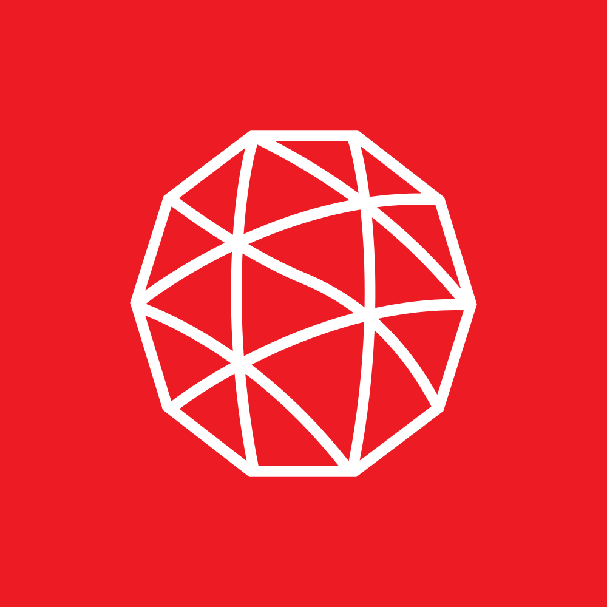 L3Harris Technologies, Inc.
 | [Full Report](output/LHX/LHX_comprehensive_report.html) | 

📉 SELL Z-Score: 1.55 (Distress)

🎯 AI Investment Profiles

🔍 Analysis Pending

 |
| 
 Li Auto Inc.
 | [Full Report](output/LI/LI_comprehensive_report.html) | 

📉 SELL Z-Score: 0.79 (Distress)

🎯 AI Investment Profiles

🔍 Analysis Pending

 |
| 
 Linde plc
 | [Full Report](output/LIN/LIN_comprehensive_report.html) | 

📈 STRONG BUY Z-Score: 3.44 (Safe)

🎯 AI Investment Profiles

🔍 Analysis Pending

 |
| 
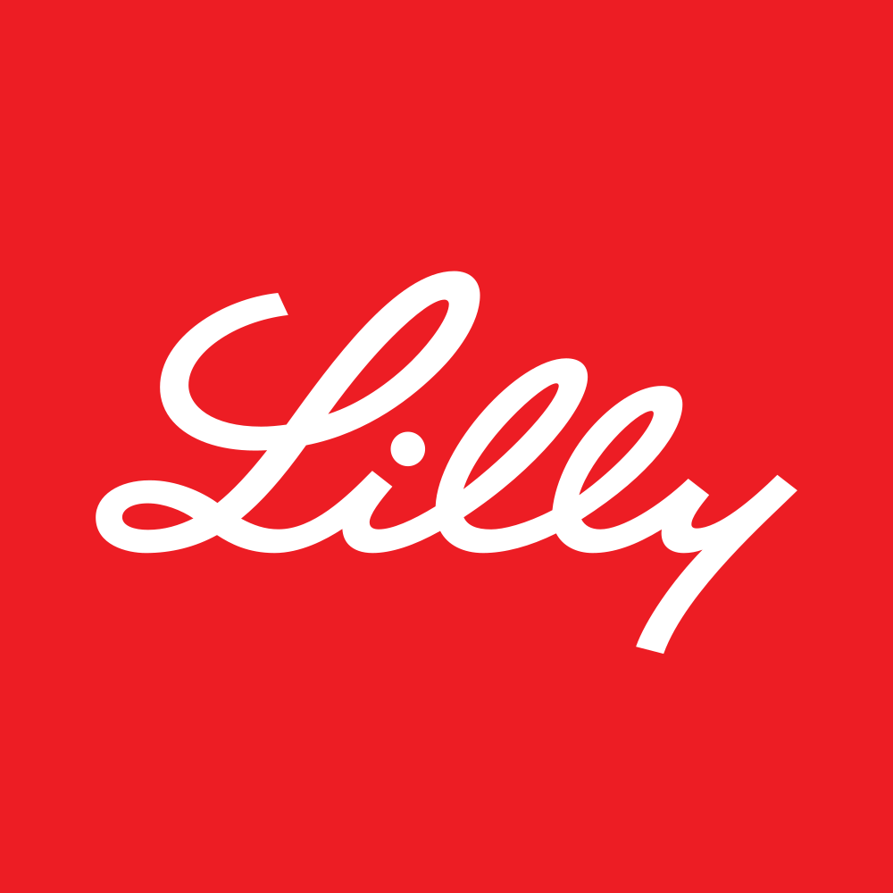 Eli Lilly and Company
 | [Full Report](output/LLY/LLY_comprehensive_report.html) | 

📈 STRONG BUY Z-Score: 6.55 (Safe)

🎯 AI Investment Profiles

🔍 Analysis Pending

 |
| 
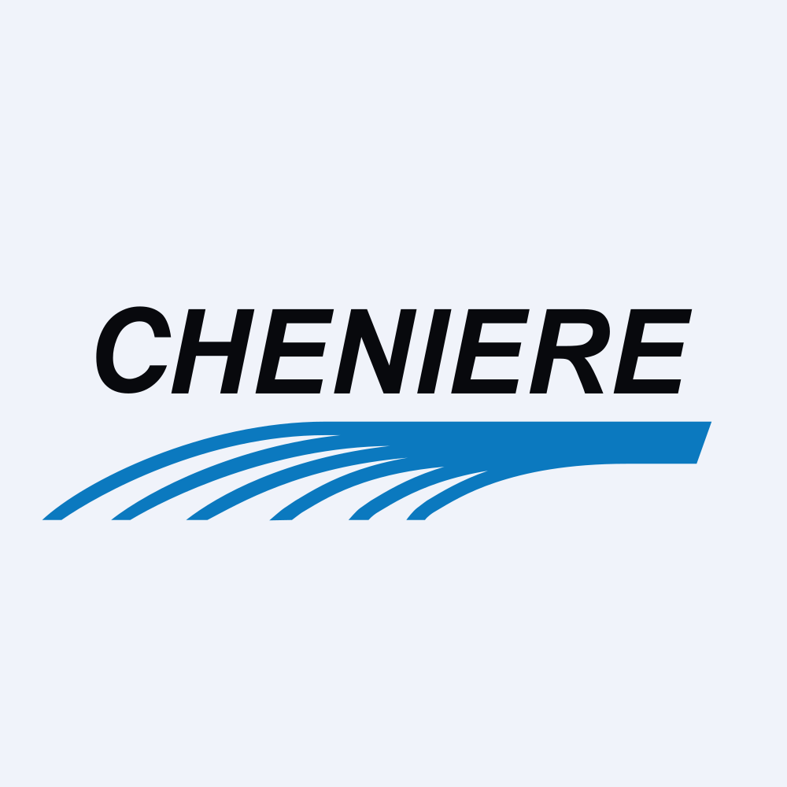 Cheniere Energy, Inc.
 | [Full Report](output/LNG/LNG_comprehensive_report.html) | 

📉 SELL Z-Score: 1.43 (Distress)

🎯 AI Investment Profiles

🔍 Analysis Pending

 |
| 
 LVMH Moët Hennessy - Louis Vuitton, Société Européenne
 | [Full Report](output/LVMUY/LVMUY_comprehensive_report.html) | 

⚖️ HOLD Z-Score: 2.51 (Gray Zone)

🎯 AI Investment Profiles

🔍 Analysis Pending

 |
| 
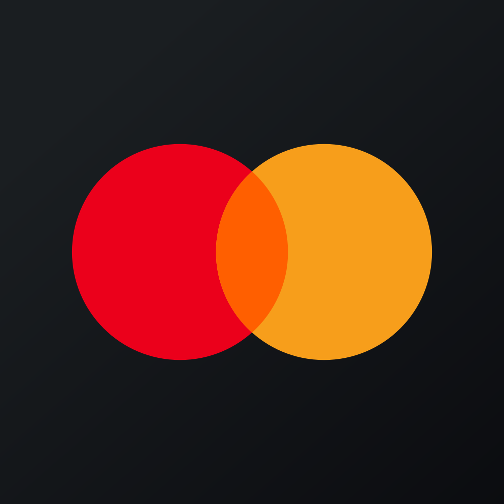 Mastercard Incorporated
 | [Full Report](output/MA/MA_comprehensive_report.html) | 

📈 STRONG BUY Z-Score: 9.78 (Safe)

🎯 AI Investment Profiles

🔍 Analysis Pending

 |
| 
 MetLife, Inc.
 | [Full Report](output/MET/MET_comprehensive_report.html) | 

📉 SELL Z-Score: 0.71 (Distress)

🎯 AI Investment Profiles

🔍 Analysis Pending

 |
| 
 Meta Platforms, Inc.
 | [Full Report](output/META/META_comprehensive_report.html) | 

📈 STRONG BUY Z-Score: 12.61 (Safe)

🎯 AI Investment Profiles

🔍 Analysis Pending

 |
| 
 Martin Marietta Materials, Inc.
 | [Full Report](output/MLM/MLM_comprehensive_report.html) | 

⚖️ HOLD Z-Score: 2.46 (Gray Zone)

🎯 AI Investment Profiles

🔍 Analysis Pending

 |
| 
 3M Company
 | [Full Report](output/MMM/MMM_comprehensive_report.html) | 

📈 STRONG BUY Z-Score: 3.14 (Safe)

🎯 AI Investment Profiles

🔍 Analysis Pending

 |
| 
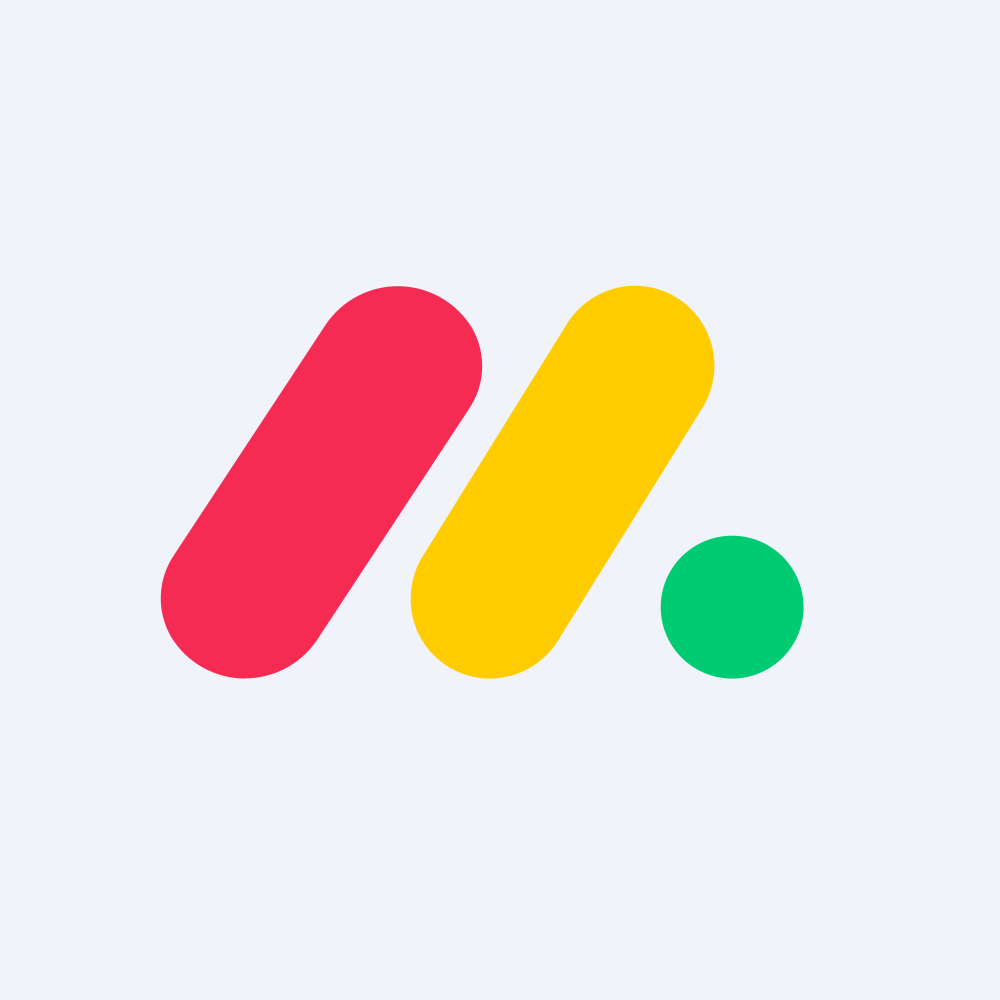 monday.com Ltd.
 | [Full Report](output/MNDY/MNDY_comprehensive_report.html) | 

📈 STRONG BUY Z-Score: 14.66 (Safe)

🎯 AI Investment Profiles

🔍 Analysis Pending

 |
| 
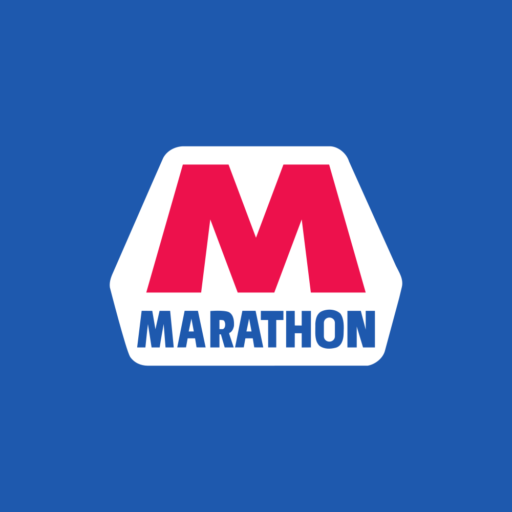 Marathon Petroleum Corporation
 | [Full Report](output/MPC/MPC_comprehensive_report.html) | 

📉 SELL Z-Score: 1.64 (Distress)

🎯 AI Investment Profiles

🔍 Analysis Pending

 |
| 
 Monolithic Power Systems, Inc.
 | [Full Report](output/MPWR/MPWR_comprehensive_report.html) | 

📈 STRONG BUY Z-Score: 40.90 (Safe)

🎯 AI Investment Profiles

🔍 Analysis Pending

 |
| 
 Morgan Stanley
 | [Full Report](output/MS/MS_comprehensive_report.html) | 

📉 SELL Z-Score: 0.03 (Distress)

🎯 AI Investment Profiles

🔍 Analysis Pending

 |
| 
 Microsoft Corporation
 | [Full Report](output/MSFT/MSFT_comprehensive_report.html) | 

📈 STRONG BUY Z-Score: 10.16 (Safe)

🎯 AI Investment Profiles

🔍 Analysis Pending

 |
| 
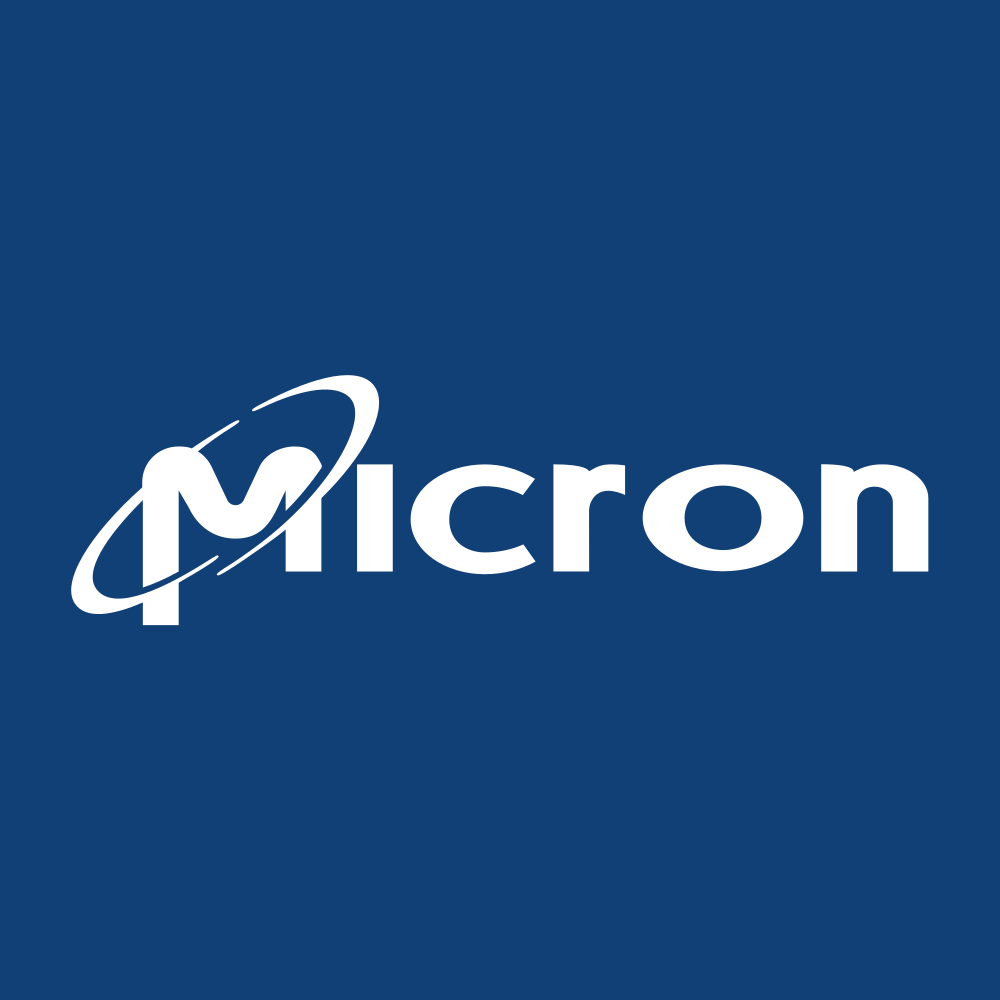 Micron Technology, Inc.
 | [Full Report](output/MU/MU_comprehensive_report.html) | 

📈 STRONG BUY Z-Score: 4.36 (Safe)

🎯 AI Investment Profiles

🔍 Analysis Pending

 |
| 
 Netflix, Inc.
 | [Full Report](output/NFLX/NFLX_comprehensive_report.html) | 

📈 STRONG BUY Z-Score: 13.27 (Safe)

🎯 AI Investment Profiles

🔍 Analysis Pending

 |
| 
 NICE Ltd.
 | [Full Report](output/NICE/NICE_comprehensive_report.html) | 

📈 STRONG BUY Z-Score: 4.07 (Safe)

🎯 AI Investment Profiles

🔍 Analysis Pending

 |
| 
 NIO Inc.
 | [Full Report](output/NIO/NIO_comprehensive_report.html) | 

📉 SELL Z-Score: -0.16 (Distress)

🎯 AI Investment Profiles

🔍 Analysis Pending

 |
| 
 NIKE, Inc.
 | [Full Report](output/NKE/NKE_comprehensive_report.html) | 

📈 STRONG BUY Z-Score: 3.48 (Safe)

🎯 AI Investment Profiles

🔍 Analysis Pending

 |
| 
 ServiceNow, Inc.
 | [Full Report](output/NOW/NOW_comprehensive_report.html) | 

📈 STRONG BUY Z-Score: 12.14 (Safe)

🎯 AI Investment Profiles

🔍 Analysis Pending

 |
| 
 NVIDIA Corporation
 | [Full Report](output/NVDA/NVDA_comprehensive_report.html) | 

📈 STRONG BUY Z-Score: 57.11 (Safe)

🎯 AI Investment Profiles

🔍 Analysis Pending

 |
| 
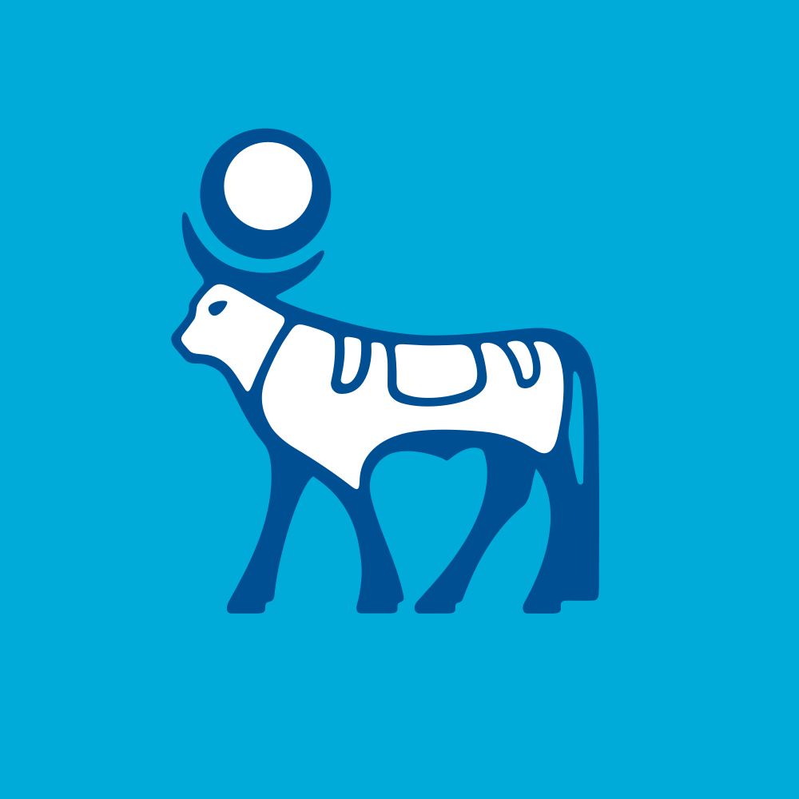 Novo Nordisk A/S
 | [Full Report](output/NVO/NVO_comprehensive_report.html) | 

📉 SELL Z-Score: 1.18 (Distress)

🎯 AI Investment Profiles

🔍 Analysis Pending

 |
| 
 Okta, Inc.
 | [Full Report](output/OKTA/OKTA_comprehensive_report.html) | 

📈 STRONG BUY Z-Score: 3.50 (Safe)

🎯 AI Investment Profiles

🔍 Analysis Pending

 |
| 
 Oracle Corporation
 | [Full Report](output/ORCL/ORCL_comprehensive_report.html) | 

⚖️ HOLD Z-Score: 2.57 (Gray Zone)

🎯 AI Investment Profiles

🔍 Analysis Pending

 |
| 
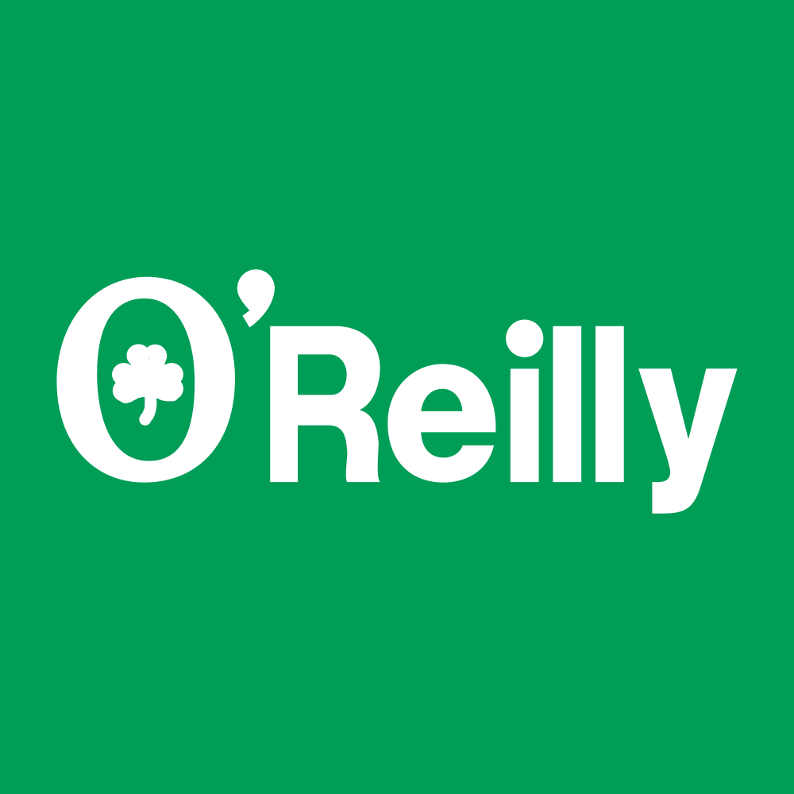 O'Reilly Automotive, Inc.
 | [Full Report](output/ORLY/ORLY_comprehensive_report.html) | 

⚖️ HOLD Z-Score: 2.70 (Gray Zone)

🎯 AI Investment Profiles

🔍 Analysis Pending

 |
| 
 Palo Alto Networks, Inc.
 | [Full Report](output/PANW/PANW_comprehensive_report.html) | 

📈 STRONG BUY Z-Score: 5.72 (Safe)

🎯 AI Investment Profiles

🔍 Analysis Pending

 |
| 
 Petróleo Brasileiro S.A. - Petrobras
 | [Full Report](output/PBR/PBR_comprehensive_report.html) | 

📉 SELL Z-Score: 0.57 (Distress)

🎯 AI Investment Profiles

🔍 Analysis Pending

 |
| 
 PACCAR Inc
 | [Full Report](output/PCAR/PCAR_comprehensive_report.html) | 

⚖️ HOLD Z-Score: 2.65 (Gray Zone)

🎯 AI Investment Profiles

🔍 Analysis Pending

 |
| 
 PDD Holdings Inc.
 | [Full Report](output/PDD/PDD_comprehensive_report.html) | 

⚖️ HOLD Z-Score: 1.83 (Gray Zone)

🎯 AI Investment Profiles

🔍 Analysis Pending

 |
| 
 Pfizer Inc.
 | [Full Report](output/PFE/PFE_comprehensive_report.html) | 

📉 SELL Z-Score: 1.70 (Distress)

🎯 AI Investment Profiles

🔍 Analysis Pending

 |
| 
 The Progressive Corporation
 | [Full Report](output/PGR/PGR_comprehensive_report.html) | 

⚖️ HOLD Z-Score: 2.08 (Gray Zone)

🎯 AI Investment Profiles

🔍 Analysis Pending

 |
| 
 Parker-Hannifin Corporation
 | [Full Report](output/PH/PH_comprehensive_report.html) | 

📈 STRONG BUY Z-Score: 3.76 (Safe)

🎯 AI Investment Profiles

🔍 Analysis Pending

 |
| 
 Palantir Technologies Inc.
 | [Full Report](output/PLTR/PLTR_comprehensive_report.html) | 

📈 STRONG BUY Z-Score: 167.83 (Safe)

🎯 AI Investment Profiles

🔍 Analysis Pending

 |
| 
 Philip Morris International Inc.
 | [Full Report](output/PM/PM_comprehensive_report.html) | 

⚖️ HOLD Z-Score: 2.49 (Gray Zone)

🎯 AI Investment Profiles

🔍 Analysis Pending

 |
| 
 The PNC Financial Services Group, Inc.
 | [Full Report](output/PNC/PNC_comprehensive_report.html) | 

📉 SELL Z-Score: -0.53 (Distress)

🎯 AI Investment Profiles

🔍 Analysis Pending

 |
| 
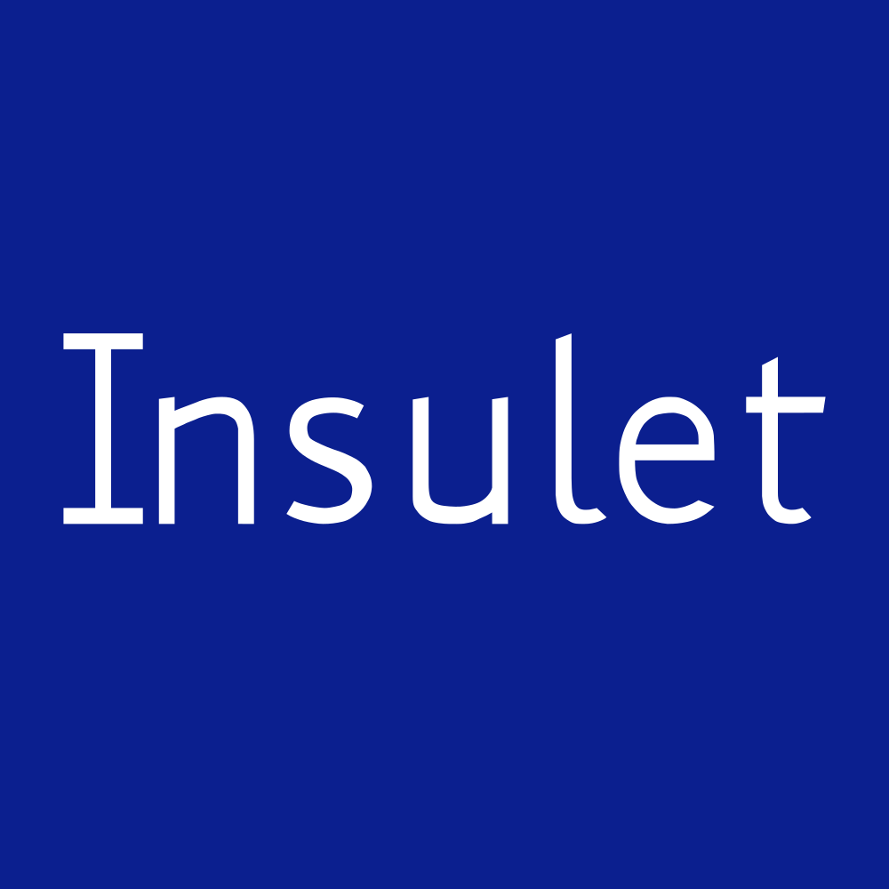 Insulet Corporation
 | [Full Report](output/PODD/PODD_comprehensive_report.html) | 

📈 STRONG BUY Z-Score: 6.84 (Safe)

🎯 AI Investment Profiles

🔍 Analysis Pending

 |
| 
 Royal Caribbean Cruises Ltd.
 | [Full Report](output/RCL/RCL_comprehensive_report.html) | 

📉 SELL Z-Score: 1.68 (Distress)

🎯 AI Investment Profiles

🔍 Analysis Pending

 |
| 
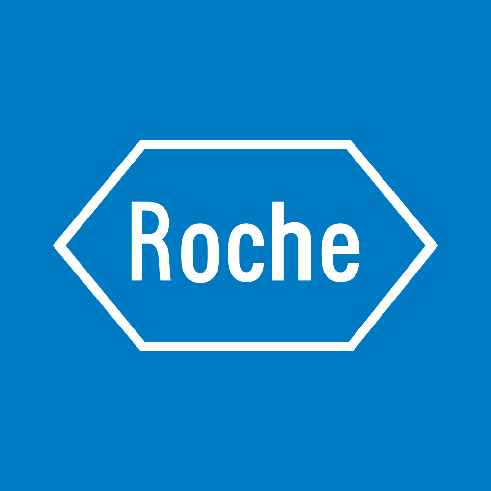 Roche Holding AG
 | [Full Report](output/RHHBY/RHHBY_comprehensive_report.html) | 

📈 STRONG BUY Z-Score: 3.80 (Safe)

🎯 AI Investment Profiles

🔍 Analysis Pending

 |
| 
 Rio Tinto Group
 | [Full Report](output/RIO/RIO_comprehensive_report.html) | 

⚖️ HOLD Z-Score: 2.44 (Gray Zone)

🎯 AI Investment Profiles

🔍 Analysis Pending

 |
| 
 RTX Corporation
 | [Full Report](output/RTX/RTX_comprehensive_report.html) | 

📉 SELL Z-Score: 1.75 (Distress)

🎯 AI Investment Profiles

🔍 Analysis Pending

 |
| 
 Sap Se
 | [Full Report](output/SAP/SAP_comprehensive_report.html) | 

📈 STRONG BUY Z-Score: 8.16 (Safe)

🎯 AI Investment Profiles

🔍 Analysis Pending

 |
| 
 Starbucks Corporation
 | [Full Report](output/SBUX/SBUX_comprehensive_report.html) | 

📉 SELL Z-Score: 1.47 (Distress)

🎯 AI Investment Profiles

🔍 Analysis Pending

 |
| 
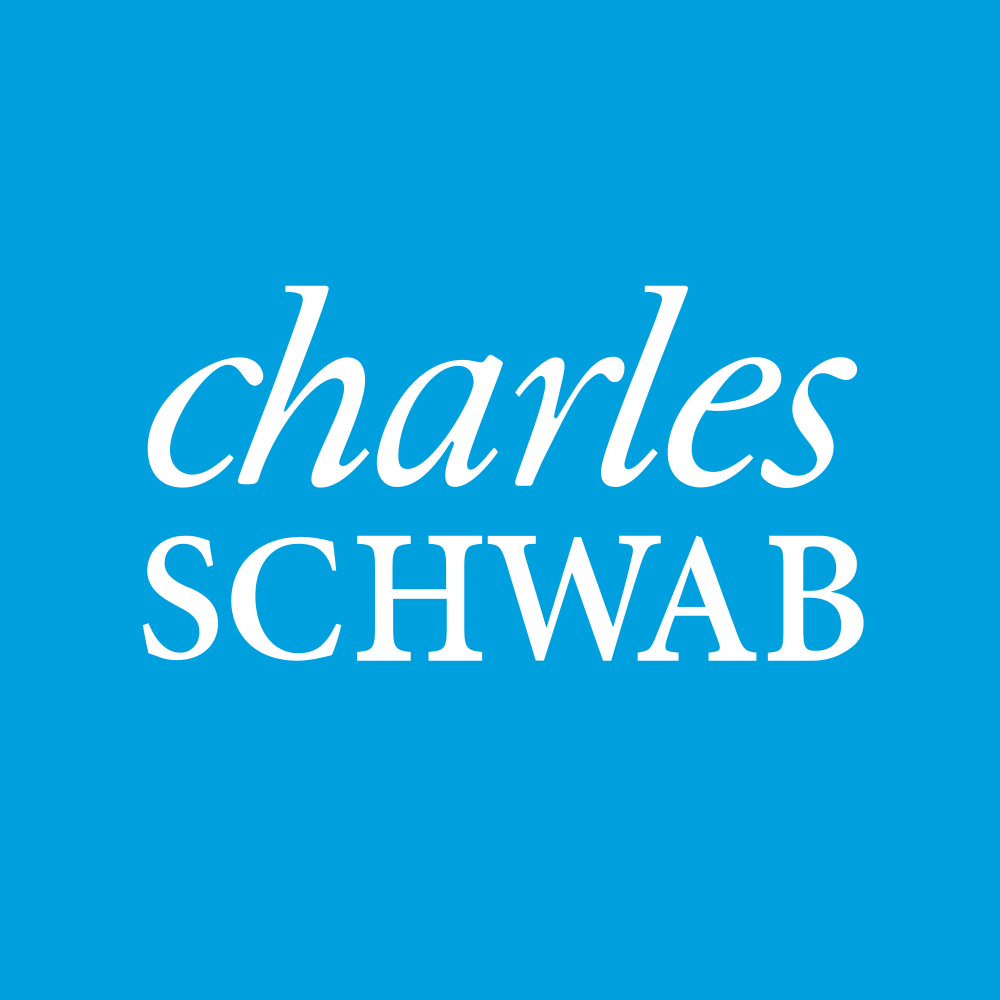 The Charles Schwab Corporation
 | [Full Report](output/SCHW/SCHW_comprehensive_report.html) | 

📉 SELL Z-Score: -0.09 (Distress)

🎯 AI Investment Profiles

🔍 Analysis Pending

 |
| 
 Shell plc
 | [Full Report](output/SHEL/SHEL_comprehensive_report.html) | 

📉 SELL Z-Score: 1.52 (Distress)

🎯 AI Investment Profiles

🔍 Analysis Pending

 |
| 
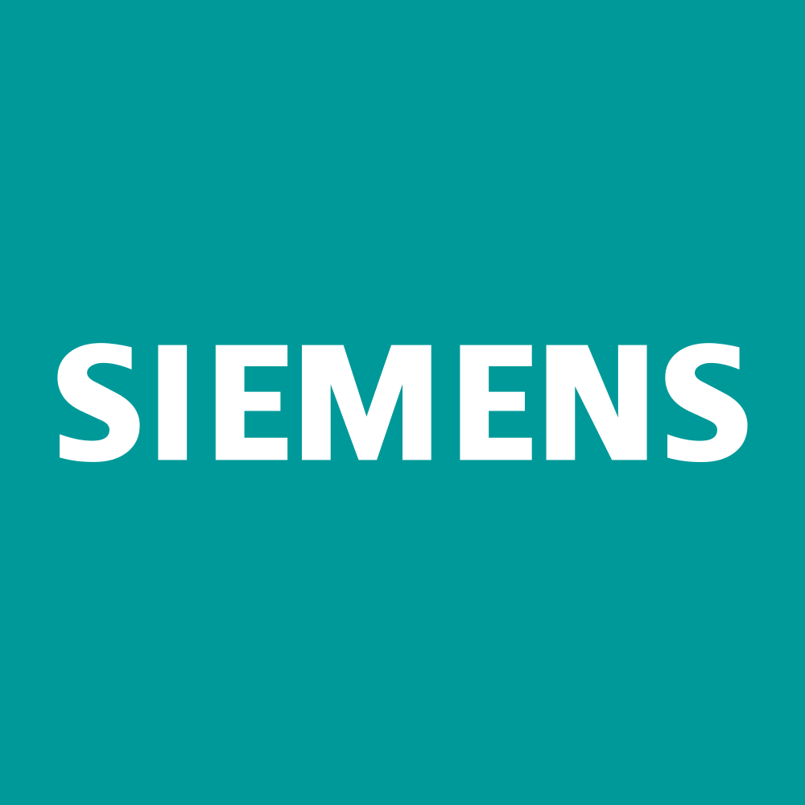 Siemens AG
 | [Full Report](output/SIEGY/SIEGY_comprehensive_report.html) | 

⚖️ HOLD Z-Score: 1.81 (Gray Zone)

🎯 AI Investment Profiles

🔍 Analysis Pending

 |
| 
 Sanofi
 | [Full Report](output/SNY/SNY_comprehensive_report.html) | 

📉 SELL Z-Score: 1.47 (Distress)

🎯 AI Investment Profiles

🔍 Analysis Pending

 |
| 
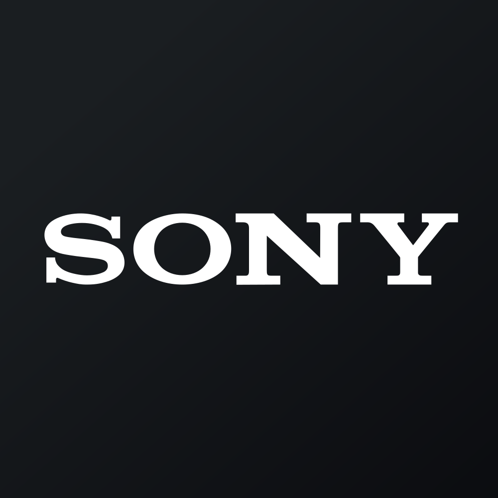 Sony Group Corporation
 | [Full Report](output/SONY/SONY_comprehensive_report.html) | 

📉 SELL Z-Score: 0.25 (Distress)

🎯 AI Investment Profiles

🔍 Analysis Pending

 |
| 
 S&P Global Inc.
 | [Full Report](output/SPGI/SPGI_comprehensive_report.html) | 

📈 STRONG BUY Z-Score: 4.41 (Safe)

🎯 AI Investment Profiles

🔍 Analysis Pending

 |
| 
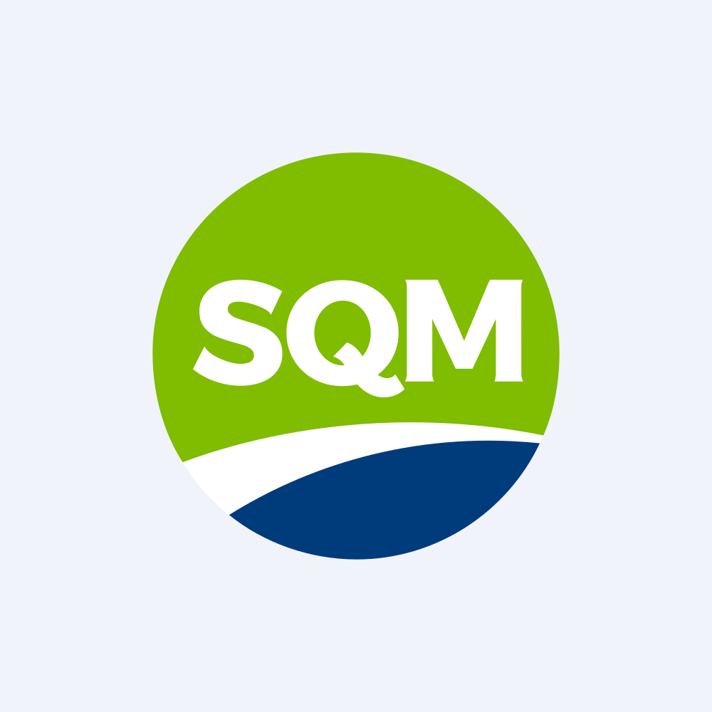 Sociedad Química y Minera de Chile S.A.
 | [Full Report](output/SQM/SQM_comprehensive_report.html) | 

⚖️ HOLD Z-Score: 1.97 (Gray Zone)

🎯 AI Investment Profiles

🔍 Analysis Pending

 |
| 
 SS&C Technologies Holdings, Inc.
 | [Full Report](output/SSNC/SSNC_comprehensive_report.html) | 

📉 SELL Z-Score: 1.06 (Distress)

🎯 AI Investment Profiles

🔍 Analysis Pending

 |
| 
 State Street Corporation
 | [Full Report](output/STT/STT_comprehensive_report.html) | 

📉 SELL Z-Score: 0.09 (Distress)

🎯 AI Investment Profiles

🔍 Analysis Pending

 |
| 
 Stryker Corporation
 | [Full Report](output/SYK/SYK_comprehensive_report.html) | 

📈 STRONG BUY Z-Score: 4.46 (Safe)

🎯 AI Investment Profiles

🔍 Analysis Pending

 |
| 
 AT&T Inc.
 | [Full Report](output/T/T_comprehensive_report.html) | 

📉 SELL Z-Score: 0.54 (Distress)

🎯 AI Investment Profiles

🔍 Analysis Pending

 |
| 
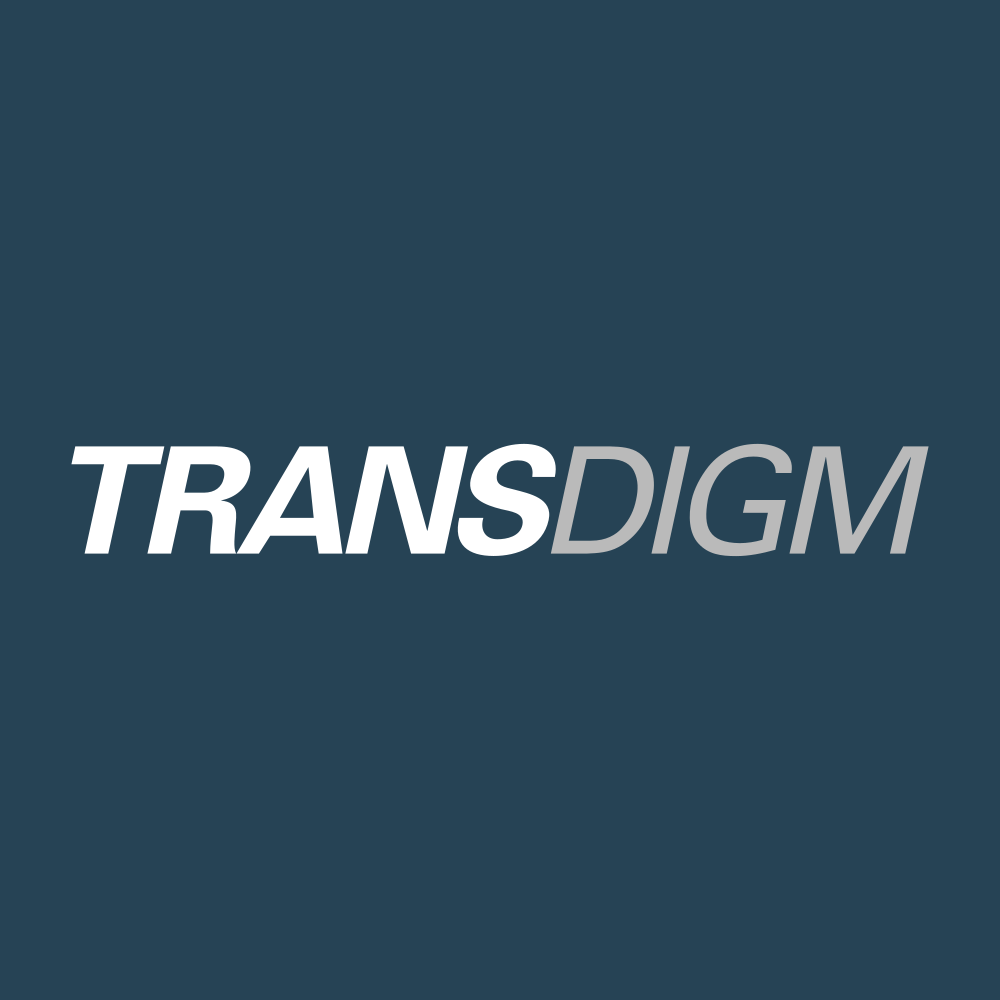 TransDigm Group Incorporated
 | [Full Report](output/TDG/TDG_comprehensive_report.html) | 

⚖️ HOLD Z-Score: 1.88 (Gray Zone)

🎯 AI Investment Profiles

🔍 Analysis Pending

 |
| 
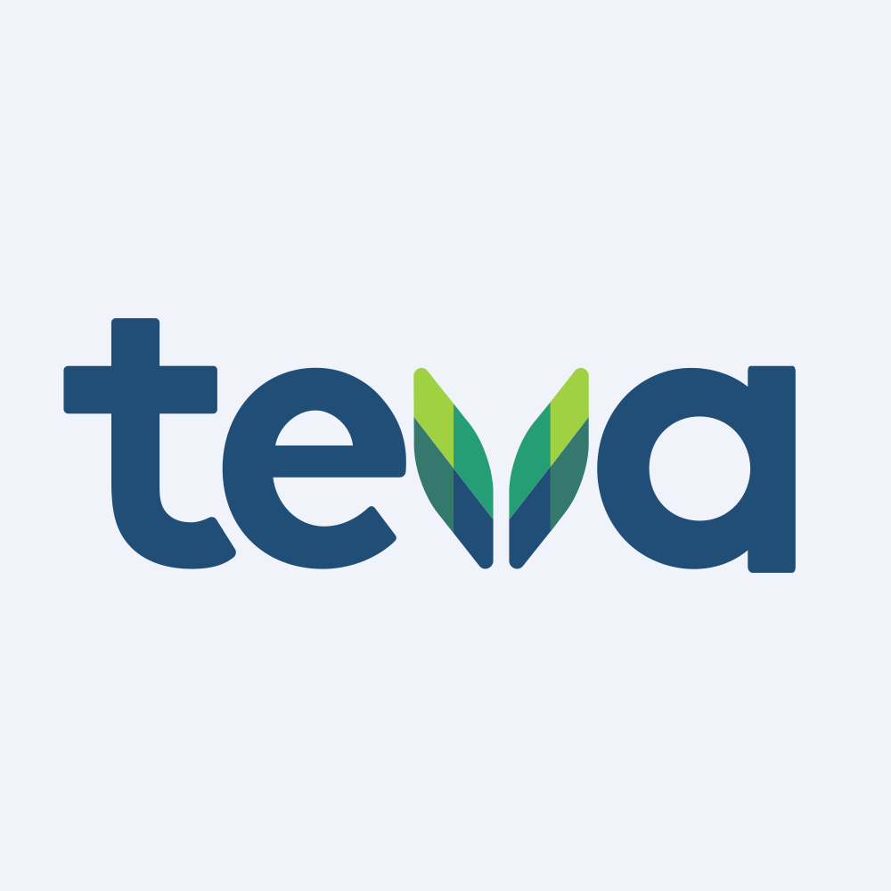 Teva Pharmaceutical Industries Limited
 | [Full Report](output/TEVA/TEVA_comprehensive_report.html) | 

📉 SELL Z-Score: -0.02 (Distress)

🎯 AI Investment Profiles

🔍 Analysis Pending

 |
| 
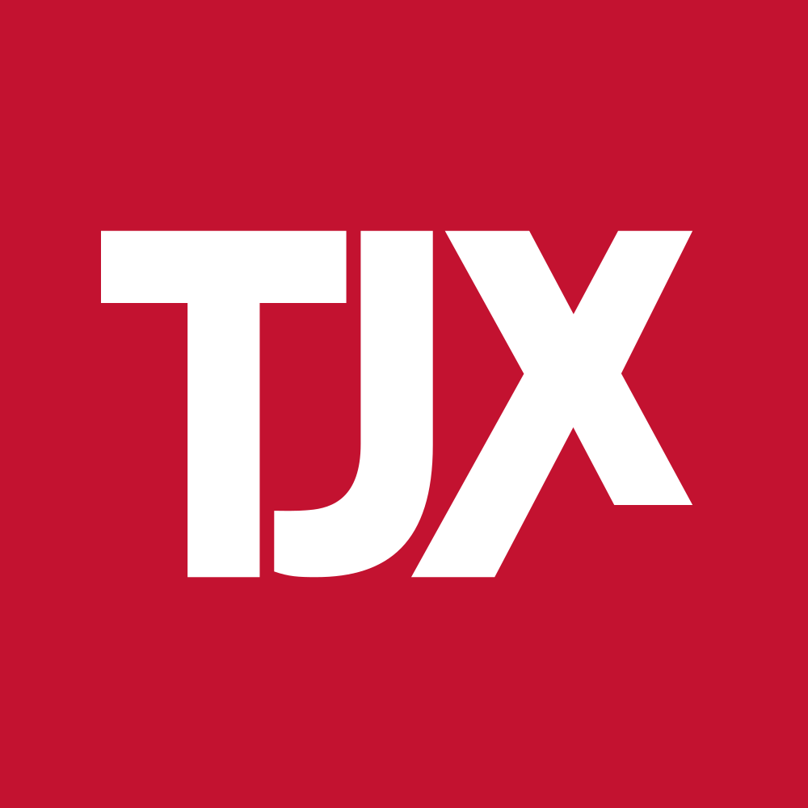 The TJX Companies, Inc.
 | [Full Report](output/TJX/TJX_comprehensive_report.html) | 

📈 STRONG BUY Z-Score: 4.12 (Safe)

🎯 AI Investment Profiles

🔍 Analysis Pending

 |
| 
 Toyota Motor Corporation
 | [Full Report](output/TM/TM_comprehensive_report.html) | 

📉 SELL Z-Score: 0.81 (Distress)

🎯 AI Investment Profiles

🔍 Analysis Pending

 |
| 
 Thermo Fisher Scientific Inc.
 | [Full Report](output/TMO/TMO_comprehensive_report.html) | 

⚖️ HOLD Z-Score: 2.18 (Gray Zone)

🎯 AI Investment Profiles

🔍 Analysis Pending

 |
| 
 T-Mobile US, Inc.
 | [Full Report](output/TMUS/TMUS_comprehensive_report.html) | 

📉 SELL Z-Score: 1.33 (Distress)

🎯 AI Investment Profiles

🔍 Analysis Pending

 |
| 
 Tesla, Inc.
 | [Full Report](output/TSLA/TSLA_comprehensive_report.html) | 

📈 STRONG BUY Z-Score: 13.52 (Safe)

🎯 AI Investment Profiles

🔍 Analysis Pending

 |
| 
 Taiwan Semiconductor Manufacturing Company Limited
 | [Full Report](output/TSM/TSM_comprehensive_report.html) | 

📉 SELL Z-Score: 1.65 (Distress)

🎯 AI Investment Profiles

🔍 Analysis Pending

 |
| 
 United Airlines Holdings, Inc.
 | [Full Report](output/UAL/UAL_comprehensive_report.html) | 

📉 SELL Z-Score: 0.35 (Distress)

🎯 AI Investment Profiles

🔍 Analysis Pending

 |
| 
 Uber Technologies, Inc.
 | [Full Report](output/UBER/UBER_comprehensive_report.html) | 

📈 STRONG BUY Z-Score: 3.70 (Safe)

🎯 AI Investment Profiles

🔍 Analysis Pending

 |
| 
 Unilever PLC
 | [Full Report](output/UL/UL_comprehensive_report.html) | 

⚖️ HOLD Z-Score: 2.87 (Gray Zone)

🎯 AI Investment Profiles

🔍 Analysis Pending

 |
| 
 UnitedHealth Group Incorporated
 | [Full Report](output/UNH/UNH_comprehensive_report.html) | 

📉 SELL Z-Score: 1.64 (Distress)

🎯 AI Investment Profiles

🔍 Analysis Pending

 |
| 
 United Parcel Service, Inc.
 | [Full Report](output/UPS/UPS_comprehensive_report.html) | 

⚖️ HOLD Z-Score: 1.80 (Distress)

🎯 AI Investment Profiles

🔍 Analysis Pending

 |
| 
 United Rentals, Inc.
 | [Full Report](output/URI/URI_comprehensive_report.html) | 

⚖️ HOLD Z-Score: 2.42 (Gray Zone)

🎯 AI Investment Profiles

🔍 Analysis Pending

 |
| 
 Visa Inc.
 | [Full Report](output/V/V_comprehensive_report.html) | 

📈 STRONG BUY Z-Score: 7.98 (Safe)

🎯 AI Investment Profiles

🔍 Analysis Pending

 |
| 
 Vale S.A.
 | [Full Report](output/VALE/VALE_comprehensive_report.html) | 

📉 SELL Z-Score: 0.73 (Distress)

🎯 AI Investment Profiles

🔍 Analysis Pending

 |
| 
 Vodafone Group Public Limited Company
 | [Full Report](output/VOD/VOD_comprehensive_report.html) | 

📉 SELL Z-Score: -1.00 (Distress)

🎯 AI Investment Profiles

🔍 Analysis Pending

 |
| 
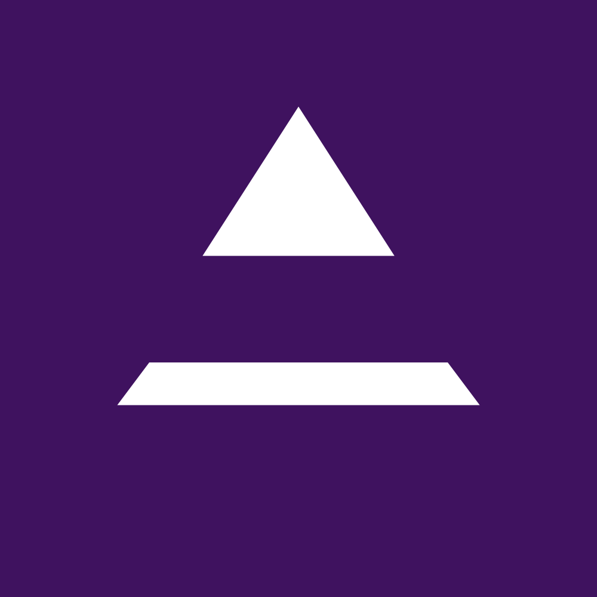 Vertex Pharmaceuticals Incorporated
 | [Full Report](output/VRTX/VRTX_comprehensive_report.html) | 

📈 STRONG BUY Z-Score: 11.86 (Safe)

🎯 AI Investment Profiles

🔍 Analysis Pending

 |
| 
 Workday, Inc.
 | [Full Report](output/WDAY/WDAY_comprehensive_report.html) | 

📈 STRONG BUY Z-Score: 4.96 (Safe)

🎯 AI Investment Profiles

🔍 Analysis Pending

 |
| 
 Wells Fargo & Company
 | [Full Report](output/WFC/WFC_comprehensive_report.html) | 

📉 SELL Z-Score: -0.41 (Distress)

🎯 AI Investment Profiles

🔍 Analysis Pending

 |
| 
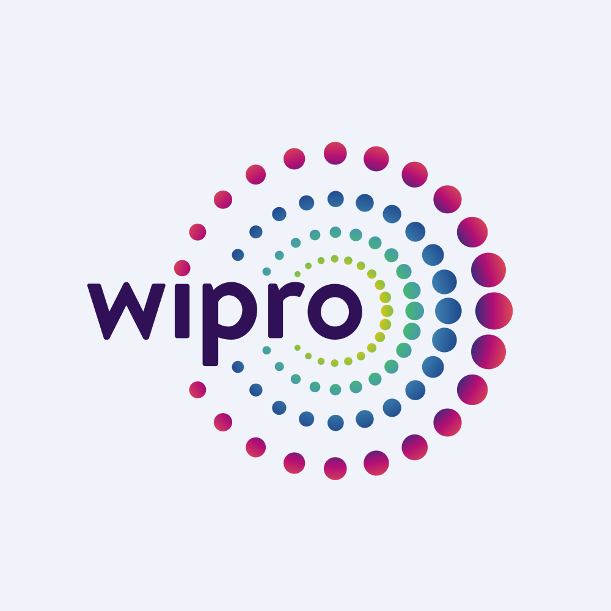 Wipro Limited
 | [Full Report](output/WIT/WIT_comprehensive_report.html) | 

📉 SELL Z-Score: 1.56 (Distress)

🎯 AI Investment Profiles

🔍 Analysis Pending

 |
| 
 Wix.com Ltd.
 | [Full Report](output/WIX/WIX_comprehensive_report.html) | 

⚖️ HOLD Z-Score: 2.12 (Gray Zone)

🎯 AI Investment Profiles

🔍 Analysis Pending

 |
| 
 Walmart Inc.
 | [Full Report](output/WMT/WMT_comprehensive_report.html) | 

📈 STRONG BUY Z-Score: 3.78 (Safe)

🎯 AI Investment Profiles

🔍 Analysis Pending

 |
| 
 YPF Sociedad Anónima
 | [Full Report](output/YPF/YPF_comprehensive_report.html) | 

📉 SELL Z-Score: 0.11 (Distress)

🎯 AI Investment Profiles

🔍 Analysis Pending

 |
| 
 ZIM Integrated Shipping Services Ltd.
 | [Full Report](output/ZIM/ZIM_comprehensive_report.html) | 

📉 SELL Z-Score: 0.75 (Distress)

🎯 AI Investment Profiles

🔍 Analysis Pending

 |
